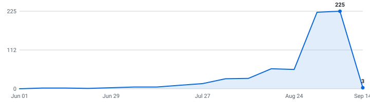

# 🎓 Summer 2027 Mechanical & Aerospace Internships

**A self-updating engine that tracks mechanical & aerospace internships so you don't have to.**

&nbsp;&nbsp;&nbsp;

### 113 open roles (100 listed below) · 46 new this week

4,198 employers tracked · updated Aug 21, 2026 at 19:08 UTC

_72 have a cycle the employer stated · 41 are recent postings whose cycle isn't stated (listed separately, never mixed in)._

**[🖥️ Live dashboard](https://pranavd1437.github.io/mechanical-aerospace-internship-engine/)** · **[📡 RSS](https://pranavd1437.github.io/mechanical-aerospace-internship-engine/feed.xml)** · **[⚙️ JSON API](https://pranavd1437.github.io/mechanical-aerospace-internship-engine/api/jobs.json)**

> [!TIP]
> **⭐ Star this repo** to save it and get updates when new roles are added.

Instead of refreshing a dozen career pages by hand, it reads company hiring feeds directly and keeps one live list — newest roles on top, refreshed automatically every six hours.

**🔔 Alerts without sharing an email:** follow the [RSS feed](https://pranavd1437.github.io/mechanical-aerospace-internship-engine/feed.xml) in any reader. Saved roles stay in your browser.

---

## What this is

This is an engine, not a hand-kept list. It polls company career feeds every six hours, finds the internships, removes duplicates, and rebuilds this page on its own.

Every link comes straight from the source — so it's real and current, not a stale list someone forgot to update. Speed matters.

## What makes this different

| | |
|---|---|
| 📅 **[Drop Radar](#drop-radar)** | A forecast of **what's coming**. Each marquee company's typical opening window, replaced by the real drop date the moment the engine catches it live. Windows are estimates and labelled as such; only dates the engine saw itself are marked verified. |
| 🛂 **Visa intel, computed** | 🇺🇸 / 🛂 flags detected automatically from every job description, plus ✓ for employers with a real H-1B track record (USCIS data, FY2022-23 — a history, not a promise). The big lists crowdsource this by hand; here it's code. Most postings say nothing either way, and those show as unknown rather than guessed. |
| 📆 **A real date on nearly every role** | Taken from the job portal itself wherever the portal states one, so newest-first actually means newest. The exact coverage figure is printed at the bottom of this page every run. |
| 🧰 **Skill tags + pay, extracted** | Every posting's text is scanned for the tools it wants (SolidWorks, GD&T, ANSYS, …) and the pay it states — searchable on the [dashboard](https://pranavd1437.github.io/mechanical-aerospace-internship-engine/), and included in the CSV and API. |
| 🔔 **Alerts your way** | Follow the [RSS feed](https://pranavd1437.github.io/mechanical-aerospace-internship-engine/feed.xml), or connect it to an RSS-capable alert tool. The dashboard's saved roles stay in your browser. |
| ⚙️ **An engine, not a spreadsheet** | 4,301 job-board endpoints (4,198 distinct employers; some run more than one board) polled every six hours across 12 ATS platforms. Full source and tests in this repo. |

## Scope

| | |
|---|---|
| **Roles** | Mechanical design/CAD, structures/FEA, manufacturing/test, thermal/fluids/propulsion, materials, controls/mechatronics, and systems engineering internships |
| **Region** | United States |
| **Cycles** | Summer 2027 and Fall 2026 |

## About

This fork adapts the open-source Internship Engine for a focused mechanical and aerospace search while preserving source-first links and human review before any application.

Use it to spot roles early and apply before they fill up. Being first genuinely helps.

## Where this is going

I'm building this in the open and adding to it as it grows.

**Included:** RSS alerts · the Drop Radar · auto-detected sponsorship flags · the live dashboard

**Mechanical scope:** design/CAD · structures/FEA · manufacturing/test · thermal/fluids/propulsion · materials · controls/mechatronics · systems

If it helps you, a star means a lot and tells me to keep going.

## How to use

<b>Reading the table — flags, dates, and the cycle split</b> (click to expand)

- Roles are grouped by cycle below - **newest posting on top, oldest at the bottom.**
- A cycle section holds only roles whose **employer stated that cycle** - in the title, or in the posting's own text. Postings that name no cycle anywhere are in *Recently posted — cycle not stated* further down, with **no cycle guessed for them**. Same quality bar, different amount of evidence.
- The **Posted** column is the date the company published the role.
- **🆁 after a company name** = **this role is remote** — the posting's own location or title says so. It marks the role on that row, not the whole company.
- **Flags after a role title:** 🇺🇸 = requires U.S. citizenship or a security clearance · 🛂 = the posting says it won't sponsor a work visa · 🆕 = spotted in the last 48 hours. Sponsorship flags are detected automatically from each job description - treat them as a strong hint and confirm on the posting.
- **✓ after a company name** = a real H-1B track record: USCIS approved 10+ petitions for that employer in FY2022–2023 (matched automatically against the official [H-1B Employer Data Hub](https://www.uscis.gov/tools/reports-and-studies/h-1b-employer-data-hub)). No ✓ doesn't mean they won't sponsor - it means we can't prove they have.
- Track your applications with [`data/internships.csv`](data/internships.csv) (opens in Excel / Google Sheets).
- Missing a company? Adding one takes a single line, see [CONTRIBUTING.md](CONTRIBUTING.md).

---

## Summer 2027  (30 employer-stated)

| Company | Role | Category | Location | Skills | Posted | Apply |
|---|---|---|---|---|---|---|
| Airbus ✓ | 2027 Summer Internship - Industrial Engineering - PPE/IE 🆕 | Manufacturing & Quality | Mobile Area, AL | No skills listed | Aug 21, 2026 | [Apply](https://ag.wd3.myworkdayjobs.com/Airbus/job/Mobile-Area-AL/XMLNAME-2027-Summer-Internship---Industrial-Engineering---PPE-IE_JR10435140) |
| Airbus ✓ | 2027 Summer Internship - X-Plant Manufacturing Engineering 🆕 | Manufacturing & Quality | Mobile Area, AL | No skills listed | Aug 21, 2026 | [Apply](https://ag.wd3.myworkdayjobs.com/Airbus/job/Mobile-Area-AL/XMLNAME-2027-Summer-Internship---X-Plant-Manufacturing-Engineering_JR10435143) |
| Elanco | Manufacturing Scientist/Quality Control Chemist Intern – Clinton, Indiana (Summer 2027) 🆕 | Manufacturing & Quality | Clinton, IN | No skills listed | Aug 21, 2026 | [Apply](https://elanco.wd5.myworkdayjobs.com/External_Career/job/Clinton-IN/Manufacturing-Scientist-Quality-Control-Chemist-Intern---Clinton--Indiana--Summer-2027-_R0026870) |
| Elanco | Manufacturing Scientist/Technical Services Intern – Elanco Technology Center (Summer 2027) 🆕 | Manufacturing & Quality | Indianapolis, IN | No skills listed | Aug 21, 2026 | [Apply](https://elanco.wd5.myworkdayjobs.com/External_Career/job/Indianapolis-IN/Manufacturing-Scientist-Technical-Services-Intern---Elanco-Technology-Center--Summer-2027-_R0026897) |
| WSP | Overhead Transmission Line Design Engineering Intern - Spring/Summer 2027 🆕 | Mechanical Design | Saint Louis, MO, United States | SolidWorks, AutoCAD | Aug 21, 2026 | [Apply](https://emit.fa.ca3.oraclecloud.com/hcmUI/CandidateExperience/en/sites/CX_2001/job/93367) |
| WSP | Overhead Transmission Line Design Engineering Intern - Summer/Fall 2027 🆕 | Mechanical Design | Saint Louis, MO, United States | SolidWorks, AutoCAD | Aug 21, 2026 | [Apply](https://emit.fa.ca3.oraclecloud.com/hcmUI/CandidateExperience/en/sites/CX_2001/job/93368) |
| General Matter | Summer 2027 Internship - Manufacturing Engineering 🆕 | Manufacturing & Quality | Los Angeles, CA | CAD, GD&T | Aug 20, 2026 | [Apply](https://job-boards.greenhouse.io/generalmatter/jobs/5376060008) |
| WSP | Mechanical Engineering (Substation) Intern - Summer 2027 🆕 | Mechanical Design | Billings, MT, United States | SolidWorks, AutoCAD | Aug 20, 2026 | [Apply](https://emit.fa.ca3.oraclecloud.com/hcmUI/CandidateExperience/en/sites/CX_2001/job/93468) |
| Elanco | Manufacturing Associate Intern – Elwood, Kansas (Summer 2027) 🆕 | Manufacturing & Quality | Elwood, KS | No skills listed | Aug 20, 2026 | [Apply](https://elanco.wd5.myworkdayjobs.com/External_Career/job/Elwood-KS/Manufacturing-Associate-Intern---Elwood--Kansas--Summer-2027-_R0026899) |
| IMEG ✓ | Mechanical Engineering Intern / Greenwood Village, CO 🆕 | Mechanical Design | Denver Metro, CO | AutoCAD | Aug 20, 2026 | [Apply](https://wd1.myworkdaysite.com/recruiting/imeg/Imeg_Careers/job/Denver-Metro-CO/Mechanical-Engineering-Intern---Greenwood-Village--CO_R-16570-1) |
| Freeform | Manufacturing Engineering Intern (Summer 2027) 🆕 | Manufacturing & Quality | Los Angeles, CA (On-site) | CNC, DFM/DFA | Aug 19, 2026 | [Apply](https://job-boards.greenhouse.io/freeformfuturecorp/jobs/7895700003) |
| Freeform | Materials Engineering Intern (Summer 2027) 🆕 | Materials Engineering | Los Angeles, CA (On-site) | No skills listed | Aug 19, 2026 | [Apply](https://job-boards.greenhouse.io/freeformfuturecorp/jobs/7907965003) |
| IMEG ✓ | Mechanical Engineering Intern / Greenwood Village, CO | Mechanical Design | Denver Metro, CO | AutoCAD | Aug 19, 2026 | [Apply](https://wd1.myworkdaysite.com/recruiting/imeg/Imeg_Careers/job/Denver-Metro-CO/Mechanical-Engineering-Intern---Greenwood-Village--CO_R-16558) |
| IMEG ✓ | Mechanical Intern Technician / Germantown, MD 🇺🇸 | Mechanical Design | Germantown, MD | CAD, CFD | Aug 19, 2026 | [Apply](https://wd1.myworkdaysite.com/recruiting/imeg/Imeg_Careers/job/Germantown-MD/Mechanical-Intern-Technician---Germantown--MD_R-16567) |
| H3X Technologies | Advanced Manufacturing Engineering Intern (Spring) | Manufacturing & Quality | Louisville, Colorado | SolidWorks, GD&T, Lean Manufacturing | Aug 18, 2026 | [Apply](https://jobs.ashbyhq.com/h3x-technologies/6af49576-a61d-480c-b155-3e034e2ed5be) |
| H3X Technologies | Test Engineering Intern (Spring) | Test & Validation | Louisville, Colorado | SolidWorks | Aug 18, 2026 | [Apply](https://jobs.ashbyhq.com/h3x-technologies/be8855c5-f8c7-4f09-bd3f-04ecbcf4b42d) |
| Freeform | Mechanical Engineering Intern (Summer 2027) | Mechanical Design | Los Angeles, CA (On-site) | Tolerance Analysis | Aug 18, 2026 | [Apply](https://job-boards.greenhouse.io/freeformfuturecorp/jobs/7894117003) |
| Northrop Grumman | 2027 Guidance Navigation and Control Intern Dulles VA 🇺🇸 | Controls & Mechatronics | United States-Virginia-Dulles | C++, MATLAB, Simulink, Git | Aug 18, 2026 | [Apply](https://ngc.wd1.myworkdayjobs.com/Northrop_Grumman_External_Site/job/United-States-Virginia-Dulles/XMLNAME-2027-Guidance-Navigation-and-Control-Intern-Dulles-VA_R10246322) |
| GlobalFoundries ✓ | US Advanced Manufacturing Equipment Engineering Intern, Junior (Summer 2027) | Manufacturing & Quality | USA - Vermont - Essex Junction | No skills listed | Aug 14, 2026 | [Apply](https://globalfoundries.wd1.myworkdayjobs.com/External/job/USA---Vermont---Essex-Junction/US-Advanced-Manufacturing-Equipment-Engineering-Intern--Junior--Summer-2027-_JR-2604656) |
| HNTB ✓ | WED - 2027 New Grad Mechanical & Fire Protection Engineer I  (For Current & Recent HNTB Interns Only) 🛂 | Mechanical Design | Oakland, CA | No skills listed | Aug 13, 2026 | [Apply](https://hntb.wd5.myworkdayjobs.com/hntb_university_careers/job/Oakland-CA/WED---2027-New-Grad-Mechanical---Fire-Protection-Engineer-I---For-Current---Recent-HNTB-Interns-Only-_R-31165) |
| Ameren ✓ | CAD Technician Co-op | Mechanical Design | St. Louis, MO | No skills listed | Aug 12, 2026 | [Apply](https://ameren.wd1.myworkdayjobs.com/External/job/St-Louis-MO/CAD-Technician-Co-op_033920-1) |
| Northrop Grumman | 2027 Operations Manufacturing Engineering Intern 🇺🇸 | Manufacturing & Quality | United States-California-Palmdale | No skills listed | Aug 07, 2026 | [Apply](https://ngc.wd1.myworkdayjobs.com/Northrop_Grumman_External_Site/job/United-States-California-Palmdale/XMLNAME-2027-Operations-Manufacturing-Engineering-Intern_R10244597) |
| Kraft Heinz ✓ | 2027 US Manufacturing Internship Program – Manufacturing Facility Garland, Texas | Manufacturing & Quality | Garland, TX | No skills listed | Aug 03, 2026 | [Apply](https://heinz.wd1.myworkdayjobs.com/KraftHeinz_Careers_UR/job/Garland-TX/XMLNAME-2027-US-Manufacturing-Internship-Program---Manufacturing-Facility-Garland--Texas_R-105352) |
| Kraft Heinz ✓ | 2027 US Manufacturing Internship Program – Manufacturing Facility Fremont, Ohio | Manufacturing & Quality | Fremont, OH | No skills listed | Jul 31, 2026 | [Apply](https://heinz.wd1.myworkdayjobs.com/KraftHeinz_Careers_UR/job/Fremont-OH/XMLNAME-2027-US-Manufacturing-Internship-Program---Manufacturing-Facility-Fremont--Ohio_R-105282) |
| Kraft Heinz ✓ | 2027 US Manufacturing Internship Program – Manufacturing Facility Winchester, Virginia | Manufacturing & Quality | Winchester, VA | No skills listed | Jul 31, 2026 | [Apply](https://heinz.wd1.myworkdayjobs.com/KraftHeinz_Careers_UR/job/Winchester-VA/XMLNAME-2027-US-Manufacturing-Internship-Program---Manufacturing-Facility-Winchester--Virginia_R-105276) |
| Kairos Power | Mechanical and Manufacturing Engineering Internship - Summer 2027 | Manufacturing & Quality | Alameda +5 more | MATLAB, SolidWorks, AutoCAD, CAD | Jul 23, 2026 | [Apply](https://job-boards.greenhouse.io/kairospower/jobs/6123676004) |
| Mosaic | Structural Engineer Co-Op/Intern - Summer 2027 | Structures & FEA | US - Tampa, FL (Lithia area) | No skills listed | Jul 22, 2026 | [Apply](https://mosaic.wd5.myworkdayjobs.com/mosaic/job/US---Tampa-FL-Lithia-area/Structural-Engineer-Co-Op-Intern---Summer-2027_64448) |
| Caterpillar Inc. ✓ | 2027 Engineering Corporate Internship Program Welding 🛂 | Manufacturing & Quality | Mossville, Illinois | No skills listed | Jul 01, 2026 | [Apply](https://cat.wd5.myworkdayjobs.com/CaterpillarCareers/job/Mossville-Illinois/XMLNAME-2027-Engineering-Corporate-Internship-Program-Welding_R0000380506) |
| Anduril | 2027 Mechanical Engineer Intern 🇺🇸 | Mechanical Design | Atlanta +26 more | SolidWorks, Siemens NX, CAD, FEA | Jun 11, 2026 | [Apply](https://boards.greenhouse.io/andurilindustries/jobs/5153187007?gh_jid=5153187007) |
| Anduril | 2027 Manufacturing Engineer Intern 🇺🇸 | Manufacturing & Quality | Atlanta +23 more | Computer Vision | Jun 11, 2026 | [Apply](https://boards.greenhouse.io/andurilindustries/jobs/5153218007?gh_jid=5153218007) |

## Fall 2026  (31 employer-stated)

| Company | Role | Category | Location | Skills | Posted | Apply |
|---|---|---|---|---|---|---|
| Renesas Electronics ✓ | Validation Engineer Intern 🆕 | Test & Validation | Duluth, GEORGIA, United States | Python, Pandas | Aug 21, 2026 | [Apply](https://jobs.smartrecruiters.com/RenesasElectronics/744000144791979) |
| ABB ✓ | Manufacturing Engineering/Documentation Intern - Fall 2026 🛂 | Manufacturing & Quality | USA, AR, Jonesboro | No skills listed | Aug 19, 2026 | [Apply](https://abb.wd3.myworkdayjobs.com/external_career_page/job/USA-AR-Jonesboro/Manufacturing-Engineering-Documentation-Intern---Fall-2026_JR00042298) |
| True Anomaly | Propulsion and Fluids Intern 🇺🇸 | Thermal, Fluids & Propulsion | Long Beach, CA | Python, MATLAB, CAD, LabVIEW | Aug 18, 2026 | [Apply](https://job-boards.greenhouse.io/trueanomalyinc/jobs/5213706007) |
| Conagra Brands ✓ | Manufacturing Co-Op | Manufacturing & Quality | Waterloo, Iowa | No skills listed | Aug 18, 2026 | [Apply](https://conagrabrands.wd1.myworkdayjobs.com/Careers_US/job/Waterloo-Iowa/Manufacturing-Co-Op_Req-039806) |
| Flextronics International ✓ | Mechanical Engineering Co-op - Fall 2026 | Mechanical Design | USA, SC, Orangeburg | SolidWorks, CAD, Six Sigma | Aug 07, 2026 | [Apply](https://flextronics.wd1.myworkdayjobs.com/Careers/job/USA-SC-Orangeburg/Mechanical-Engineering-Co-op---Fall-2026_WD227049) |
| Bosch ✓ | Quality Engineering Co-op - Fall 2026 | Manufacturing & Quality | Pineville, NC, United States | No skills listed | Aug 06, 2026 | [Apply](https://jobs.smartrecruiters.com/BoschGroup/744000141923029) |
| GlobalFoundries ✓ | IP & Design Engineering Intern (Fall 2026) | Mechanical Design | USA - Texas - Richardson | No skills listed | Aug 06, 2026 | [Apply](https://globalfoundries.wd1.myworkdayjobs.com/External/job/USA---Texas---Richardson/XMLNAME-1H-University-Intern---PVD-Equipment_JR-2502699) |
| Merck | 2026 Future Talent Program – Manufacturing and Reliability Engineering Co-Op | Manufacturing & Quality | USA - Pennsylvania - West Point | No skills listed | Aug 04, 2026 | [Apply](https://msd.wd5.myworkdayjobs.com/searchjobs/job/USA---Pennsylvania---West-Point/XMLNAME-2026-Future-Talent-Program---Manufacturing-and-Reliability-Engineering-Co-Op_R395901) |
| Figure | Power Systems Integration Intern [Fall 2026] | Systems Engineering | San Jose, CA | Python, Linux | Aug 03, 2026 | [Apply](https://job-boards.greenhouse.io/figureai/jobs/4702104006) |
| Draper | Space GNC Co-Op (Fall 2026) 🇺🇸 | Controls & Mechatronics | Houston, TX | Python, C++, MATLAB, Simulink | Aug 03, 2026 | [Apply](https://draper.wd5.myworkdayjobs.com/Draper_Careers/job/Houston-TX/Space-GNC-Co-Op--Fall-2026-_JR002721) |
| Northrop Grumman | 2026 Fall Co-op Manufacturing Engineering - Baltimore MD 🇺🇸 | Manufacturing & Quality | United States-Maryland-Linthicum | No skills listed | Aug 03, 2026 | [Apply](https://ngc.wd1.myworkdayjobs.com/Northrop_Grumman_External_Site/job/United-States-Maryland-Linthicum/XMLNAME-2026-Fall-Co-op-Manufacturing-Engineering---Baltimore-MD_R10243390-1) |
| Flextronics International ✓ | Industrial Engineering Co-Op - Fall 2026 | Manufacturing & Quality | USA, SC, Orangeburg | Six Sigma, Lean Manufacturing | Jul 30, 2026 | [Apply](https://flextronics.wd1.myworkdayjobs.com/Careers/job/USA-SC-Orangeburg/Industrial-Engineering-Co-Op---Fall-2026_WD226357) |
| Rendezvous Robotics | Manufacturing and Test Engineering Intern (Fall 2026) 🇺🇸 | Manufacturing & Quality | Golden, CO | Python, LabVIEW | Jul 27, 2026 | [Apply](https://job-boards.greenhouse.io/rendezvousrobotics/jobs/4332076009) |
| Rendezvous Robotics | GNC Intern (Fall 2026) 🇺🇸 | Controls & Mechatronics | Golden, CO | Python, C++, MATLAB, Simulink | Jul 27, 2026 | [Apply](https://job-boards.greenhouse.io/rendezvousrobotics/jobs/4332459009) |
| Flextronics International ✓ | Quality Engineering Co-Op - Fall 2026 | Manufacturing & Quality | USA, SC, Orangeburg | No skills listed | Jul 27, 2026 | [Apply](https://flextronics.wd1.myworkdayjobs.com/Careers/job/USA-SC-Orangeburg/Quality-Engineering-Co-Op---Fall-2026_WD226046) |
| Rendezvous Robotics | Mechanical Engineering Intern (Fall 2026) 🇺🇸 | Mechanical Design | Golden, CO | SolidWorks, Siemens NX, CAD, ANSYS | Jul 22, 2026 | [Apply](https://job-boards.greenhouse.io/rendezvousrobotics/jobs/4329113009) |
| Bosch ✓ | Quality Engineering Intern / Co-op - Fall 2026 | Manufacturing & Quality | Florence, KY, United States | FMEA | Jul 21, 2026 | [Apply](https://jobs.smartrecruiters.com/BoschGroup/744000138864841) |
| Reflect Orbital | Composites Engineering Intern (Fall 2026) | Materials Engineering | Hawthorne, CA | No skills listed | Jul 15, 2026 | [Apply](https://jobs.ashbyhq.com/reflect-orbital/51d75a91-c088-4f00-89bc-4be8250b09f9) |
| Sunday Robotics | Manufacturing Engineering Intern (Fall 2026) | Manufacturing & Quality | Redwood City, CA | SolidWorks, CAD, DFM/DFA | Jul 07, 2026 | [Apply](https://jobs.ashbyhq.com/sunday/08feb65a-08b0-462d-aebf-4f0239a16ed8) |
| VAST | 2026 Fall Internship - Supplier Quality Engineering Intern 🇺🇸 | Manufacturing & Quality | Long Beach, California, United States | No skills listed | Jun 25, 2026 | [Apply](https://boards.greenhouse.io/vast/jobs/4691428006?gh_jid=4691428006) |
| Lawrence Livermore National Laboratory (LLNL) | Materials Science Division Undergraduate Intern - Fall 2026 🇺🇸 | Materials Engineering | Livermore, CA, United States | No skills listed | Jun 15, 2026 | [Apply](https://jobs.smartrecruiters.com/LLNL/3743990013626030) |
| Menasha Corporation | Custom Packaging Design Engineer Co-Op (Summer/Fall 2026) 🛂 | Mechanical Design | Piedmont, South Carolina | SolidWorks, AutoCAD | May 18, 2026 | [Apply](https://menasha.wd12.myworkdayjobs.com/menashacorp/job/Piedmont-South-Carolina/Custom-Packaging-Design-Engineer-Co-Op--Summer-Fall-2026-_R13995) |
| Westlake | 2026 Intern - Mechanical Engineer 🛂 | Mechanical Design | US - Houston, TX | No skills listed | Apr 22, 2026 | [Apply](https://westlake.wd1.myworkdayjobs.com/westlake/job/US---Houston-TX/XMLNAME-2026-Intern---Mechanical-Engineer_R30240) |
| HNTB ✓ | Co-op Engineer: Structures - Fall/Winter 2026-2027 🛂 | Structures & FEA | Philadelphia, PA (Pennsylvania) | AutoCAD, CAD | Apr 13, 2026 | [Apply](https://hntb.wd5.myworkdayjobs.com/hntb_university_careers/job/Philadelphia-PA-Pennsylvania/Co-op-Engineer--Structures---Fall-Winter-2026-2027_R-29875) |
| Alloy Enterprises | Co-Op, Thermal Test Engineer, Fall 2026 (July-December) 🇺🇸 | Thermal, Fluids & Propulsion | Burlington, MA | Python, MATLAB, SolidWorks, CAD | Mar 25, 2026 | [Apply](https://jobs.ashbyhq.com/alloyenterprises/946e7ae1-d2ac-4889-a72a-268b0aeda9bd) |
| Field AI | Internship - Robot Control Systems (Fall 2026) | Controls & Mechatronics | Irvine, CA | Python, C++, CUDA, Kubernetes | Mar 22, 2026 | [Apply](https://jobs.lever.co/field-ai/8a3b5d4b-f88f-4704-bfdd-74e8dcd30704) |
| Hermeus | Propulsion Test Engineering Intern - Fall 2026 🇺🇸 | Thermal, Fluids & Propulsion | Jacksonville, FL | No skills listed | Mar 16, 2026 | [Apply](https://jobs.lever.co/hermeus/31513d2a-8e08-424b-b125-4f972fcfc805) |
| Hermeus | Mechanical Engineering Intern  - Fall 2026 🇺🇸 | Mechanical Design | Los Angeles, CA | FEA | Mar 09, 2026 | [Apply](https://jobs.lever.co/hermeus/6b6afa4a-b37d-4033-ac3b-e6501a951b98) |
| SharkNinja ✓ | Fall 2026: Product Design Engineering Co-op, Advanced Development (July/August to December) | Mechanical Design | Needham, MA, United States | SolidWorks, Creo, CAD | Jan 21, 2026 | [Apply](https://job-boards.greenhouse.io/sharkninjaoperatingllc/jobs/4646272006) |
| Amazon ✓ | Robotics - Hardware Development Engineer Intern/Co-op - 2026 (Robotics, Mechanical, Electrical, Hardware Test, Reliability, Failure Analysis, Operations, and more) | Materials Engineering | Westboro, Massachusetts, USA | CAD | Dec 17, 2025 | [Apply](https://www.amazon.jobs/en/jobs/3145033/robotics-hardware-development-engineer-intern-co-op-2026-robotics-mechanical-electrical-hardware-test-reliability-failure-analysis-operations-and-more) |
| Hermeus | Manufacturing Engineering Intern - Fall 2026 🇺🇸 | Manufacturing & Quality | Los Angeles, CA | No skills listed | Sep 30, 2025 | [Apply](https://jobs.lever.co/hermeus/a1f3aa29-72ea-4843-b2ea-801f3bef73ae) |

## Recently posted — cycle not stated  (39 roles)

These postings never name a cycle — not in the title, not in the posting text — so neither do we. They're recent mechanical & aerospace internships (posted within the last few weeks), often exactly the early drops worth applying to first; we just can't tell you which cycle they're for, and we'd rather say so than guess. The moment a posting's own text states a cycle, the role moves up into that section automatically.

| Company | Role | Category | Location | Skills | Posted | Apply |
|---|---|---|---|---|---|---|
| Heidelberg Materials | Mechanical Engineering Intern 🆕 | Mechanical Design | Nazareth, PA | No skills listed | Aug 21, 2026 | [Apply](https://heidelbergmaterials.wd3.myworkdayjobs.com/global_hm_career_site/job/Nazareth-PA/Mechanical-Engineering-Intern_JR10018120) |
| IMEG ✓ | Structural Engineering Intern / Raleigh, NC 🆕 | Structures & FEA | Raleigh, NC | AutoCAD | Aug 21, 2026 | [Apply](https://wd1.myworkdaysite.com/recruiting/imeg/Imeg_Careers/job/Raleigh-NC/Structural-Engineering-Intern---Raleigh--NC_R-16319-1) |
| Magna International ✓ | Intern - Engineering Mechanical Optics 🆕 | Mechanical Design | Auburn Hills, Michigan, US | No skills listed | Aug 21, 2026 | [Apply](https://magna.wd3.myworkdayjobs.com/Magna/job/Auburn-Hills-Michigan-US/Student---Engineering-Mechanical-Optics_R00256153) |
| Re:Build Manufacturing | Mechanical Engineering Intern 🆕 | Mechanical Design | Merrimack, NH | SolidWorks, CAD, FEA | Aug 21, 2026 | [Apply](https://job-boards.greenhouse.io/rebuildmanufacturing/jobs/4554542005) |
| Scotts Miracle-Gro | EHS Manufacturing Intern 🆕 | Manufacturing & Quality | Marysville, OH | No skills listed | Aug 20, 2026 | [Apply](https://scottsmiraclegro.wd5.myworkdayjobs.com/smgexternal/job/Marysville-OH/EHS-Manufacturing-Intern_R26379-1) |
| Leidos ✓ | Robotics Engineer Intern 🇺🇸 🆕 | Controls & Mechatronics | Huntsville, AL | Python, C++, MATLAB, Computer Vision | Aug 20, 2026 | [Apply](https://leidos.wd5.myworkdayjobs.com/External/job/Huntsville-AL/Robotics-Engineer-Intern_R-00190159) |
| GlobalFoundries ✓ | Production Control Engineering Intern 🆕 | Controls & Mechatronics | USA - New York - Malta | No skills listed | Aug 20, 2026 | [Apply](https://globalfoundries.wd1.myworkdayjobs.com/External/job/USA---New-York---Malta/Technology-Development-Engineering-Intern--ULP-CMOS_JR-2503682) |
| North Wind Group | Structural Engineering Intern 04206 LBYD 🆕 | Structures & FEA | HUNTSVILLE, AL | No skills listed | Aug 19, 2026 | [Apply](https://north-wind-group.breezy.hr/p/206627bdd565-structural-engineering-intern-04206-lbyd) |
| Johnson & Johnson | Automation & Robotics Engineering Spring Co-op | Controls & Mechatronics | Santa Clara +2 more | Python, C++, MATLAB, Computer Vision | Aug 19, 2026 | [Apply](https://jj.wd5.myworkdayjobs.com/JJ/job/Santa-Clara-California-United-States-of-America/Automation---Robotics-Engineering-Spring-Co-op_R-093526) |
| H3X Technologies | Mechanical Design Engineer Intern (Spring) | Mechanical Design | Louisville, Colorado | SolidWorks, GD&T, FEA, CFD | Aug 18, 2026 | [Apply](https://jobs.ashbyhq.com/h3x-technologies/7add5fe2-8e3e-4817-b88a-34d803ba86f9) |
| Micron Technology ✓ | Intern - DRAM Design Engineer | Mechanical Design | Boise, ID - Main Site | No skills listed | Aug 17, 2026 | [Apply](https://micron.wd1.myworkdayjobs.com/External/job/Boise-ID---Main-Site/Intern---DRAM-Design-Engineer_JR108458) |
| Diversified Automation | Controls Engineering Co-op | Controls & Mechatronics | Louisville, KY | No skills listed | Aug 13, 2026 | [Apply](https://jobs.lever.co/diversified-automation/02ac2964-5362-4ff2-934c-b122ba26c365) |
| Micron Technology ✓ | Intern - Digital IP Design Engineer, DRAM | Mechanical Design | Boise, ID - Main Site | Python, MATLAB, LLMs, Verilog | Aug 13, 2026 | [Apply](https://micron.wd1.myworkdayjobs.com/External/job/Boise-ID---Main-Site/Intern---Digital-IP-Design-Engineer--DRAM_JR108533) |
| Powell | College Co-Op, Manufacturing Engineering | Manufacturing & Quality | North Canton, OH, United States | No skills listed | Aug 13, 2026 | [Apply](https://ekcf.fa.us6.oraclecloud.com/hcmUI/CandidateExperience/en/sites/CX_1/job/7604) |
| Odys Aviation | Mechanical Engineering Intern/Co-Op [Propulsion] | Thermal, Fluids & Propulsion | Long Beach CA | SolidWorks, Siemens NX, CAD | Aug 11, 2026 | [Apply](https://jobs.ashbyhq.com/odys-aviation/8f5e460a-98a4-4fd8-b880-d22071faa29f) |
| Ameren ✓ | Mechanical Engineering Fall Co-Op | Mechanical Design | St. Louis, MO | No skills listed | Aug 11, 2026 | [Apply](https://ameren.wd1.myworkdayjobs.com/External/job/St-Louis-MO/Mechanical-Engineering-Fall-Co-Op_034018-1) |
| Ameren ✓ | Mechanical Engineering Spring Co-Op | Mechanical Design | St. Louis, MO | No skills listed | Aug 11, 2026 | [Apply](https://ameren.wd1.myworkdayjobs.com/External/job/St-Louis-MO/Mechanical-Engineering-Spring-Co-Op_034022-1) |
| Micron Technology ✓ | Intern - DRAM Design Engineer | Mechanical Design | Boise, ID - Main Site | Verilog | Aug 10, 2026 | [Apply](https://micron.wd1.myworkdayjobs.com/External/job/Boise-ID---Main-Site/Intern---DRAM-Design-Engineer_JR108448) |
| 1X | Internship - Manufacturing Engineering (Fall) | Manufacturing & Quality | San Carlos, CA | SolidWorks, CAD, DFM/DFA | Aug 10, 2026 | [Apply](https://jobs.ashbyhq.com/1x/7d93444c-01f5-485c-89ef-24164f30441d) |
| Teledyne | Mechanical Engineering Intern 🇺🇸 | Mechanical Design | US - Miamisburg, OH | SolidWorks | Aug 10, 2026 | [Apply](https://flir.wd1.myworkdayjobs.com/flircareers/job/US---Miamisburg-OH/Mechanical-Engineering-Intern_REQ35562) |
| Field AI | Mechanical Engineer, Robotics Hardware - Part-Time Internship | Mechanical Design | Irvine, CA | SolidWorks, CAD, GD&T, FEA | Aug 10, 2026 | [Apply](https://jobs.lever.co/field-ai/88f05d6e-ee93-4fc5-80cd-efe6854e22bc) |
| Bosch ✓ | Internship Vehicle Thermal Systems Engineering | Thermal, Fluids & Propulsion | Farmington Hills, MI, United States | No skills listed | Aug 07, 2026 | [Apply](https://jobs.smartrecruiters.com/BoschGroup/744000142173185) |
| Moog | Intern, Industrial Engineering | Manufacturing & Quality | Buffalo, NY | No skills listed | Aug 07, 2026 | [Apply](https://moog.wd5.myworkdayjobs.com/moog_external_career_site/job/Buffalo-NY/Intern--Industrial-Engineering_R-26-19319) |
| Solid Power | Materials Engineering Intern 🛂 | Materials Engineering | 486 S. Pierce Ave +3 more | No skills listed | Aug 06, 2026 | [Apply](https://job-boards.greenhouse.io/solidpower/jobs/6138210004) |
| Rainmaker | Mechanical Engineering Intern - Fall | Mechanical Design | El Segundo, CA | SolidWorks, CAD, FEA | Aug 06, 2026 | [Apply](https://jobs.lever.co/make-rain/87613e64-cc8f-47ab-a053-0b2c3ee93ebd) |
| Winland Foods | Packaging Engineer COOP | Mechanical Design | USA-IL Oak Brook | No skills listed | Aug 05, 2026 | [Apply](https://winlandfoods.wd1.myworkdayjobs.com/external/job/USA-IL-Oak-Brook/Packaging-Engineer-COOP_R28809) |
| ALFA LAVAL | Automation Engineer Intern | Controls & Mechatronics | Warminster, PA | AutoCAD | Aug 05, 2026 | [Apply](https://alfalaval.wd3.myworkdayjobs.com/Alfa_Laval_jobs/job/Warminster-PA/Automation-Engineer-Intern_JR0047292) |
| Motorola ✓ 🆁 | CAD/RMS System Administrator - Internship 🛂 | Mechanical Design | Washington DC Remote Work, More... | CAD, SQL | Aug 05, 2026 | [Apply](https://motorolasolutions.wd5.myworkdayjobs.com/Careers/job/Washington-DC-Remote-Work/CAD-RMS-Technical-Co-op-Program_R64127) |
| E-Space | Engineering / Characterization Lab Intern – Materials Science / Mechanical / Electrical / Aerospace / Chemistry / Physics 🆕 | Materials Engineering | Arlington, TX | Python, C++, MATLAB | Aug 04, 2026 | [Apply](https://jobs.lever.co/espace/e2ee73af-22b9-4274-9994-9783e9ce9220) |
| Nissan ✓ | Production Engineer Co-op | Manufacturing & Quality | Smyrna +1 more | AutoCAD, CAD | Aug 04, 2026 | [Apply](https://alliance.wd3.myworkdayjobs.com/nissanjobs/job/Smyrna-Tennessee---United-States-of-America/Production-Engineer-Co-op_R00212452) |
| 1X | CNC Machine Park Internship | Manufacturing & Quality | San Carlos, CA | CNC | Aug 03, 2026 | [Apply](https://jobs.ashbyhq.com/1x/e7b4aaf5-5c55-4e2f-abcd-5c250657bede) |
| Bosch ✓ | Project Management / Test Engineering Intern | Test & Validation | Plymouth, MI, United States | No skills listed | Aug 03, 2026 | [Apply](https://jobs.smartrecruiters.com/BoschGroup/744000141334799) |
| Magna International ✓ | Intern - System Test | Test & Validation | Auburn Hills, Michigan, US | No skills listed | Aug 03, 2026 | [Apply](https://magna.wd3.myworkdayjobs.com/Magna/job/Auburn-Hills-Michigan-US/Intern---System-Test_R00246431) |
| Graco | CNC Machine Mechanic Intern 🛂 | Manufacturing & Quality | Anoka, Minnesota, USA | No skills listed | Jul 31, 2026 | [Apply](https://graco.wd501.myworkdayjobs.com/Graco_Careers/job/Anoka-Minnesota-USA/CNC-Machine-Mechanic-Intern_R0023183) |
| Pivotal Software ✓ | Internship, GNC Engineering (Fall) 🇺🇸 | Controls & Mechatronics | Palo Alto, CA | Python, MATLAB, Simulink, Git | Jul 30, 2026 | [Apply](https://jobs.lever.co/pivotal/b05be1f0-20ff-4264-8839-4f18f97cbfb7) |
| Masco | Quality Engineer Intern | Manufacturing & Quality | US - California - Santa Ana | Lean Manufacturing | Jul 29, 2026 | [Apply](https://masco.wd1.myworkdayjobs.com/Masco/job/US---California---Santa-Ana/Quality-Engineer-Intern_REQ53902-1) |
| Skydio ✓ | Product Design Engineer Intern | Mechanical Design | San Mateo, California, United States | CATIA, CAD, CNC, DFM/DFA | Jul 28, 2026 | [Apply](https://jobs.ashbyhq.com/skydio/ce482813-99c2-4eaa-a165-2ed201249182) |
| Draper | Metrology Co-Op | Manufacturing & Quality | Cambridge, MA | Python, MATLAB, SolidWorks, ANSYS | Jul 27, 2026 | [Apply](https://draper.wd5.myworkdayjobs.com/Draper_Careers/job/Cambridge-MA/Metrology-Co-Op_JR002717) |
| Neuralink | R&D Materials Engineer Intern | Materials Engineering | South San Francisco +2 more | SolidWorks, CAD | Jul 17, 2026 | [Apply](https://boards.greenhouse.io/neuralink/jobs/7808233003?gh_jid=7808233003) |

## 📅 Drop Radar — when companies usually post for Summer 2027

Stop refreshing career pages. 🎯 = the employer's **own posted date**, read from their careers API. (We may have discovered the role after it went live — the date is the employer's, not our discovery time.) The rest are typical opening **months**, hand-checked against each company's careers page and public recruiting guides. ✅ = already live in the list above.

> **Heads up:** companies trend *earlier* every cycle, and "~Aug" is a month, not a day. Treat "expected" as when to **start watching**, and "rolling" companies as worth checking year-round.

| Company | Typical opening | Expected this cycle | Status |
|---|---|---|---|
| John Deere | ~Aug | ~Aug · any day now | ⏳ waiting |
| Tesla | ~Aug | ~Aug · any day now | ⏳ waiting |
| Blue Origin | ~Sep | ~Sep · in ~11d | ⏳ waiting |
| Boeing | ~Sep | ~Sep · in ~11d | ⏳ waiting |
| Ford | ~Sep | ~Sep · in ~11d | ⏳ waiting |
| General Motors | ~Sep | ~Sep · in ~11d | ⏳ waiting |
| Honeywell | ~Sep | ~Sep · in ~11d | ⏳ waiting |
| Lockheed Martin | ~Sep | ~Sep · in ~11d | ⏳ waiting |
| Rivian | ~Sep | ~Sep · in ~11d | ⏳ waiting |
| RTX | ~Sep | ~Sep · in ~11d | ⏳ waiting |
| SpaceX | ~Sep | ~Sep · in ~11d | ⏳ waiting |
| Rocket Lab | ~Oct | ~Oct · in ~41d | ⏳ waiting |
| 🎯 Anduril | Jun 11 | dropped Jun 11 | ✅ [open now](https://boards.greenhouse.io/andurilindustries/jobs/5153187007?gh_jid=5153187007) |
| 🎯 Caterpillar | Jul 01 | dropped Jul 01 | ✅ [open now](https://cat.wd5.myworkdayjobs.com/CaterpillarCareers/job/Mossville-Illinois/XMLNAME-2027-Engineering-Corporate-Internship-Program-Welding_R0000380506) |
| 🎯 Mosaic | Jul 22 | dropped Jul 22 | ✅ [open now](https://mosaic.wd5.myworkdayjobs.com/mosaic/job/US---Tampa-FL-Lithia-area/Structural-Engineer-Co-Op-Intern---Summer-2027_64448) |
| 🎯 Kairos Power | Jul 23 | dropped Jul 23 | ✅ [open now](https://job-boards.greenhouse.io/kairospower/jobs/6123676004) |
| 🎯 Kraft Heinz | Jul 31 | dropped Jul 31 | ✅ [open now](https://heinz.wd1.myworkdayjobs.com/KraftHeinz_Careers_UR/job/Fremont-OH/XMLNAME-2027-US-Manufacturing-Internship-Program---Manufacturing-Facility-Fremont--Ohio_R-105282) |
| 🎯 Northrop Grumman | Aug 07 | dropped Aug 07 | ✅ [open now](https://ngc.wd1.myworkdayjobs.com/Northrop_Grumman_External_Site/job/United-States-California-Palmdale/XMLNAME-2027-Operations-Manufacturing-Engineering-Intern_R10244597) |
| 🎯 Ameren | Aug 12 | dropped Aug 12 | ✅ [open now](https://ameren.wd1.myworkdayjobs.com/External/job/St-Louis-MO/CAD-Technician-Co-op_033920-1) |
| 🎯 HNTB | Aug 13 | dropped Aug 13 | ✅ [open now](https://hntb.wd5.myworkdayjobs.com/hntb_university_careers/job/Oakland-CA/WED---2027-New-Grad-Mechanical---Fire-Protection-Engineer-I---For-Current---Recent-HNTB-Interns-Only-_R-31165) |
| 🎯 Gevernova | Jul 31 | dropped Jul 31 · closed | 🗓️ dropped |
| 🎯 MKS Instruments | Aug 11 | dropped Aug 11 · closed | 🗓️ dropped |
| 🎯 Amazon | Aug 13 | dropped Aug 13 · closed | 🗓️ dropped |
| 🎯 American Express | Aug 13 | dropped Aug 13 · closed | 🗓️ dropped |

_32 companies on the [full radar](https://pranavd1437.github.io/mechanical-aerospace-internship-engine/#radar). **20** dated from our own live observations 🎯 (this grows every cycle). "~Aug" = hand-verified typical month, not a promise of the day; "rolling" = posts year-round; "waiting" = not seen in our tracked feeds yet, not a guarantee it isn't out somewhere else._

<strong>Recently closed</strong> — 29 roles that left the list in the last 14 days

_Why each one left is in the last column, because the two reasons carry different evidence. **Gone from feed** = two consecutive complete reads of the employer's board no longer returned it (strong, but not the employer telling us directly). **Out of scope** = still posted, but it no longer passes our filters — our call, not theirs. **Not recorded** = closed before we started tracking the reason._

| Company | Role | Cycle | Closed | Why |
|---|---|---|---|---|
| WSP | Structural Engineering Co-Op - Fall 2026 | Fall 2026 | 2026-08-21 | gone from feed |
| Airbus | Short-term Internship (Fall 2026) - Industrial and Manufacturing Engineering | Fall 2026 | 2026-08-21 | gone from feed |
| IMEG | Mechanical Engineering Intern / Rock Island, IL | Summer 2027 | 2026-08-21 | gone from feed |
| GlobalFoundries | Factory Automation Engineering Intern (Fall 2026) | Fall 2026 | 2026-08-20 | gone from feed |
| SharkNinja | Fall 2026: SQA Automation Engineering Co-op (August to December) | Fall 2026 | 2026-08-20 | gone from feed |
| Renesas Electronics | Digital Design Engineer Intern | Fall 2026 | 2026-08-20 | gone from feed |
| Western Digital | Fall 2026 Intern - Failure Analysis Automation Engineering | Fall 2026 | 2026-08-20 | gone from feed |
| IMEG | Mechanical Engineering Intern / Rock Island, IL | Summer 2027 | 2026-08-20 | gone from feed |
| Johnson Electric | Quality Engineering Intern - Fall Term 2026 | Fall 2026 | 2026-08-20 | gone from feed |
| Sierra Space | Fall 2026 Mechanical Engineering Intern | Fall 2026 | 2026-08-20 | gone from feed |
| Renesas Electronics | Validation Engineer Intern | Fall 2026 | 2026-08-19 | gone from feed |
| Rocket Lab | Manufacturing Engineering Intern Fall 2026 | Fall 2026 | 2026-08-19 | gone from feed |
| WSP | Power Distribution Design Engineering Intern - Summer 2027 | Summer 2027 | 2026-08-19 | gone from feed |
| MKS Instruments | 2027 Summer Mechanical Automation Engineering Intern | Summer 2027 | 2026-08-18 | gone from feed |
| Figure | Mechanical Engineer Intern [Fall 2026] | Fall 2026 | 2026-08-18 | gone from feed |
| Figure | Validation Engineering Intern [Fall 2026] | Fall 2026 | 2026-08-18 | gone from feed |
| QuEra Computing | Mechanical Engineering Co-Op - Fall 2026 | Fall 2026 | 2026-08-18 | gone from feed |
| Hermeus | Propulsion Engineer Intern - Fall 2026 | Fall 2026 | 2026-08-17 | gone from feed |
| American Express | Campus Undergraduate Summer Internship Program - 2027 Industrial Engineering, Global Servicing- Phoenix, AZ | Summer 2027 | 2026-08-17 | gone from feed |
| American Express | Campus Undergraduate Summer Internship Program - 2027 Industrial Engineering, Global Servicing- Sunrise, FL | Summer 2027 | 2026-08-17 | gone from feed |
| Hermeus | Manufacturing Engineering Intern - Fall 2026 | Fall 2026 | 2026-08-17 | gone from feed |
| Amazon | Automation Engineer Intern, (Nationwide) - Summer 2027 | Summer 2027 | 2026-08-15 | gone from feed |
| Howmet Aerospace | Co-Op - Electrical/Automation Engineering (Fall 2026) | Fall 2026 | 2026-08-13 | gone from feed |
| Varda Space | Mechanical Engineering Internship - Fall 2026 | Fall 2026 | 2026-08-12 | gone from feed |
| VAST | 2026 Fall Internship - Manufacturing | Fall 2026 | 2026-08-11 | gone from feed |
| VAST | 2026 Fall Internship - Mechanical / Aerospace | Fall 2026 | 2026-08-11 | gone from feed |
| Toshiba Global Commerce | Mechanical Engineering Intern | Fall 2026 | 2026-08-11 | gone from feed |
| Applied Materials | 2026 Fall Mechanical Engineer Co-op - BS/MS (Gloucester, MA) | Fall 2026 | 2026-08-11 | gone from feed |
| General Motors | 2026 Fall Intern - Research & Development: Materials Science / Metallurgical Engineering | Fall 2026 | 2026-08-09 | gone from feed |

---

## Hiring timeline

Internships posted per week, from each role's real published date - redrawn automatically on every run. When this line takes off, recruiting season is open:

<picture>
  <source media="(prefers-color-scheme: dark)" srcset="docs/trends-dark.svg">
  
</picture>

## How it stays current

A small Python engine reads public company hiring feeds directly, keeps the roles that match the scope above, de-duplicates across sources, records each role's published date once (so it never shifts), and regenerates this page through GitHub Actions. It polls every company concurrently (async) with retry/backoff and per-host rate limits. The full source is in this repo.

_Engine (last run): 4,010 of 4,301 registered boards returned successfully across 12 ATS platforms (98% of boards attempted, 93% of the full registry) · completed in 497.5s · 109 board(s) returned a capped result set, so their roles were not eligible to be closed this run · employer or source-derived date on 100% of open roles._

## How this list is built

[METHODOLOGY.md](METHODOLOGY.md) documents exactly what every label claims — what separates a stated cycle from an inferred one, what the ✓ H-1B badge does and doesn't mean, how a role gets closed, and which limitations are known. Anything on this page that doesn't match the code is a bug worth reporting.

## Contributing

Adding a company takes one line, see [CONTRIBUTING.md](CONTRIBUTING.md), or just [open a request](../../issues/new?template=add-company.yml) with the board URL. **Spotted something wrong?** [Report the exact field](../../issues/new?template=wrong-data.yml) — wrong country, wrong cycle, closed role, bad sponsorship flag. Those reports usually fix a rule, which fixes every other role too.

Also here: [PRIVACY.md](PRIVACY.md) · [SECURITY.md](SECURITY.md) · [ARCHITECTURE.md](ARCHITECTURE.md) · [MIT licensed](LICENSE).

Adapted from Shah Zain's MIT-licensed Internship Engine. The rules, tests, and every run's output remain public and checkable.

## Note on dates

The **Posted** column shows when a role was published, with the newest at the top. The engine pulls the posting date straight from each job portal, but a lot of them don't expose one publicly, so those rows show a dash (—) for now instead of a guessed date. The ones that do publish a date are dated. Know the real date for a dashed role? Open a PR and I'll merge it.

Roles can close at any time, so always confirm on the company's own site before applying.
