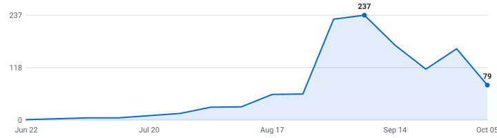

# 🎓 Summer 2027 Mechanical & Aerospace Internships

**A self-updating engine that tracks mechanical & aerospace internships so you don't have to.**

&nbsp;&nbsp;&nbsp;

### 672 open roles (420 listed below) · 142 new this week

4,609 employers tracked · updated Oct 04, 2026 at 12:40 UTC

_411 have a cycle the employer stated · 261 are recent postings whose cycle isn't stated (listed separately, never mixed in)._

**[🖥️ Live dashboard](https://pranavd1437.github.io/mechanical-aerospace-internship-engine/)** · **[📡 RSS](https://pranavd1437.github.io/mechanical-aerospace-internship-engine/feed.xml)** · **[⚙️ JSON API](https://pranavd1437.github.io/mechanical-aerospace-internship-engine/api/jobs.json)**

> [!TIP]
> **⭐ Star this repo** to save it and get updates when new roles are added.

Instead of refreshing a dozen career pages by hand, it reads company hiring feeds directly and keeps one live list — newest roles on top, refreshed automatically every six hours.

**🔔 Alerts without sharing an email:** follow the [RSS feed](https://pranavd1437.github.io/mechanical-aerospace-internship-engine/feed.xml) in any reader. Saved roles stay in your browser.

---

## What this is

This is an engine, not a hand-kept list. It polls company career feeds every six hours, finds the internships, removes duplicates, and rebuilds this page on its own.

Every link comes straight from the source — so it's real and current, not a stale list someone forgot to update. Speed matters.

## What makes this different

| | |
|---|---|
| 📅 **[Drop Radar](#drop-radar)** | A forecast of **what's coming**. Each marquee company's typical opening window, replaced by the real drop date the moment the engine catches it live. Windows are estimates and labelled as such; only dates the engine saw itself are marked verified. |
| 🛂 **Visa intel, computed** | 🇺🇸 / 🛂 flags detected automatically from every job description, plus ✓ for employers with a real H-1B track record (USCIS data, FY2022-23 — a history, not a promise). The big lists crowdsource this by hand; here it's code. Most postings say nothing either way, and those show as unknown rather than guessed. |
| 📆 **A real date on nearly every role** | Taken from the job portal itself wherever the portal states one, so newest-first actually means newest. The exact coverage figure is printed at the bottom of this page every run. |
| 🧰 **Skill tags + pay, extracted** | Every posting's text is scanned for the tools it wants (SolidWorks, GD&T, ANSYS, …) and the pay it states — searchable on the [dashboard](https://pranavd1437.github.io/mechanical-aerospace-internship-engine/), and included in the CSV and API. |
| 🔔 **Alerts your way** | Follow the [RSS feed](https://pranavd1437.github.io/mechanical-aerospace-internship-engine/feed.xml), or connect it to an RSS-capable alert tool. The dashboard's saved roles stay in your browser. |
| ⚙️ **An engine, not a spreadsheet** | 4,729 job-board endpoints (4,609 distinct employers; some run more than one board) polled every six hours across 12 ATS platforms. Full source and tests in this repo. |

## Scope

| | |
|---|---|
| **Roles** | Mechanical design/CAD, structures/FEA, manufacturing/test, thermal/fluids/propulsion, materials, controls/mechatronics, and systems engineering internships |
| **Region** | United States |
| **Cycles** | Summer 2027 and Fall 2026 |

## About

This fork adapts the open-source Internship Engine for a focused mechanical and aerospace search while preserving source-first links and human review before any application.

Use it to spot roles early and apply before they fill up. Being first genuinely helps.

## Where this is going

I'm building this in the open and adding to it as it grows.

**Included:** RSS alerts · the Drop Radar · auto-detected sponsorship flags · the live dashboard

**Mechanical scope:** design/CAD · structures/FEA · manufacturing/test · thermal/fluids/propulsion · materials · controls/mechatronics · systems

If it helps you, a star means a lot and tells me to keep going.

## How to use

<b>Reading the table — flags, dates, and the cycle split</b> (click to expand)

- Roles are grouped by cycle below - **newest posting on top, oldest at the bottom.**
- A cycle section holds only roles whose **employer stated that cycle** - in the title, or in the posting's own text. Postings that name no cycle anywhere are in *Recently posted — cycle not stated* further down, with **no cycle guessed for them**. Same quality bar, different amount of evidence.
- The **Posted** column is the date the company published the role.
- **🆁 after a company name** = **this role is remote** — the posting's own location or title says so. It marks the role on that row, not the whole company.
- **Flags after a role title:** 🇺🇸 = requires U.S. citizenship or a security clearance · 🛂 = the posting says it won't sponsor a work visa · 🆕 = spotted in the last 48 hours. Sponsorship flags are detected automatically from each job description - treat them as a strong hint and confirm on the posting.
- **✓ after a company name** = a real H-1B track record: USCIS approved 10+ petitions for that employer in FY2022–2023 (matched automatically against the official [H-1B Employer Data Hub](https://www.uscis.gov/tools/reports-and-studies/h-1b-employer-data-hub)). No ✓ doesn't mean they won't sponsor - it means we can't prove they have.
- Track your applications with [`data/internships.csv`](data/internships.csv) (opens in Excel / Google Sheets).
- Missing a company? Adding one takes a single line, see [CONTRIBUTING.md](CONTRIBUTING.md).

---

## Summer 2027  (214 employer-stated)

| Company | Role | Category | Location | Skills | Posted | Apply |
|---|---|---|---|---|---|---|
| Muon Space | Industrial Engineering Intern (Summer 2027) 🇺🇸 🆕 | Manufacturing & Quality | San Jose, CA | Python, SQL, CAD, Six Sigma | Oct 02, 2026 | [Apply](https://job-boards.greenhouse.io/muonspace/jobs/5256284007) |
| Muon Space | Environmental Test Engineering Intern (Summer 2027) 🇺🇸 🆕 | Test & Validation | San Jose, CA | Python, C++, MATLAB, Simulink | Oct 02, 2026 | [Apply](https://job-boards.greenhouse.io/muonspace/jobs/5256286007) |
| Anduril | 2027 Industrial Engineer Intern 🆕 | Manufacturing & Quality | Ashville +5 more | SQL, AutoCAD, Six Sigma, Lean Manufacturing | Oct 02, 2026 | [Apply](https://boards.greenhouse.io/andurilindustries/jobs/5255593007?gh_jid=5255593007) |
| Charter Manufacturing | Controls Engineer Intern (Summer 2027) 🆕 | Controls & Mechatronics | Charter Aarrowcast - Shawano, WI | SQL, AutoCAD | Oct 02, 2026 | [Apply](https://chartermfg.wd5.myworkdayjobs.com/Charter_Careers/job/Charter-Aarrowcast---Shawano-WI/Controls-Engineer-Intern--Summer-2027-_R08167) |
| Charter Manufacturing | Smart Manufacturing Engineer Intern (Summer 2027) 🆕 | Manufacturing & Quality | Charter Steel - Saukville, WI | No skills listed | Oct 02, 2026 | [Apply](https://chartermfg.wd5.myworkdayjobs.com/Charter_Careers/job/Charter-Steel---Saukville-WI/Smart-Manufacturing-Engineer-Intern--Summer-2027-_R08133) |
| Northrop Grumman | 2027 Manufacturing Operations and Planning Intern - Huntsville AL 🇺🇸 🆕 | Manufacturing & Quality | United States-Alabama-Huntsville | No skills listed | Oct 02, 2026 | [Apply](https://ngc.wd1.myworkdayjobs.com/Northrop_Grumman_External_Site/job/United-States-Alabama-Huntsville/XMLNAME-2027-Manufacturing-Operations-and-Planning-Intern---Huntsville-AL_R10253263) |
| nVent | Electrical/Controls Engineering Co-Op (January - August 2027) 🆕 | Controls & Mechatronics | Anoka, MN, US | No skills listed | Oct 02, 2026 | [Apply](https://nvent.wd5.myworkdayjobs.com/nVent/job/Anoka-MN-US/Electrical-Controls-Engineering-Co-Op--January---August-2027-_R23894) |
| CoStar Group | Mechanical Engineering Intern 🛂 | Mechanical Design | Sunnyvale (US) | Python, MATLAB, SolidWorks, CAD | Oct 01, 2026 | [Apply](https://costar.wd1.myworkdayjobs.com/Costar_Campus/job/Sunnyvale-US/Mechanical-Engineering-Intern_R39952) |
| Varda Space | Aerodynamics & Analysis Engineering Internship - Summer 2027 🇺🇸 | Thermal, Fluids & Propulsion | El Segundo, California, United States | Python, MATLAB, CFD, Linux | Oct 01, 2026 | [Apply](https://job-boards.greenhouse.io/vardaspace/jobs/8010632003) |
| Stantec ✓ | Mechanical Engineering Intern - Water (Summer 2027) | Mechanical Design | Nashville, TN, United States | CAD | Oct 01, 2026 | [Apply](https://hdhl.fa.us6.oraclecloud.com/hcmUI/CandidateExperience/en/sites/CX_1/job/1008121) |
| Stantec ✓ | Mechanical Engineering Intern - Water (Summer 2027) | Mechanical Design | Lexington, KY, United States | CAD | Oct 01, 2026 | [Apply](https://hdhl.fa.us6.oraclecloud.com/hcmUI/CandidateExperience/en/sites/CX_1/job/1008122) |
| AECOM ✓ | Structural Engineering Intern – Hiring Event with AECOM – Atlanta, GA | Structures & FEA | Atlanta, GA, United States | AutoCAD | Oct 01, 2026 | [Apply](https://jobs.smartrecruiters.com/AECOM2/744000152952229) |
| Allison Transmission ✓ | Manufacturing Engineering Intern - Summer 2027 | Manufacturing & Quality | Indianapolis, IN | No skills listed | Oct 01, 2026 | [Apply](https://allisontransmission.wd1.myworkdayjobs.com/ATI-External/job/Indianapolis-IN/Manufacturing-Engineering-Intern---Summer-2027_R008126) |
| RTX | Product Quality Engineering Co-Op (Summer/Fall 2027) 🇺🇸 | Manufacturing & Quality | US-IA-CEDAR RAPIDS-108 ~ 400 Collins Rd… | No skills listed | Oct 01, 2026 | [Apply](https://globalhr.wd5.myworkdayjobs.com/rec_rtx_ext_gateway/job/US-IA-CEDAR-RAPIDS-108--400-Collins-Rd-NE--BLDG-108/Product-Quality-Engineering-Co-Op--Summer-Fall-2027-_01878918) |
| RTX | Industrial Engineering Co-Op (Spring/Summer 2027) 🇺🇸 | Manufacturing & Quality | US-IA-CEDAR RAPIDS-109 ~ 400 Collins Rd… | SolidWorks, AutoCAD, CAD | Oct 01, 2026 | [Apply](https://globalhr.wd5.myworkdayjobs.com/rec_rtx_ext_gateway/job/US-IA-CEDAR-RAPIDS-109--400-Collins-Rd-NE--BLDG-109/Industrial-Engineering-Co-Op--Spring-Summer-2027-_01871431) |
| RTX | Industrial Engineering Co-Op (Summer/Fall 2027) 🇺🇸 | Manufacturing & Quality | US-IA-CEDAR RAPIDS-109 ~ 400 Collins Rd… | SolidWorks, AutoCAD, CAD | Oct 01, 2026 | [Apply](https://globalhr.wd5.myworkdayjobs.com/rec_rtx_ext_gateway/job/US-IA-CEDAR-RAPIDS-109--400-Collins-Rd-NE--BLDG-109/Industrial-Engineering-Co-Op--Summer-Fall-2027-_01871439) |
| Insulet Corporation ✓ | Co-op - Supplier Quality Engineering: January - June 2027 (Onsite) | Manufacturing & Quality | Acton, Massachusetts | Six Sigma | Oct 01, 2026 | [Apply](https://insulet.wd5.myworkdayjobs.com/insuletcareers/job/Acton-Massachusetts/Co-op---Supplier-Quality-Engineering--January---June-2027--Onsite-_REQ-2026-18125) |
| Northrop Grumman | 2027 Vehicle Engineer Intern 🇺🇸 | Mechanical Design | United States-Mississippi-Iuka | No skills listed | Oct 01, 2026 | [Apply](https://ngc.wd1.myworkdayjobs.com/Northrop_Grumman_External_Site/job/United-States-Mississippi-Iuka/XMLNAME-2027-Vehicle-Engineer-Intern_R10253965) |
| Northrop Grumman | 2027 Structural Engineering Intern Dulles Va 🇺🇸 | Structures & FEA | United States-Virginia-Dulles | No skills listed | Oct 01, 2026 | [Apply](https://ngc.wd1.myworkdayjobs.com/Northrop_Grumman_External_Site/job/United-States-Virginia-Dulles/XMLNAME-2027-Structural-Engineering-Intern-Dulles-Va_R10253912) |
| Zekelman Industries | Intern, Manufacturing Engineer | Manufacturing & Quality | Niles, OH | SolidWorks, AutoCAD, CAD | Oct 01, 2026 | [Apply](https://zekelman.wd12.myworkdayjobs.com/Careers/job/Niles-OH/Intern--Manufacturing-Engineer_JR002843) |
| Varda Space | Guidance, Navigation & Controls (GNC) Internship - Summer 2027 🇺🇸 | Controls & Mechatronics | El Segundo, California, United States | Python, C++, MATLAB, Simulink | Oct 01, 2026 | [Apply](https://job-boards.greenhouse.io/vardaspace/jobs/7865601003) |
| Varda Space | Manufacturing Engineering Internship - Summer 2027 🇺🇸 | Manufacturing & Quality | El Segundo, California, United States | SQL, MATLAB, Siemens NX, CAD | Oct 01, 2026 | [Apply](https://job-boards.greenhouse.io/vardaspace/jobs/8010166003) |
| Allison Transmission ✓ | Quality Engineering Intern - Summer 2027 🇺🇸 | Manufacturing & Quality | Indianapolis, IN | No skills listed | Oct 01, 2026 | [Apply](https://allisontransmission.wd1.myworkdayjobs.com/ATI-External/job/Indianapolis-IN/Quality-Engineering-Intern---Summer-2027_R008206) |
| Generac ✓ | 2027 Summer Intern Digital Manufacturing Engineering | Manufacturing & Quality | Waukesha, WI - USA | Python, Tableau | Oct 01, 2026 | [Apply](https://generac.wd5.myworkdayjobs.com/external/job/Waukesha-WI---USA/XMLNAME-2027-Summer-Intern-Digital-Manufacturing-Engineering_JR16255) |
| Muon Space | Quality Engineering Intern (Summer 2027) 🇺🇸 🆕 | Manufacturing & Quality | San Jose, CA | CAD | Sep 30, 2026 | [Apply](https://job-boards.greenhouse.io/muonspace/jobs/5253432007) |
| Helion Energy | Mechanical Engineering Summer 2027 Intern 🆕 | Mechanical Design | Everett, WA | SolidWorks, Siemens NX, CAD, GD&T | Sep 30, 2026 | [Apply](https://jobs.ashbyhq.com/helion/b73602bd-b644-4a46-9188-fded4b2db606) |
| Hermeus | Loads & Dynamics Engineering Intern - Summer 2027 🇺🇸 | Structures & FEA | Los Angeles, CA | FEA | Sep 30, 2026 | [Apply](https://jobs.lever.co/hermeus/29c10a11-aa02-4d64-83d0-00001cbd3ac0) |
| Allison Transmission ✓ | Manufacturing Engineer Intern - Summer 2027-1 🇺🇸 | Manufacturing & Quality | Indianapolis, IN | No skills listed | Sep 30, 2026 | [Apply](https://allisontransmission.wd1.myworkdayjobs.com/ATI-External/job/Indianapolis-IN/Manufacturing-Engineer-Intern---Summer-2027-1_R008267) |
| Marvell ✓ | Test Engineering Intern, MS - Summer 2027 | Test & Validation | Santa Clara, CA | Python | Sep 30, 2026 | [Apply](https://marvell.wd1.myworkdayjobs.com/marvellcareers2/job/Santa-Clara-CA/Test-Engineering-Intern--MS---Summer-2027_2604002) |
| Watts Water | Production Engineer Intern, Summer 2027 🛂 | Manufacturing & Quality | Fort Worth, TX | CAD, Lean Manufacturing | Sep 30, 2026 | [Apply](https://wattswater.wd5.myworkdayjobs.com/Intern-External/job/Fort-Worth-TX/Production-Engineer-Intern--Summer-2027_10017592) |
| Zekelman Industries | Intern, Manufacturing Engineer | Manufacturing & Quality | Rochelle, IL | SolidWorks, AutoCAD, CAD | Sep 30, 2026 | [Apply](https://zekelman.wd12.myworkdayjobs.com/Careers/job/Rochelle-IL/Intern--Manufacturing-Engineer_JR002824) |
| Zekelman Industries | Intern, Quality Engineer | Manufacturing & Quality | Warren, OH | No skills listed | Sep 30, 2026 | [Apply](https://zekelman.wd12.myworkdayjobs.com/Careers/job/Warren-OH/Intern--Quality-Engineer_JR002821) |
| Helion Energy | Materials Engineering Summer 2027 Intern 🆕 | Materials Engineering | Everett, WA | Python, MATLAB | Sep 29, 2026 | [Apply](https://jobs.ashbyhq.com/helion/56636c72-2c72-4f4f-8334-3b233a235c8d) |
| The Aerospace Corporation | 2027 Structural Mechanics Undergraduate Intern 🇺🇸 | Structures & FEA | El Segundo, CA | Python, MATLAB, FEA | Sep 29, 2026 | [Apply](https://aero.wd5.myworkdayjobs.com/external/job/El-Segundo-CA/XMLNAME-2027-Structural-Mechanics-Undergraduate-Intern_R016763) |
| Freeform | Manufacturing Engineering Intern, CNC Machining (Summer 2027) | Manufacturing & Quality | Los Angeles, CA (On-site) | CNC, CAD, GD&T | Sep 29, 2026 | [Apply](https://job-boards.greenhouse.io/freeformfuturecorp/jobs/8004101003) |
| Insulet Corporation ✓ | Co-op, Manufacturing: January - June 2027 (Onsite) | Manufacturing & Quality | Irvine, California | SolidWorks, Six Sigma, Lean Manufacturing | Sep 29, 2026 | [Apply](https://insulet.wd5.myworkdayjobs.com/insuletcareers/job/Irvine-California/Co-op--Manufacturing--January---June-2027--Onsite-_REQ-2026-18119) |
| Leidos ✓ | Electrical Hardware Design Engineering Intern 🇺🇸 | Mechanical Design | Huntsville, AL | Python, C++, MATLAB, Verilog | Sep 29, 2026 | [Apply](https://leidos.wd5.myworkdayjobs.com/External/job/Huntsville-AL/Electrical-Hardware-Design-Engineering-Intern_R-00193413) |
| The Toro Company | Manufacturing Engineer Intern - Ditch Witch 🛂 | Manufacturing & Quality | Perry, OK | SolidWorks, AutoCAD, ANSYS | Sep 29, 2026 | [Apply](https://ttc.wd1.myworkdayjobs.com/Toro_External_Careers/job/Perry-OK/Manufacturing-Engineer-Intern---Ditch-Witch_JR17449) |
| Ralliant | Manufacturing Engineering Intern - Summer 2027 | Manufacturing & Quality | Boxborough, MA, United States | SolidWorks, AutoCAD, CAD, Lean Manufacturing | Sep 29, 2026 | [Apply](https://ibwujb.fa.ocs.oraclecloud.com/hcmUI/CandidateExperience/en/sites/CX_1001/job/10680) |
| Ralliant | Manufacturing Engineering Intern - Summer 2027 | Manufacturing & Quality | Plainville, CT, United States | SolidWorks, AutoCAD, CAD, Lean Manufacturing | Sep 29, 2026 | [Apply](https://ibwujb.fa.ocs.oraclecloud.com/hcmUI/CandidateExperience/en/sites/CX_1001/job/10681) |
| nVent | Manufacturing Automaton Intern (June - August 2027) 🛂 | Manufacturing & Quality | Anoka, MN, US | No skills listed | Sep 29, 2026 | [Apply](https://nvent.wd5.myworkdayjobs.com/nVent/job/Anoka-MN-US/Manufacturing-Automaton-Intern--June---August-2027-_R23865) |
| General Motors ✓ | 2027 Summer Intern – Motorsports Aero-Thermal Engineering | Thermal, Fluids & Propulsion | Milford +2 more | CAD, CFD, Computer Vision | Sep 28, 2026 | [Apply](https://generalmotors.wd5.myworkdayjobs.com/Careers_GM/job/Milford-Michigan-United-States-of-America/XMLNAME-2027-Summer-Intern---Motorsports-Aero-Thermal-Engineering_JR-202619861) |
| Zurn Elkay Water Solutions | Industrial Engineering Intern (Summer 2027) | Manufacturing & Quality | Freeport, IL | AutoCAD | Sep 28, 2026 | [Apply](https://elkay.wd1.myworkdayjobs.com/Elkay_External/job/Freeport-IL/Industrial-Engineering-Intern--Summer-2027-_REQ-020072) |
| AtkinsRéalis | Structural Engineering Intern – Summer 2027 | Structures & FEA | US.CO.Denver | No skills listed | Sep 28, 2026 | [Apply](https://slihrms.wd3.myworkdayjobs.com/careers/job/USCODenver/Structural-Engineering-Intern---Summer-2027_R-161182-1) |
| AtkinsRéalis | Structural Engineering Intern – Summer 2027 | Structures & FEA | US.WA.Bothell | AutoCAD, CAD | Sep 28, 2026 | [Apply](https://slihrms.wd3.myworkdayjobs.com/careers/job/USWABothell/Structural-Engineering-Intern---Summer-2027_R-162449-1) |
| Eversource Energy | 2027 Co-op: Substation Design Engineering | Mechanical Design | Westwood, MA | No skills listed | Sep 28, 2026 | [Apply](https://eversource.wd1.myworkdayjobs.com/ExternalSite/job/Westwood-MA/XMLNAME-2027-Co-op--Substation-Design-Engineering_R-031701) |
| Mars | Summer 2027 Mars Petcare Manufacturing Internship | Manufacturing & Quality | USA-Arkansas-Ft. Smith | No skills listed | Sep 28, 2026 | [Apply](https://mars.wd3.myworkdayjobs.com/external/job/USA-Arkansas-Ft-Smith/Summer-2027-Mars-Petcare-Manufacturing-Internship_R168212-1) |
| AECOM ✓ | Mechanical Engineering Intern - Hiring Event with AECOM - Arlington, VA | Mechanical Design | Arlington, VA, United States | AutoCAD | Sep 28, 2026 | [Apply](https://jobs.smartrecruiters.com/AECOM2/744000152172269) |
| Life Fitness ✓ | Manufacturing Quality Engineering Intern - Owatonna, MN | Manufacturing & Quality | Owatonna, MN | Six Sigma, Lean Manufacturing | Sep 25, 2026 | [Apply](https://lifefitness.wd1.myworkdayjobs.com/searchLFN/job/Owatonna-MN/Manufacturing-Quality-Engineering-Intern---Owatonna--MN_JR-025245) |
| Watts Water | Production Engineer Intern, Summer 2027 | Manufacturing & Quality | Fort Worth, TX | CAD, Lean Manufacturing | Sep 25, 2026 | [Apply](https://wattswater.wd5.myworkdayjobs.com/Intern-External/job/Fort-Worth-TX/Production-Engineer-Intern--Summer-2027_10017591) |
| Rocket Lab | Test Engineering Intern Summer 2027 🇺🇸 | Test & Validation | Wallops Island, VA | Python, Siemens NX, CAD, CAM | Sep 24, 2026 | [Apply](https://job-boards.greenhouse.io/rocketlab/jobs/8003529003) |
| iRhythm Technologies ✓ | Electrical Test Engineering Co-op Intern January-June 2027 | Test & Validation | San Francisco, CA | Python | Sep 24, 2026 | [Apply](https://irhythmtech.wd5.myworkdayjobs.com/irhythm/job/San-Francisco-CA/Electrical-Test-Engineering-Co-op-Intern-January-June-2027_JR1785) |
| iRhythm Technologies ✓ | Mechanical Engineering Co-op Full Time Intern Jan - June 2027 | Mechanical Design | San Francisco, CA | SolidWorks | Sep 24, 2026 | [Apply](https://irhythmtech.wd5.myworkdayjobs.com/irhythm/job/San-Francisco-CA/Mechanical-Engineering-Co-op-Full-Time-Intern-Jan---June-2027_JR1766) |
| iRhythm Technologies ✓ | System Test Engineer Co-Op Full Time Intern Jan-June 2027 | Test & Validation | San Francisco, CA | Python, SQL | Sep 24, 2026 | [Apply](https://irhythmtech.wd5.myworkdayjobs.com/irhythm/job/San-Francisco-CA/System-Test-Engineer-Co-Op-Full-Time-Intern-Jan-June-2027_JR1781) |
| Mill | Product Design Engineering Intern, Summer 2027 🛂 | Mechanical Design | San Bruno, California | Siemens NX, CAD, FEA, DFM/DFA | Sep 24, 2026 | [Apply](https://job-boards.greenhouse.io/mill/jobs/4737767005) |
| The Toro Company | Mechanical Engineer Intern - The Toro Company 🛂 | Mechanical Design | Bloomington, MN | No skills listed | Sep 24, 2026 | [Apply](https://ttc.wd1.myworkdayjobs.com/Toro_External_Careers/job/Bloomington-MN/Mechanical-Engineer-Intern---The-Toro-Company_JR17112) |
| ZOLL Medical Corporation | Mechanical Engineering Intern | Mechanical Design | Chelmsford, MA | SolidWorks | Sep 24, 2026 | [Apply](https://zoll.wd5.myworkdayjobs.com/ZOLLMedicalCorp/job/Chelmsford-MA/Mechanical-Engineering-Intern_R20310) |
| Continental | 2027 Internship - Manufacturing Engineer (Hoosier Racing Tire) | Manufacturing & Quality | Plymouth, IN, United States | No skills listed | Sep 23, 2026 | [Apply](https://jobs.smartrecruiters.com/Continental/744000151462939) |
| The Aerospace Corporation | 2027 Flight Loads Structural Dynamics Undergraduate Intern 🇺🇸 | Structures & FEA | El Segundo, CA | Python, MATLAB, FEA | Sep 23, 2026 | [Apply](https://aero.wd5.myworkdayjobs.com/external/job/El-Segundo-CA/XMLNAME-2027-Flight-Loads-Structural-Dynamics-Undergraduate-Intern_R016671) |
| The Aerospace Corporation | 2027 Structural Dynamics Undergraduate Intern 🇺🇸 | Structures & FEA | El Segundo, CA | Python, MATLAB, FEA | Sep 23, 2026 | [Apply](https://aero.wd5.myworkdayjobs.com/external/job/El-Segundo-CA/XMLNAME-2027-Structural-Dynamics-Undergraduate-Intern_R016668) |
| Philips | Co-op - Global Supplier Quality Approved Supplier List (ASL) - Murrysville, PA - January-June 2027 | Manufacturing & Quality | Murrysville, Pennsylvania, United States | No skills listed | Sep 23, 2026 | [Apply](https://philips.wd3.myworkdayjobs.com/jobs-and-careers/job/Murrysville-Pennsylvania-United-States/Co-op---Global-Supplier-Quality-Approved-Supplier-List--ASL----Murrysville--PA---January-June-2027_590536) |
| Philips | Co-op - Supplier Quality Engineer - Murrysville, PA - January-June 2027 | Manufacturing & Quality | Murrysville, Pennsylvania, United States | No skills listed | Sep 23, 2026 | [Apply](https://philips.wd3.myworkdayjobs.com/jobs-and-careers/job/Murrysville-Pennsylvania-United-States/Co-op---Supplier-Quality-Engineer---Murrysville--PA---January-June-2027_590233) |
| Generac ✓ | Mechanical Engineering Intern - Transfer Switch - Summer 2027 | Mechanical Design | Waukesha, WI - USA | AutoCAD, CAD, Tolerance Analysis | Sep 23, 2026 | [Apply](https://generac.wd5.myworkdayjobs.com/external/job/Waukesha-WI---USA/Mechanical-Engineering-Intern---Transfer-Switch---Summer-2027_JR17048) |
| Marvell ✓ | Security Verification/Validation Engineer Intern, BS - Summer 2027 | Test & Validation | Chandler, AZ | Linux, Verilog | Sep 23, 2026 | [Apply](https://marvell.wd1.myworkdayjobs.com/marvellcareers2/job/Chandler-AZ/Security-Verification-Validation-Engineer-Intern--BS---Summer-2027_2604148) |
| Life Fitness ✓ | Manufacturing Engineering Intern - Ramsey, MN | Manufacturing & Quality | Ramsey, MN | CAD | Sep 22, 2026 | [Apply](https://lifefitness.wd1.myworkdayjobs.com/searchLFN/job/Ramsey-MN/Manufacturing-Engineering-Intern---Ramsey--MN_JR-025239) |
| Hermeus | Build Reliability Engineering Intern - Spring/Summer 2027 🇺🇸 | Test & Validation | Atlanta, GA | No skills listed | Sep 22, 2026 | [Apply](https://jobs.lever.co/hermeus/ee3a4109-b6e7-4ed5-8981-a483b3936e5a) |
| Moog | Intern, Test Engineering | Test & Validation | Buffalo, NY | No skills listed | Sep 22, 2026 | [Apply](https://moog.wd5.myworkdayjobs.com/moog_external_career_site/job/Buffalo-NY/Intern--Test-Engineering_R-26-20243-1) |
| Formlabsinternships | Mechanical Engineering Intern (Summer 2027) | Mechanical Design | Somerville, MA | CAD | Sep 21, 2026 | [Apply](https://job-boards.greenhouse.io/formlabsinternships/jobs/8199928) |
| Brunswick ✓ | Mercury Marine: Intern Design Analysis Group-Fluid & Thermal | Thermal, Fluids & Propulsion | Fond du Lac, WI | CFD | Sep 21, 2026 | [Apply](https://brunswick.wd1.myworkdayjobs.com/search/job/Fond-du-Lac-WI/Mercury-Marine--Intern-Design-Analysis-Group-Fluid---Thermal_JR-050977) |
| Shield AI | Summer 2027 - Mechanical Engineering Intern | Mechanical Design | Seattle, Washington | SolidWorks, Siemens NX, CATIA, CAD | Sep 21, 2026 | [Apply](https://jobs.lever.co/shieldai/da54c482-fe62-4f60-98b1-55ac0b82b3bc) |
| Rocket Lab | Thermal Engineering Intern Summer 2027 🇺🇸 | Thermal, Fluids & Propulsion | Long Beach, CA | CAD, FEA, CAM | Sep 21, 2026 | [Apply](https://job-boards.greenhouse.io/rocketlab/jobs/8000958003) |
| Avav | Summer 2027 Autonomy & Robotics Engineering Intern 🇺🇸 | Controls & Mechatronics | Moorpark, CA | Python, C++, MATLAB, Computer Vision | Sep 21, 2026 | [Apply](https://avav.wd1.myworkdayjobs.com/avav/job/Moorpark-CA/Summer-2027-Autonomy---Robotics-Engineering-Intern_8551) |
| Charter Manufacturing | Mechanical Engineer Intern (Summer 2027) | Mechanical Design | Charter Steel - Saukville, WI | SolidWorks, AutoCAD, Lean Manufacturing | Sep 21, 2026 | [Apply](https://chartermfg.wd5.myworkdayjobs.com/Charter_Careers/job/Charter-Steel---Saukville-WI/Mechanical-Engineering-Intern--Year-Round-_R08122) |
| Draper | Mechanical Engineering & System Packaging Intern (Summer 2027) 🇺🇸 | Mechanical Design | Cambridge, MA | SolidWorks, Creo, CAD, ANSYS | Sep 21, 2026 | [Apply](https://draper.wd5.myworkdayjobs.com/Draper_Careers/job/Cambridge-MA/Mechanical-Engineering---System-Packaging-Intern--Summer-2027-_JR002943) |
| Zurn Elkay Water Solutions | Mechanical Engineering Intern (Summer 2027) | Mechanical Design | Paso Robles, CA | AutoCAD | Sep 21, 2026 | [Apply](https://elkay.wd1.myworkdayjobs.com/Elkay_External/job/Paso-Robles-CA/Mechanical-Engineering-Intern--Summer-2027-_REQ-020111) |
| Life Fitness ✓ | Mechanical Engineering Intern - Ramsey, MN | Mechanical Design | Ramsey, MN | SolidWorks, CAD, FEA, Tolerance Analysis | Sep 21, 2026 | [Apply](https://lifefitness.wd1.myworkdayjobs.com/searchLFN/job/Ramsey-MN/Mechanical-Engineering-Intern---Ramsey--MN_JR-025235) |
| The Toro Company | Quality Engineer Intern - Ditch Witch 🛂 | Manufacturing & Quality | Perry, OK | No skills listed | Sep 21, 2026 | [Apply](https://ttc.wd1.myworkdayjobs.com/Toro_External_Careers/job/Perry-OK/Quality-Engineer-Intern---Ditch-Witch_JR17218) |
| United Parcel Service (UPS) | 2027 Americas Region Industrial Engineering Summer Intern 🇺🇸 | Manufacturing & Quality | US - UPS CORPORATE OFFICES (GACOR) | No skills listed | Sep 18, 2026 | [Apply](https://hcmportal.wd5.myworkdayjobs.com/Search/job/US---UPS-CORPORATE-OFFICES-GACOR/XMLNAME-2027-Americas-Region-Industrial-Engineering-Summer-Intern_R26032989) |
| Philips | Co-op - Design Engineering - Latham, NY - January-June 2027 | Mechanical Design | Latham, New York, United States | No skills listed | Sep 18, 2026 | [Apply](https://philips.wd3.myworkdayjobs.com/jobs-and-careers/job/Latham-New-York-United-States/Co-op---Design-Engineering---Latham--NY---January-June-2027_590362) |
| Alcon ✓ | 2027 Spring/Summer Co-Op - Manufacturing Engineer 🛂 | Manufacturing & Quality | Fort Worth, Texas | C++, CAD | Sep 18, 2026 | [Apply](https://alcon.wd5.myworkdayjobs.com/careers_alcon/job/Fort-Worth-Texas/XMLNAME-2027-Spring-Summer-Co-Op---Manufacturing-Engineer_R-2026-49587) |
| Watts Water | Manufacturing Quality Intern, Summer 2027 | Manufacturing & Quality | Fort Myers, FL | Six Sigma, Lean Manufacturing | Sep 18, 2026 | [Apply](https://wattswater.wd5.myworkdayjobs.com/Intern-External/job/Fort-Myers-FL/Manufacturing-Quality-Intern--Summer-2027_10017584) |
| Rocket Lab | Test Engineering Intern Summer 2027 🇺🇸 | Test & Validation | Stennis Space Center, MS | Python, Java, MATLAB, CAD | Sep 17, 2026 | [Apply](https://job-boards.greenhouse.io/rocketlab/jobs/7990350003) |
| Lowe's | Store Operations Industrial Engineering – Undergrad Internship – Summer 2027 | Manufacturing & Quality | Mooresville, NC (SSC) 1999 | No skills listed | Sep 17, 2026 | [Apply](https://lowes.wd5.myworkdayjobs.com/LWS_External_CS/job/Mooresville-NC-SSC-1999/Store-Operations-Industrial-Engineering---Undergrad-Internship---Summer-2027_JR-02651868-1) |
| nVent | Electrical/Controls Engineering Co-Op (June - December 2027) | Controls & Mechatronics | Anoka, MN, US | No skills listed | Sep 17, 2026 | [Apply](https://nvent.wd5.myworkdayjobs.com/nVent/job/Anoka-MN-US/Electrical-Controls-Engineering-Co-Op_R23626) |
| X-energy | Mechanical Engineering Internship - Summer 2027 | Mechanical Design | Rockville, MD | SolidWorks, Siemens NX, CAD, ANSYS | Sep 17, 2026 | [Apply](https://xenergy.wd5.myworkdayjobs.com/X-energyUS/job/Rockville-MD/Mechanical-Engineering-Internship---Summer-2027_R101319-1) |
| X-energy | Test Engineering Internship - Summer 2027 | Test & Validation | Rockville, MD | No skills listed | Sep 17, 2026 | [Apply](https://xenergy.wd5.myworkdayjobs.com/X-energyUS/job/Rockville-MD/Test-Engineering-Internship---Summer-2027_R101320-1) |
| Bass Pro Shops | Advanced Manufacturing Intern Summer 2027 | Manufacturing & Quality | Springfield +1 more | No skills listed | Sep 16, 2026 | [Apply](https://basspro.wd1.myworkdayjobs.com/careers/job/Springfield-MO-Bass-Pro-Shops-Base-Camp/Advanced-Manufacturing-Intern-Summer-2027_R267458) |
| Rendezvous Robotics | GNC Intern (Summer 2027) 🇺🇸 | Controls & Mechatronics | Golden, CO | Python, C++, MATLAB, Simulink | Sep 16, 2026 | [Apply](https://job-boards.greenhouse.io/rendezvousrobotics/jobs/4408587009) |
| Rendezvous Robotics | Mechanical Engineering Intern (Summer 2027) 🇺🇸 | Mechanical Design | Golden, CO | SolidWorks, Siemens NX, CAD, ANSYS | Sep 16, 2026 | [Apply](https://job-boards.greenhouse.io/rendezvousrobotics/jobs/4408601009) |
| ABB ✓ | Quality Engineering Intern - Summer 2027 🛂 | Manufacturing & Quality | New Berlin +2 more | No skills listed | Sep 16, 2026 | [Apply](https://abb.wd3.myworkdayjobs.com/external_career_page/job/New-Berlin-Wisconsin-United-States-of-America/Quality-Engineering-Intern---Summer-2027_JR00047273) |
| Insulet Corporation ✓ | Co-op, R&D Mechanical Engineering: January - June 2027 (Hybrid) | Mechanical Design | Acton, Massachusetts | MATLAB, SolidWorks, CAD, ANSYS | Sep 16, 2026 | [Apply](https://insulet.wd5.myworkdayjobs.com/insuletcareers/job/Acton-Massachusetts/Co-op--R-D-Mechanical-Engineering--January---June-2027--Hybrid-_REQ-2026-18007) |
| Sensata ✓ | Mechanical Engineer Intern (Aerospace) - Summer 2027 🇺🇸 | Mechanical Design | Thousand Oaks, CA | No skills listed | Sep 16, 2026 | [Apply](https://sensata.wd1.myworkdayjobs.com/Sensata-Careers/job/Thousand-Oaks-CA/Mechanical-Engineer-Intern--Aerospace----Summer-2027_IRC98482) |
| Sensata ✓ | Mechanical Engineer Intern (Aerospace) - Summer 2027 🇺🇸 | Mechanical Design | Vista, CA | No skills listed | Sep 16, 2026 | [Apply](https://sensata.wd1.myworkdayjobs.com/Sensata-Careers/job/Vista-CA/Mechanical-Engineer-Intern--Aerospace----Summer-2027_IRC98483) |
| Duracell | PS Manufacturing - Engineering Intern Spring/Summer 2027 | Manufacturing & Quality | Cleveland, TN, United States | SolidWorks, AutoCAD | Sep 16, 2026 | [Apply](https://fa-ewub-saasfaprod1.fa.ocs.oraclecloud.com/hcmUI/CandidateExperience/en/sites/CX_26/job/1399) |
| Duracell | PS Manufacturing -Engineering Co-Op-2027 | Manufacturing & Quality | Cleveland, TN, United States | No skills listed | Sep 16, 2026 | [Apply](https://fa-ewub-saasfaprod1.fa.ocs.oraclecloud.com/hcmUI/CandidateExperience/en/sites/CX_26/job/1400) |
| AECOM ✓ | Mechanical Engineering Intern – Hiring Event with AECOM – New York City | Mechanical Design | New York, NY, United States | AutoCAD | Sep 16, 2026 | [Apply](https://jobs.smartrecruiters.com/AECOM2/744000149913009) |
| Avery Dennison ✓ | RFID New Product Development Engineering Intern Summer 2027 🛂 | Mechanical Design | Fletcher, NC, United States | Python, C#, CNC | Sep 16, 2026 | [Apply](https://jobs.smartrecruiters.com/AveryDennison/744000149895029) |
| Teledyne | EADSIM MBSE Intern (Summer 2027) 🇺🇸 | Systems Engineering | US - Huntsville, AL | Git | Sep 16, 2026 | [Apply](https://flir.wd1.myworkdayjobs.com/flircareers/job/US---Huntsville-AL/EADSIM-MBSE-Intern--Summer-2027-_REQ36670-1) |
| Lonza ✓ | Summer 2027 Manufacturing, Science & Technology Internship | Manufacturing & Quality | US - Portsmouth, NH | No skills listed | Sep 16, 2026 | [Apply](https://lonza.wd3.myworkdayjobs.com/lonza_careers/job/US---Portsmouth-NH/Summer-2026-Manufacturing--Science---Technology-Internship_R79570) |
| Everest | 2027 Everest Design Engineering Internship Program | Mechanical Design | Warren, NJ | No skills listed | Sep 15, 2026 | [Apply](https://everestre.wd5.myworkdayjobs.com/careers/job/Warren-NJ/XMLNAME-2027-Everest-Design-Engineering-Internship-Program_R7401) |
| Brunswick ✓ | Mercury Marine: Industrial Engineer Intern | Manufacturing & Quality | Brownsburg, IN | No skills listed | Sep 15, 2026 | [Apply](https://brunswick.wd1.myworkdayjobs.com/search/job/Brownsburg-IN/Mercury-Marine--Industrial-Engineer-Intern_JR-051584) |
| TreeHouse Foods | Packaging Engineer Co-Op 2027 | Mechanical Design | USA-IL Oak Brook | No skills listed | Sep 15, 2026 | [Apply](https://treehouse.wd1.myworkdayjobs.com/TreeHouseCareers/job/USA-IL-Oak-Brook/Packaging-Engineer-Co-Op-2027_R30987) |
| TreeHouse Foods | Packaging Engineer Co-Op 2027 | Mechanical Design | USA-IL Oak Brook | No skills listed | Sep 15, 2026 | [Apply](https://treehouse.wd1.myworkdayjobs.com/TreeHouseCareers/job/USA-IL-Oak-Brook/Packaging-Engineer-Co-Op-2027_R30988) |
| Johnson & Johnson | Mechatronics & Systems Integration Intern - R&D | Controls & Mechatronics | Santa Clara +2 more | Python, C++ | Sep 15, 2026 | [Apply](https://jj.wd5.myworkdayjobs.com/JJ/job/Santa-Clara-California-United-States-of-America/Mechatronics---Systems-Integration-Intern---R-D_R-099833) |
| Woodward Governor | Engineering Co-op - Design Engineering / Zeeland, MI (Summer 2027) 🇺🇸 | Mechanical Design | Zeeland, MI, US | No skills listed | Sep 15, 2026 | [Apply](https://woodward.wd5.myworkdayjobs.com/woodward/job/Zeeland-MI-US/Engineering-Co-op---Design-Engineering---Zeeland--MI--Summer-2027-_JR112252) |
| Woodward Governor | Engineering Co-op - Manufacturing Engineering / Zeeland, MI (Summer 2027) | Manufacturing & Quality | Zeeland, MI, US | No skills listed | Sep 15, 2026 | [Apply](https://woodward.wd5.myworkdayjobs.com/woodward/job/Zeeland-MI-US/Engineering-Co-op---Manufacturing-Engineering---Zeeland--MI--Summer-2027-_JR112088) |
| Bedrock Robotics | 2027 Internship Hardware Engineer, Machine Integration & Test | Test & Validation | San Francisco, CA | SolidWorks, CAD | Sep 14, 2026 | [Apply](https://jobs.ashbyhq.com/bedrock-robotics/c9c08251-6a42-4f9c-be4d-2621995cc8f9) |
| Anduril | 2027 Manufacturing Optimization Engineer Intern | Manufacturing & Quality | Ashville, Ohio, United States | Computer Vision | Sep 14, 2026 | [Apply](https://boards.greenhouse.io/andurilindustries/jobs/5236893007?gh_jid=5236893007) |
| Zurn Elkay Water Solutions | Industrial Engineering Intern (Summer 2027) | Manufacturing & Quality | Freeport, IL | AutoCAD | Sep 14, 2026 | [Apply](https://elkay.wd1.myworkdayjobs.com/Elkay_External/job/Freeport-IL/Industrial-Engineering-Intern--Summer-2027-_REQ-020073) |
| General Motors ✓ | 2027 Summer Intern – Motorsports Aerodynamics | Thermal, Fluids & Propulsion | Concord +2 more | CAD, CFD, Computer Vision | Sep 14, 2026 | [Apply](https://generalmotors.wd5.myworkdayjobs.com/Careers_GM/job/Concord-North-Carolina-United-States-of-America/XMLNAME-2027-Summer-Intern---Motorsports-Aerodynamics_JR-202620069) |
| General Motors ✓ | 2027 Summer Inter - Supplier Quality Intern | Manufacturing & Quality | Warren +2 more | GD&T, Six Sigma, Lean Manufacturing | Sep 14, 2026 | [Apply](https://generalmotors.wd5.myworkdayjobs.com/Careers_GM/job/Warren-Michigan-United-States-of-America/XMLNAME-2027-Summer-Inter---Supplier-Quality-Intern_JR-202619692) |
| Johnson & Johnson | Mechanical Engineering Intern - Robotics R&D 🛂 | Mechanical Design | Santa Clara +2 more | CAD | Sep 14, 2026 | [Apply](https://jj.wd5.myworkdayjobs.com/JJ/job/Santa-Clara-California-United-States-of-America/Mechanical-Engineering-Intern---Robotics-R-D_R-099647-1) |
| The Walt Disney Company | Disneyland Resort Industrial Engineering Intern, Summer 2027 | Manufacturing & Quality | Anaheim, CA, USA | No skills listed | Sep 14, 2026 | [Apply](https://disney.wd5.myworkdayjobs.com/disneycareer/job/Anaheim-CA-USA/Disneyland-Resort-Industrial-Engineering-Intern--Summer-2027_10159978-1) |
| The Walt Disney Company | Walt Disney World Industrial Engineering Intern, Summer/Fall 2027 | Manufacturing & Quality | Lake Buena Vista, FL, USA | No skills listed | Sep 14, 2026 | [Apply](https://disney.wd5.myworkdayjobs.com/disneycareer/job/Lake-Buena-Vista-FL-USA/Walt-Disney-World-Industrial-Engineering-Intern--Summer-Fall-2027_10159994-1) |
| Xcimer Energy | Summer 2027 Internship - Mechanical Engineering 🇺🇸 | Mechanical Design | Denver, CO | CAD, FEA | Sep 11, 2026 | [Apply](https://jobs.lever.co/xcimer/c672a37e-007d-45ee-a4f9-b5d4dd25a2e3) |
| Saab | Mechanical Engineer Co-Op (Summer 2027) 🇺🇸 | Mechanical Design | East Syracuse, NY (Aspen Park) | SolidWorks | Sep 11, 2026 | [Apply](https://saabusa.wd1.myworkdayjobs.com/saab_careers/job/East-Syracuse-NY-Aspen-Park/Mechanical-Engineer-Co-Op--Summer-2027-_R-03261-1) |
| Graco | Manufacturing Engineering Intern - Summer 2027 🛂 | Manufacturing & Quality | Sioux Falls, South Dakota, USA | SolidWorks, Creo, AutoCAD | Sep 11, 2026 | [Apply](https://graco.wd501.myworkdayjobs.com/Graco_Careers/job/Sioux-Falls-South-Dakota-USA/Manufacturing-Engineering-Intern---Summer-2027_R0023643) |
| Momentive ✓ | Summer 2027- Polymers and New Product Development Production Engineer Intern | Manufacturing & Quality | US WV Friendly | Six Sigma, Lean Manufacturing | Sep 11, 2026 | [Apply](https://momentive.wd1.myworkdayjobs.com/MC/job/US-WV-Friendly/Summer-2027--Polymers-and-New-Product-Development-Production-Engineer-Intern_R9799) |
| Momentive ✓ | Summer 2027 Reliability Engineer Intern | Test & Validation | US WV Friendly | No skills listed | Sep 11, 2026 | [Apply](https://momentive.wd1.myworkdayjobs.com/MC/job/US-WV-Friendly/Summer-2027-Reliability-Engineer-Intern_R9818-1) |
| Bedrock Robotics | 2027 Internship Validation & Verification Test Engineer | Test & Validation | San Francisco, CA | Python | Sep 10, 2026 | [Apply](https://jobs.ashbyhq.com/bedrock-robotics/c396dedc-06ec-4a23-8408-0194e360f30e) |
| Bracco | Mechanical Engineering Co-op (R&D Sustaining) 🛂 | Mechanical Design | USA, Eden Prairie, Minnesota, 55344 | No skills listed | Sep 09, 2026 | [Apply](https://bracco.wd103.myworkdayjobs.com/braccocareers/job/USA-Eden-Prairie-Minnesota-55344/Mechanical-Engineering-Co-op--R-D-Sustaining-_JR100317) |
| Pacific Fusion | Summer 2027 Internship- Mechanical Engineering 🇺🇸 | Mechanical Design | San Leandro +3 more | Python, MATLAB, SolidWorks, Creo | Sep 09, 2026 | [Apply](https://job-boards.greenhouse.io/pacificfusion/jobs/4398312009) |
| Pacific Fusion | Summer 2027 Internship-Manufacturing Engineering 🇺🇸 | Manufacturing & Quality | San Leandro +3 more | Python, MATLAB, CAD | Sep 09, 2026 | [Apply](https://job-boards.greenhouse.io/pacificfusion/jobs/4398388009) |
| HMH | Manufacturing Shop Operations Intern | Manufacturing & Quality | Houston, TX | No skills listed | Sep 09, 2026 | [Apply](https://hmhw.wd12.myworkdayjobs.com/hmh_careers/job/Houston-TX/Manufacturing-Shop-Operations-Intern_JR102389) |
| HMH | Mechanical Engineering Intern | Mechanical Design | Houston, TX | No skills listed | Sep 09, 2026 | [Apply](https://hmhw.wd12.myworkdayjobs.com/hmh_careers/job/Houston-TX/Mechanical-Engineering-Intern_JR102383) |
| J.M. Smucker | Packaging Engineering Intern- 2027, 6-8 month Co-Op | Mechanical Design | Orrville, OH | No skills listed | Sep 09, 2026 | [Apply](https://smucker.wd5.myworkdayjobs.com/US_External_Careers/job/Orrville-OH/Packaging-Engineering-Intern--2027--6-8-month-Co-Op_115697) |
| Saronic | Manufacturing Engineer Intern (Summer 2027) 🇺🇸 | Manufacturing & Quality | Franklin, LA | Lean Manufacturing | Sep 09, 2026 | [Apply](https://jobs.ashbyhq.com/saronic/2b037fca-754c-4077-b224-eb35cf2b2b97) |
| Saronic | Mechanical Engineer Intern (Summer 2027) 🇺🇸 | Mechanical Design | Austin, TX | SolidWorks, AutoCAD, CAD, CFD | Sep 09, 2026 | [Apply](https://jobs.ashbyhq.com/saronic/f52ae6eb-7eba-4c64-97c7-57e2a234e088) |
| Allegion | Summer Intern - Controls Engineering | Controls & Mechatronics | Indianapolis, IN - Tobey Dr | No skills listed | Sep 09, 2026 | [Apply](https://allegion.wd5.myworkdayjobs.com/careers/job/Indianapolis-IN---Tobey-Dr/Summer-Intern---Controls-Engineering_JR37366-1) |
| Momentive ✓ | Summer 2027 Intern - Waterford Manufacturing Engineering | Manufacturing & Quality | US NY Waterford | No skills listed | Sep 09, 2026 | [Apply](https://momentive.wd1.myworkdayjobs.com/MC/job/US-NY-Waterford/Summer-2027-Intern---Waterford-Manufacturing-Engineering_R9885) |
| Bosch ✓ | Manufacturing Engineer Intern - Summer 2027 | Manufacturing & Quality | Lincolnshire, IL, United States | Creo, CAD, FMEA | Sep 09, 2026 | [Apply](https://jobs.smartrecruiters.com/BoschGroup/744000148518808) |
| Bosch ✓ | Manufacturing Engineer Intern - Summer 2027 | Manufacturing & Quality | Lincolnshire, IL, United States | Creo, CAD, FMEA | Sep 09, 2026 | [Apply](https://jobs.smartrecruiters.com/BoschGroup/744000148542054) |
| Graco | Automation Engineering Co-Op (January - August 2027) 🛂 | Controls & Mechatronics | Rogers +2 more | AutoCAD, CAD, React | Sep 09, 2026 | [Apply](https://graco.wd501.myworkdayjobs.com/Graco_Careers/job/Rogers-Minnesota-USA-David-Koch-Center/Automation-Engineering-Co-Op--January---August-2027-_R0023586) |
| Graco | Manufacturing Engineering (Operational Technology) Co-op (January - August 2027) 🛂 | Manufacturing & Quality | Rogers +2 more | AutoCAD, CAD, React | Sep 09, 2026 | [Apply](https://graco.wd501.myworkdayjobs.com/Graco_Careers/job/Rogers-Minnesota-USA-David-Koch-Center/Manufacturing-Engineering--Operational-Technology--Co-op--January---August-2027-_R0023574) |
| Moog | Intern, Design Engineering | Mechanical Design | Mineral Wells, TX | No skills listed | Sep 09, 2026 | [Apply](https://moog.wd5.myworkdayjobs.com/moog_external_career_site/job/Mineral-Wells-TX/Intern--Design-Engineering_R-26-19881) |
| Moog | Intern, Design Engineering | Mechanical Design | Mineral Wells, TX | No skills listed | Sep 09, 2026 | [Apply](https://moog.wd5.myworkdayjobs.com/moog_external_career_site/job/Mineral-Wells-TX/Intern--Design-Engineering_R-26-19882) |
| Allen Control Systems | Manufacturing Engineering Co-op / Intern, 2027 | Manufacturing & Quality | Pflugerville, TX | SolidWorks, Creo, CAD, GD&T | Sep 09, 2026 | [Apply](https://jobs.ashbyhq.com/allen-control-systems/e7cefcf6-7322-43ba-861e-22e76f8186bd) |
| Lawrence Livermore National Laboratory (LLNL) | Materials Engineering Division (MED): Undergraduate Intern - Summer 2027 🇺🇸 | Materials Engineering | Livermore, CA, United States | No skills listed | Sep 09, 2026 | [Apply](https://jobs.smartrecruiters.com/LLNL/3743990015127766) |
| Formlabsinternships | Manufacturing Engineering Intern (Summer 2027) | Manufacturing & Quality | Somerville, MA | Python, SQL, SolidWorks, CAD | Sep 08, 2026 | [Apply](https://job-boards.greenhouse.io/formlabsinternships/jobs/8186604) |
| Brunswick ✓ | Manufacturing Engineering Intern Summer '27 🛂 | Manufacturing & Quality | Edgewater, FL | CAD, Six Sigma, Lean Manufacturing | Sep 08, 2026 | [Apply](https://brunswick.wd1.myworkdayjobs.com/search/job/Edgewater-FL/Manufacturing-Engineering-Intern-Summer--27_JR-051339) |
| Bedrock Robotics | 2027 Internship Sensor Hardware Test Engineer | Test & Validation | San Francisco, CA | Python, CAD, Git | Sep 08, 2026 | [Apply](https://jobs.ashbyhq.com/bedrock-robotics/1f413f83-b897-4938-a19e-ab91bd326c51) |
| Allen Control Systems | Mechanical Engineering Intern, 2027 | Mechanical Design | Austin, TX | SolidWorks, CAD, Computer Vision | Sep 08, 2026 | [Apply](https://jobs.ashbyhq.com/allen-control-systems/ad41a645-7b94-407d-a579-003fba1b8e68) |
| Meijer ✓ | Labor Industrial Engineering Intern- Summer 2027 | Manufacturing & Quality | Grand Rapids, MI | No skills listed | Sep 08, 2026 | [Apply](https://meijer.wd5.myworkdayjobs.com/Meijer/job/Grand-Rapids-MI/Labor-Industrial-Engineering-Intern--Summer-2027_R000698645) |
| Merck | 2027 Future Talent Program - Manufacturing Intern | Manufacturing & Quality | USA - North Carolina - Durham (Old Oxfo… | No skills listed | Sep 08, 2026 | [Apply](https://msd.wd5.myworkdayjobs.com/searchjobs/job/USA---North-Carolina---Durham-Old-Oxford/XMLNAME-2027-Future-Talent-Program---Manufacturing-Intern_R416739) |
| Merck | 2027 Future Talent Program - Elkton Manufacturing Co-op | Manufacturing & Quality | USA - Virginia - Elkton | Six Sigma | Sep 08, 2026 | [Apply](https://msd.wd5.myworkdayjobs.com/searchjobs/job/USA---Virginia---Elkton/XMLNAME-2027-Future-Talent-Program---Elkton-Manufacturing-Co-op_R412910) |
| Merck | 2027 Future Talent Program - Elkton Manufacturing Intern | Manufacturing & Quality | USA - Virginia - Elkton | Six Sigma | Sep 08, 2026 | [Apply](https://msd.wd5.myworkdayjobs.com/searchjobs/job/USA---Virginia---Elkton/XMLNAME-2027-Future-Talent-Program---Elkton-Manufacturing-Intern_R412907) |
| Johnson & Johnson | Athens Manufacturing Plant 2027 Co-Op | Manufacturing & Quality | Athens +2 more | No skills listed | Sep 07, 2026 | [Apply](https://jj.wd5.myworkdayjobs.com/JJ/job/Athens-Georgia-United-States-of-America/Athens-Manufacturing-Plant-2027-Co-Op_R-097654-1) |
| AMCA | Mechanical Engineering Intern (Summer 2027) 🇺🇸 | Mechanical Design | El Segundo, CA | SolidWorks, Siemens NX, CAD, GD&T | Sep 04, 2026 | [Apply](https://job-boards.greenhouse.io/amca/jobs/4396629009) |
| Skydio ✓ | Flight Test Intern - Summer 2027 | Test & Validation | San Mateo, California, United States | Linux | Sep 04, 2026 | [Apply](https://jobs.ashbyhq.com/skydio/3eb06d6e-b6f0-4814-a80a-f1c43075873b) |
| Skydio ✓ | Product Design Engineer Intern - Summer 2027 | Mechanical Design | San Mateo, California, United States | CATIA, CAD, CNC, DFM/DFA | Sep 04, 2026 | [Apply](https://jobs.ashbyhq.com/skydio/e541e878-567c-4c03-add8-baf19c63418f) |
| Saab | Quality Engineer, Summer 2027 Intern 🇺🇸 | Manufacturing & Quality | West Lafayette, IN | No skills listed | Sep 04, 2026 | [Apply](https://saabusa.wd1.myworkdayjobs.com/saab_careers/job/West-Lafayette-IN/Quality-Engineer--Summer-2027-Intern_R-03212) |
| Elanco | Manufacturing Scientist/Quality Control Chemist Intern – Fort Dodge, Iowa (Summer 2027) | Manufacturing & Quality | Fort Dodge, IA | No skills listed | Sep 04, 2026 | [Apply](https://elanco.wd5.myworkdayjobs.com/External_Career/job/Fort-Dodge-IA/Manufacturing-Scientist-Quality-Control-Chemist-Intern---Fort-Dodge--Iowa--Summer-2027-_R0027070) |
| Elanco | Manufacturing Scientist/Technical Services Intern – Fort Dodge, Iowa (Summer 2027) | Manufacturing & Quality | Fort Dodge, IA | No skills listed | Sep 04, 2026 | [Apply](https://elanco.wd5.myworkdayjobs.com/External_Career/job/Fort-Dodge-IA/Manufacturing-Scientist-Technical-Services-Intern---Fort-Dodge--Iowa--Summer-2027-_R0027069-1) |
| Bracco | Mechanical Engineering Co-op (R&D Sustaining) 🛂 | Mechanical Design | USA, Eden Prairie, Minnesota, 55344 | No skills listed | Sep 03, 2026 | [Apply](https://bracco.wd103.myworkdayjobs.com/braccocareers/job/USA-Eden-Prairie-Minnesota-55344/Mechanical-Engineering-Co-op--R-D-Sustaining-_JR100316) |
| Hermeus | Mission Systems Engineering Intern - Spring/Summer 2027 🇺🇸 | Systems Engineering | Atlanta, GA | Python, C++ | Sep 03, 2026 | [Apply](https://jobs.lever.co/hermeus/9229aa88-f54d-4ecd-85ee-b31f53b4207d) |
| Barr | Internship – Structural Engineer (Hybrid) 🛂 | Structures & FEA | Ann Arbor, MI | No skills listed | Sep 03, 2026 | [Apply](https://barr.wd1.myworkdayjobs.com/barrcareers/job/Ann-Arbor-MI/Internship---Structural-Engineer--Hybrid-_R-102315) |
| Barr | Internship – Structural Engineer (Hybrid) 🛂 | Structures & FEA | Hibbing, MN | No skills listed | Sep 03, 2026 | [Apply](https://barr.wd1.myworkdayjobs.com/barrcareers/job/Hibbing-MN/Internship---Structural-Engineer--Hybrid-_R-102316) |
| Barr | Internship – Structural Engineer (Hybrid) 🛂 | Structures & FEA | Minneapolis, MN | No skills listed | Sep 03, 2026 | [Apply](https://barr.wd1.myworkdayjobs.com/barrcareers/job/Minneapolis-MN/Internship---Structural-Engineer--Hybrid-_R-102314) |
| Sierra Nevada Corporation | Aerospace Engineering Intern (Summer 2027) 🇺🇸 | Aerospace & Flight Sciences | Dayton, OH | MATLAB, CAD | Sep 03, 2026 | [Apply](https://snc.wd1.myworkdayjobs.com/snc_external_career_site/job/Dayton-OH/Aerospace-Engineering-Intern--Summer-2027-_R0030727) |
| Sierra Nevada Corporation | Mechanical Engineer Intern (Summer 2027) 🇺🇸 | Mechanical Design | Dayton, OH | MATLAB, CAD | Sep 03, 2026 | [Apply](https://snc.wd1.myworkdayjobs.com/snc_external_career_site/job/Dayton-OH/Mechanical-Engineer-Intern--Summer-2027-_R0030744) |
| Sierra Nevada Corporation | Test Engineering Intern (Summer 2027) 🇺🇸 | Test & Validation | Dayton, OH | MATLAB, CAD | Sep 03, 2026 | [Apply](https://snc.wd1.myworkdayjobs.com/snc_external_career_site/job/Dayton-OH/Test-Engineering-Intern--Summer-2027-_R0030766) |
| POET | Mechanical Engineering Intern - Summer 2027 | Mechanical Design | Sioux Falls, SD | No skills listed | Sep 03, 2026 | [Apply](https://poet.wd1.myworkdayjobs.com/POET/job/Sioux-Falls-SD/Mechanical-Engineering-Intern---Summer-2027_R101696) |
| Church & Dwight | 2027 Undergraduate Packaging Engineer Co-Op | Mechanical Design | USA, Princeton, NJ | CAD | Sep 02, 2026 | [Apply](https://churchdwight.wd1.myworkdayjobs.com/chdcareers/job/USA-Princeton-NJ/XMLNAME-2027-Undergraduate-Packaging-Engineer-Co-Op_R2026-15611) |
| FOTH | Structural Engineering Intern (Summer 2027) | Structures & FEA | Green Bay, Wisconsin | CAD | Sep 02, 2026 | [Apply](https://jobs.lever.co/foth/2dab53e6-9f06-41fe-a2c9-c9808402c1e7) |
| FOTH | Mechanical Packaging Systems Engineering Co-op (Summer/Fall 2027) | Mechanical Design | Green Bay, Wisconsin | AutoCAD | Sep 02, 2026 | [Apply](https://jobs.lever.co/foth/78374fff-0ecd-4505-9f9d-bbfb0686c51e) |
| FOTH | Mechanical Process Engineering Intern (Summer 2027) | Mechanical Design | Green Bay, Wisconsin | No skills listed | Sep 02, 2026 | [Apply](https://jobs.lever.co/foth/9b9e654e-cca7-463f-b0c0-fab83c0acd81) |
| United Parcel Service (UPS) | 2027 Industrial Engineering Summer Intern - Bayonne NJ 🇺🇸 | Manufacturing & Quality | US - BAYONNE CENTER (NJBAY) | No skills listed | Sep 02, 2026 | [Apply](https://hcmportal.wd5.myworkdayjobs.com/Search/job/US---BAYONNE-CENTER-NJBAY/XMLNAME-2027-Industrial-Engineering-Summer-Intern---Bayonne-NJ_R26030793) |
| United Parcel Service (UPS) | 2027 Industrial Engineering Summer Intern - Atlanta, GA 🇺🇸 | Manufacturing & Quality | US - UPS CORPORATE OFFICES (GACOR) | No skills listed | Sep 02, 2026 | [Apply](https://hcmportal.wd5.myworkdayjobs.com/Search/job/US---UPS-CORPORATE-OFFICES-GACOR/XMLNAME-2027-Industrial-Engineering-Summer-Intern---Atlanta--GA_R26030769) |
| K2 Space | Mechanical  Engineering Intern – Summer 2027 🇺🇸 | Mechanical Design | Los Angeles, CA | CAD | Sep 01, 2026 | [Apply](https://job-boards.greenhouse.io/k2spacecorporation/jobs/5411915008) |
| K2 Space | GNC Engineering Intern – Summer 2027 🇺🇸 | Controls & Mechatronics | Los Angeles, CA | Python, C++, Rust, MATLAB | Sep 01, 2026 | [Apply](https://job-boards.greenhouse.io/k2spacecorporation/jobs/5411917008) |
| K2 Space | Avionics Systems/Test Engineering Intern – Summer 2027 🇺🇸 | Test & Validation | Los Angeles, CA | Python, C++, Rust, Bash | Sep 01, 2026 | [Apply](https://job-boards.greenhouse.io/k2spacecorporation/jobs/5411921008) |
| General Matter | Summer 2027 Internship - Mechanical Engineering (HVAC) | Thermal, Fluids & Propulsion | Los Angeles, CA | Python, C#, AutoCAD, Airflow | Sep 01, 2026 | [Apply](https://job-boards.greenhouse.io/generalmatter/jobs/5377104008) |
| Bosch ✓ | Chassis Control Intern - Kettering University Co-Op Section B (Jan-Mar '27) | Mechanical Design | Plymouth, MI, United States | No skills listed | Sep 01, 2026 | [Apply](https://jobs.smartrecruiters.com/BoschGroup/744000146800238) |
| Mondelez International | Manufacturing- Process Engineering Co-Op(For Naperville, IL Local Candidates Only) | Manufacturing & Quality | Naperville, Illinois, United States | Six Sigma | Sep 01, 2026 | [Apply](https://wd3.myworkdaysite.com/recruiting/mdlz/External/job/Naperville-Illinois-United-States/Manufacturing--Process-Engineering-Co-Op-For-Naperville--IL-Local-Candidates-Only-_R-176632) |
| Stanley Black & Decker ✓ | Mechanical Engineering Intern Summer 2027 | Mechanical Design | Towson, MD, United States | SolidWorks, AutoCAD, CAD | Sep 01, 2026 | [Apply](https://sbdinc.wd1.myworkdayjobs.com/Stanley_Black_Decker_Career_Site/job/Towson-MD-United-States/Mechanical-Engineering-Intern-Summer-2027_REQ-1000052017) |
| Lexington Medical | Mechanical Engineering Intern | Mechanical Design | Bedford, MA | No skills listed | Aug 31, 2026 | [Apply](https://job-boards.greenhouse.io/lexingtonmedical/jobs/5400185008) |
| Lexington Medical | Manufacturing Engineering Intern | Manufacturing & Quality | Bedford, MA | No skills listed | Aug 31, 2026 | [Apply](https://job-boards.greenhouse.io/lexingtonmedical/jobs/5404584008) |
| Olsson | Mechanical Engineering Internship - Data Center Facilities | Mechanical Design | Dallas +9 more | No skills listed | Aug 31, 2026 | [Apply](https://job-boards.greenhouse.io/olsson/jobs/5396012008) |
| Olsson | Structural Engineering Internship - Federal Infrastructure | Structures & FEA | Overland Park, KS | No skills listed | Aug 31, 2026 | [Apply](https://job-boards.greenhouse.io/olsson/jobs/5396073008) |
| Olsson | Structural Drafting Internship - Industrial Facilities | Structures & FEA | Des Moines, IA | AutoCAD | Aug 31, 2026 | [Apply](https://job-boards.greenhouse.io/olsson/jobs/5408530008) |
| Michelin | Summer 2027 Internship: Mechanical Engineer (Emporia, KS) | Mechanical Design | EMPORIA, KS | FMEA | Aug 31, 2026 | [Apply](https://michelinhr.wd3.myworkdayjobs.com/Michelin/job/EMPORIA-KS/XMLNAME-2027-Summer-Mechanical-Engineer--Emporia--KS-_R-2026030587) |
| Vermeer | Test Engineering Internship Summer 2027 | Test & Validation | Pella, Iowa, USA - Shop 48 | No skills listed | Aug 31, 2026 | [Apply](https://vermeer.wd5.myworkdayjobs.com/externalcareersite/job/Pella-Iowa-USA---Shop-48/Test-Engineering-Internship-Summer-2027_REQ-22120) |
| Vermeer | Advanced Manufacturing Intern - Summer 2027 | Manufacturing & Quality | Pella, Iowa, USA - The Center | No skills listed | Aug 31, 2026 | [Apply](https://vermeer.wd5.myworkdayjobs.com/externalcareersite/job/Pella-Iowa-USA---The-Center/Advanced-Manufacturing-Intern---Summer-2027_REQ-22140) |
| Vermeer | Quality Engineer Intern - Summer 2027 | Manufacturing & Quality | Pella, Iowa, USA - Plant 3 | GD&T, FMEA, Six Sigma, Lean Manufacturing | Aug 31, 2026 | [Apply](https://vermeer.wd5.myworkdayjobs.com/externalcareersite/job/Pella-Iowa-USA---Plant-3/Quality-Engineer-Intern---Summer-2027_REQ-22137) |
| Northwood Space | Mechanical Engineering Intern (2027 Summer Internship) 🇺🇸 | Mechanical Design | Torrance, CA | SolidWorks, Siemens NX, CAD, ANSYS | Aug 29, 2026 | [Apply](https://jobs.ashbyhq.com/northwoodspace/6081eebf-7021-4a3f-a34f-78c91c94fcd3) |
| Shield AI | Summer 2027 - Advanced Manufacturing Engineering Intern | Manufacturing & Quality | Dallas, Texas | No skills listed | Aug 27, 2026 | [Apply](https://jobs.lever.co/shieldai/c41c41a2-83d8-41a0-8a3b-ff8b84dc1c8a) |
| ABB ✓ | Manufacturing Engineering Intern - Summer 2027 🛂 | Manufacturing & Quality | USA, NJ, Hackettstown | No skills listed | Aug 27, 2026 | [Apply](https://abb.wd3.myworkdayjobs.com/external_career_page/job/USA-NJ-Hackettstown/Manufacturing-Engineering-Intern---Summer-2027_JR00044977) |
| Air Products ✓ | Summer Intern/Co-op-Mechanical Engineering (2027) | Mechanical Design | Allentown, Pennsylvania | No skills listed | Aug 27, 2026 | [Apply](https://airproducts.wd5.myworkdayjobs.com/AP0001/job/Allentown-Pennsylvania/Summer-Intern-Co-op-Mechanical-Engineering--2027-_JR-2026-21956) |
| MetOx International | Mechanical Engineering Co-Op/Intern (Spring/Summer 2027) | Mechanical Design | Houston, TX | SolidWorks, FEA, CFD | Aug 25, 2026 | [Apply](https://job-boards.greenhouse.io/metoxinternationalinc/jobs/5405775008) |
| Sensata ✓ | Mechanical Engineer Intern (Dynapower) - Summer 2027 🇺🇸 | Mechanical Design | Dynapower South Burlington, VT | No skills listed | Aug 25, 2026 | [Apply](https://sensata.wd1.myworkdayjobs.com/Sensata-Careers/job/Dynapower-South-Burlington-VT/Mechanical-Engineer-Intern--Dynapower----Summer-2027_IRC98334) |
| The Walt Disney Company | Walt Disney World Workforce Management Industrial Engineering Intern, Spring/Summer 2027 | Manufacturing & Quality | Lake Buena Vista, FL, USA | Python, SQL, Tableau | Aug 24, 2026 | [Apply](https://disney.wd5.myworkdayjobs.com/disneycareer/job/Lake-Buena-Vista-FL-USA/Walt-Disney-World-Workforce-Management-Industrial-Engineering-Intern--Spring-Summer-2027_10158144) |
| Elanco | Manufacturing Scientist/Quality Control Chemist Intern – Clinton, Indiana (Summer 2027) | Manufacturing & Quality | Clinton, IN | No skills listed | Aug 21, 2026 | [Apply](https://elanco.wd5.myworkdayjobs.com/External_Career/job/Clinton-IN/Manufacturing-Scientist-Quality-Control-Chemist-Intern---Clinton--Indiana--Summer-2027-_R0026870) |
| General Matter | Summer 2027 Internship - Manufacturing Engineering | Manufacturing & Quality | Los Angeles, CA | CAD, GD&T | Aug 20, 2026 | [Apply](https://job-boards.greenhouse.io/generalmatter/jobs/5376060008) |
| IMEG ✓ | Mechanical Engineering Intern / Greenwood Village, CO | Mechanical Design | Denver Metro, CO | AutoCAD | Aug 20, 2026 | [Apply](https://wd1.myworkdaysite.com/recruiting/imeg/Imeg_Careers/job/Denver-Metro-CO/Mechanical-Engineering-Intern---Greenwood-Village--CO_R-16570-1) |
| Freeform | Manufacturing Engineering Intern (Summer 2027) | Manufacturing & Quality | Los Angeles, CA (On-site) | CNC, DFM/DFA | Aug 19, 2026 | [Apply](https://job-boards.greenhouse.io/freeformfuturecorp/jobs/7895700003) |
| Freeform | Materials Engineering Intern (Summer 2027) | Materials Engineering | Los Angeles, CA (On-site) | No skills listed | Aug 19, 2026 | [Apply](https://job-boards.greenhouse.io/freeformfuturecorp/jobs/7907965003) |
| IMEG ✓ | Mechanical Engineering Intern / Greenwood Village, CO | Mechanical Design | Denver Metro, CO | AutoCAD | Aug 19, 2026 | [Apply](https://wd1.myworkdaysite.com/recruiting/imeg/Imeg_Careers/job/Denver-Metro-CO/Mechanical-Engineering-Intern---Greenwood-Village--CO_R-16558) |
| IMEG ✓ | Structural Engineering Intern / Minneapolis, MN | Structures & FEA | Minneapolis, MN | AutoCAD | Aug 18, 2026 | [Apply](https://wd1.myworkdaysite.com/recruiting/imeg/Imeg_Careers/job/Minneapolis-MN/Structural-Engineering-Intern---Minneapolis--MN_R-16483) |
| H3X Technologies | Advanced Manufacturing Engineering Intern (Spring) | Manufacturing & Quality | Louisville, Colorado | SolidWorks, GD&T, Lean Manufacturing | Aug 18, 2026 | [Apply](https://jobs.ashbyhq.com/h3x-technologies/6af49576-a61d-480c-b155-3e034e2ed5be) |
| H3X Technologies | Test Engineering Intern (Spring) | Test & Validation | Louisville, Colorado | SolidWorks | Aug 18, 2026 | [Apply](https://jobs.ashbyhq.com/h3x-technologies/be8855c5-f8c7-4f09-bd3f-04ecbcf4b42d) |
| GlobalFoundries ✓ | US Advanced Manufacturing Equipment Engineering Intern, Junior (Summer 2027) | Manufacturing & Quality | USA - Vermont - Essex Junction | No skills listed | Aug 14, 2026 | [Apply](https://globalfoundries.wd1.myworkdayjobs.com/External/job/USA---Vermont---Essex-Junction/US-Advanced-Manufacturing-Equipment-Engineering-Intern--Junior--Summer-2027-_JR-2604666) |
| Amazon ✓ | Automation Engineer Intern, (Nationwide) - Summer 2027 🛂 | Controls & Mechatronics | Mt. Juliet, Tennessee, USA | No skills listed | Aug 13, 2026 | [Apply](https://www.amazon.jobs/en/jobs/10501526/automation-engineer-intern-nationwide-summer-2027) |
| Nexus Engineering Group | Instrumentation & Controls Engineer Intern or Co-Op (Summer 2027) | Controls & Mechatronics | Cleveland, OH | AutoCAD | Aug 12, 2026 | [Apply](https://jobs.lever.co/nexuse-group/9732456a-5672-4cf2-bcdb-721159c0d8a6) |
| Ameren ✓ | CAD Technician Co-op | Mechanical Design | St. Louis, MO | No skills listed | Aug 12, 2026 | [Apply](https://ameren.wd1.myworkdayjobs.com/External/job/St-Louis-MO/CAD-Technician-Co-op_033920-1) |
| Gevernova | GE Vernova Nuclear - Manufacturing Intern (Summer 2027) 🛂 | Manufacturing & Quality | Wilmington NC USA | Lean Manufacturing | Jul 31, 2026 | [Apply](https://gevernova.wd5.myworkdayjobs.com/only_confidential_executive_recruiting/job/Wilmington-NC-USA/GE-Vernova-Nuclear---Manufacturing---Supply-Chain-Intern--Summer-2027-_R5049016-2) |
| Kairos Power | Mechanical and Manufacturing Engineering Internship - Summer 2027 | Manufacturing & Quality | Alameda +5 more | MATLAB, SolidWorks, AutoCAD, CAD | Jul 23, 2026 | [Apply](https://job-boards.greenhouse.io/kairospower/jobs/6123676004) |
| Mosaic | Structural Engineer Co-Op/Intern - Summer 2027 | Structures & FEA | US - Tampa, FL (Lithia area) | No skills listed | Jul 22, 2026 | [Apply](https://mosaic.wd5.myworkdayjobs.com/mosaic/job/US---Tampa-FL-Lithia-area/Structural-Engineer-Co-Op-Intern---Summer-2027_64448) |
| Caterpillar Inc. ✓ | 2027 Engineering Corporate Internship Program Welding 🛂 | Manufacturing & Quality | Mossville, Illinois | No skills listed | Jul 01, 2026 | [Apply](https://cat.wd5.myworkdayjobs.com/CaterpillarCareers/job/Mossville-Illinois/XMLNAME-2027-Engineering-Corporate-Internship-Program-Welding_R0000380506) |
| Anduril | 2027 Mechanical Engineer Intern 🇺🇸 | Mechanical Design | Atlanta +26 more | SolidWorks, Siemens NX, CAD, FEA | Jun 11, 2026 | [Apply](https://boards.greenhouse.io/andurilindustries/jobs/5153187007?gh_jid=5153187007) |
| Torus | Mechanical Engineer Intern (Summer 2027) | Mechanical Design | Salt Lake City, UT | No skills listed | — | [Apply](https://ats.rippling.com/torus/jobs/c88bd62f-243e-4aca-8b72-c0ce36ab4d4c) |
| REV Robotics | Mechanical Engineering INTERN 2027 | Mechanical Design | Carrollton, TX | No skills listed | — | [Apply](https://ats.rippling.com/rev-robotics/jobs/6f40fd69-7d97-4142-a5fa-3c535a0b3e6e) |
| American Rare Earths | Manufacturing Intern (Summer 2027) | Manufacturing & Quality | Stillwater, OK | No skills listed | — | [Apply](https://ats.rippling.com/usare/jobs/affd3b55-48c3-4d5d-88f4-859441845337) |
| Collier Aerospace | NCSG Aerospace Methods & Automations Intern (Summer 2027) | Aerospace & Flight Sciences | Raleigh, NC | No skills listed | — | [Apply](https://ats.rippling.com/collieraerospace/jobs/c1fcbdc3-fe19-4209-b080-15a5db8c75e1) |
| Collier Aerospace | NCSG Aerospace Structural Engineering Intern (Summer 2027) | Structures & FEA | Raleigh, NC | No skills listed | — | [Apply](https://ats.rippling.com/collieraerospace/jobs/e132478d-3a1c-4bb6-9f57-002df2853f0c) |

## Fall 2026  (23 employer-stated)

| Company | Role | Category | Location | Skills | Posted | Apply |
|---|---|---|---|---|---|---|
| RoboForce | Robotics Mechanical Engineering Intern (Fall/Winter 2026) | Mechanical Design | Milpitas, CA | SolidWorks, CAD, GD&T, FEA | Oct 01, 2026 | [Apply](https://job-boards.greenhouse.io/roboforce/jobs/5441463008) |
| Voyager Technologies | Fall 2026 Mechanical Engineering Internship 🇺🇸 | Mechanical Design | Reno, NV | SolidWorks, ANSYS | Oct 01, 2026 | [Apply](https://job-boards.greenhouse.io/voyagertechnologiesinc/jobs/4428920009) |
| S&C Electric Company ✓ | Test Equipment & Maintenance Engineer Intern- Franklin, WI | Test & Validation | Franklin, WI, United States | No skills listed | Sep 29, 2026 | [Apply](https://ejia.fa.us6.oraclecloud.com/hcmUI/CandidateExperience/en/sites/CX_1001/job/107296) |
| S&C Electric Company ✓ | Manufacturing Engineer Intern- Palatine | Manufacturing & Quality | Palatine, IL, United States | No skills listed | Sep 29, 2026 | [Apply](https://ejia.fa.us6.oraclecloud.com/hcmUI/CandidateExperience/en/sites/CX_1001/job/107298) |
| S&C Electric Company ✓ | Mechanical Engineer Co-Op | Mechanical Design | Chicago, IL, United States | CAD | Sep 29, 2026 | [Apply](https://ejia.fa.us6.oraclecloud.com/hcmUI/CandidateExperience/en/sites/CX_1001/job/107299) |
| American Century Investments | Infrastructure Automation Engineer Intern 🛂 | Controls & Mechatronics | Kansas City, Missouri | Python, Bash, Terraform | Sep 25, 2026 | [Apply](https://americancentury.wd5.myworkdayjobs.com/AmericanCenturyInvestments/job/Kansas-City-Missouri/Infrastructure-Automation-Engineer-Intern_R0005750) |
| Sierra Nevada Corporation | Quality Engineer I (For 2026 Interns Only) 🇺🇸 | Manufacturing & Quality | Hagerstown, MD | Six Sigma | Sep 23, 2026 | [Apply](https://snc.wd1.myworkdayjobs.com/snc_external_career_site/job/Hagerstown-MD/Quality-Engineer-I--For-2026-Interns-Only-_R0030583) |
| Contoro | Robotics Engineer Intern - Test & Validation (Fall 2026) | Controls & Mechatronics | Austin, TX | Linux | Sep 16, 2026 | [Apply](https://jobs.ashbyhq.com/contoro/cf7c8043-8fbe-4c7e-b91f-ee6db2a616c5) |
| Moog | Intern, Mechanical Engineering | Mechanical Design | Torrance, CA | No skills listed | Sep 15, 2026 | [Apply](https://moog.wd5.myworkdayjobs.com/moog_external_career_site/job/Torrance-CA/Intern--Mechanical-Engineering_R-26-19918-1) |
| Moog | Intern, Embedded Design Engineering | Mechanical Design | Blacksburg, VA | No skills listed | Sep 11, 2026 | [Apply](https://moog.wd5.myworkdayjobs.com/moog_external_career_site/job/Blacksburg-VA/Intern--Embedded-Design-Engineering_R-26-20053) |
| Re:Build Manufacturing | Manufacturing Engineer Intern Fall 2026 | Manufacturing & Quality | Merrimack, NH | FEA | Sep 02, 2026 | [Apply](https://job-boards.greenhouse.io/rebuildmanufacturing/jobs/4729848005) |
| Fortive | Test Engineer Co-Op | Test & Validation | Everett, WA, United States | No skills listed | Aug 28, 2026 | [Apply](https://ejta.fa.us6.oraclecloud.com/hcmUI/CandidateExperience/en/sites/CX_2001/job/10562) |
| Northrop Grumman | 2026 Part-Time Mechanical Engineering Intern - Chandler AZ 🇺🇸 | Mechanical Design | United States-Arizona-Chandler | No skills listed | Aug 26, 2026 | [Apply](https://ngc.wd1.myworkdayjobs.com/Northrop_Grumman_External_Site/job/United-States-Arizona-Chandler/XMLNAME-2026-Part-Time-Mechanical-Engineering-Intern---Chandler-AZ_R10247965) |
| The Walt Disney Company | Disneyland Quality Engineering Intern, Fall 2026 | Manufacturing & Quality | Anaheim, CA, USA | No skills listed | Aug 24, 2026 | [Apply](https://disney.wd5.myworkdayjobs.com/disneycareer/job/Anaheim-CA-USA/Disneyland-Quality-Engineering-Intern--Fall-2026_10158416-2) |
| Bosch ✓ | Quality Engineering Co-op - Fall 2026 | Manufacturing & Quality | Pineville, NC, United States | No skills listed | Aug 06, 2026 | [Apply](https://jobs.smartrecruiters.com/BoschGroup/744000141923029) |
| GlobalFoundries ✓ | IP & Design Engineering Intern (Fall 2026) | Mechanical Design | USA - Texas - Richardson | No skills listed | Aug 06, 2026 | [Apply](https://globalfoundries.wd1.myworkdayjobs.com/External/job/USA---Texas---Richardson/XMLNAME-1H-University-Intern---PVD-Equipment_JR-2502699) |
| Merck | 2026 Future Talent Program – Manufacturing and Reliability Engineering Co-Op | Manufacturing & Quality | USA - Pennsylvania - West Point | No skills listed | Aug 04, 2026 | [Apply](https://msd.wd5.myworkdayjobs.com/searchjobs/job/USA---Pennsylvania---West-Point/XMLNAME-2026-Future-Talent-Program---Manufacturing-and-Reliability-Engineering-Co-Op_R395901) |
| Northrop Grumman | 2026 Fall Co-op Manufacturing Engineering - Baltimore MD 🇺🇸 | Manufacturing & Quality | United States-Maryland-Linthicum | No skills listed | Aug 03, 2026 | [Apply](https://ngc.wd1.myworkdayjobs.com/Northrop_Grumman_External_Site/job/United-States-Maryland-Linthicum/XMLNAME-2026-Fall-Co-op-Manufacturing-Engineering---Baltimore-MD_R10243390-1) |
| Bosch ✓ | Quality Engineering Intern / Co-op - Fall 2026 | Manufacturing & Quality | Florence, KY, United States | FMEA | Jul 21, 2026 | [Apply](https://jobs.smartrecruiters.com/BoschGroup/744000138864841) |
| Lawrence Livermore National Laboratory (LLNL) | Materials Science Division Undergraduate Intern - Fall 2026 🇺🇸 | Materials Engineering | Livermore, CA, United States | No skills listed | Jun 15, 2026 | [Apply](https://jobs.smartrecruiters.com/LLNL/3743990013626030) |
| Alloy Enterprises | Co-Op, Thermal Test Engineer, Fall 2026 (July-December) 🇺🇸 | Thermal, Fluids & Propulsion | Burlington, MA | Python, MATLAB, SolidWorks, CAD | Mar 25, 2026 | [Apply](https://jobs.ashbyhq.com/alloyenterprises/946e7ae1-d2ac-4889-a72a-268b0aeda9bd) |
| Mill | Product Design Engineering Intern, Fall/Winter 2026 🛂 | Mechanical Design | San Bruno, California | Siemens NX, CAD, FEA, DFM/DFA | Mar 17, 2026 | [Apply](https://job-boards.greenhouse.io/mill/jobs/4674154005) |
| Amazon ✓ | Robotics - Hardware Development Engineer Intern/Co-op - 2026 (Robotics, Mechanical, Electrical, Hardware Test, Reliability, Failure Analysis, Operations, and more) | Materials Engineering | Westboro, Massachusetts, USA | CAD | Dec 17, 2025 | [Apply](https://www.amazon.jobs/en/jobs/3145033/robotics-hardware-development-engineer-intern-co-op-2026-robotics-mechanical-electrical-hardware-test-reliability-failure-analysis-operations-and-more) |

## Recently posted — cycle not stated  (183 roles)

These postings never name a cycle — not in the title, not in the posting text — so neither do we. They're recent mechanical & aerospace internships (posted within the last few weeks), often exactly the early drops worth applying to first; we just can't tell you which cycle they're for, and we'd rather say so than guess. The moment a posting's own text states a cycle, the role moves up into that section automatically.

| Company | Role | Category | Location | Skills | Posted | Apply |
|---|---|---|---|---|---|---|
| RTX | Avionics Test Engineering -Systems Engineer Intern (Onsite) 🇺🇸 🆕 | Test & Validation | US-IA-CEDAR RAPIDS-112 ~ 400 Collins Rd… | MATLAB | Oct 03, 2026 | [Apply](https://globalhr.wd5.myworkdayjobs.com/rec_rtx_ext_gateway/job/US-IA-CEDAR-RAPIDS-112--400-Collins-Rd-NE--BLDG-112/Avionics-Test-Engineering--Systems-Engineer-Intern--Onsite-_01876518) |
| Wabtec ✓ | Transducer Manufacturing Engineering Co-Op 🆕 | Manufacturing & Quality | Waltham, MA, United States | C#, LabVIEW, Lean Manufacturing | Oct 02, 2026 | [Apply](https://jobs.smartrecruiters.com/Wabtec/3743990015874986) |
| Airbus ✓ | Long-term Internship - Quality Engineering 🆕 | Manufacturing & Quality | Grand Prairie, TX | AutoCAD, Six Sigma, Lean Manufacturing | Oct 02, 2026 | [Apply](https://ag.wd3.myworkdayjobs.com/Airbus/job/Grand-Prairie-TX/Long-term-Internship---Quality-Engineering_JR10446781) |
| The Toro Company | Mechatronics Engineering Co-Op 🆕 | Controls & Mechatronics | Bloomington, MN | Python, LabVIEW | Oct 02, 2026 | [Apply](https://ttc.wd1.myworkdayjobs.com/Toro_External_Careers/job/Bloomington-MN/Mechatronics-Engineering-Co-Op_JR17153) |
| ZOLL Medical Corporation | Manufacturing Engineering Co-op 🆕 | Manufacturing & Quality | Pawtucket, RI | SolidWorks, CAD | Oct 02, 2026 | [Apply](https://zoll.wd5.myworkdayjobs.com/ZOLLMedicalCorp/job/Pawtucket-RI/Manufacturing-Engineering-Co-op_R20367) |
| Cisco ✓ | Mechanical Engineer I (Intern) - United States | Mechanical Design | San Jose, California, US | Python, C++, MATLAB, SolidWorks | Oct 01, 2026 | [Apply](https://cisco.wd5.myworkdayjobs.com/cisco_careers/job/San-Jose-California-US/Mechanical-Engineer-I--Intern----United-States_2026028) |
| Johnson Controls ✓ | HVAC Controls Intern | Thermal, Fluids & Propulsion | Amherst-New York-United States of Ameri… | AutoCAD | Oct 01, 2026 | [Apply](https://jci.wd5.myworkdayjobs.com/JCI/job/Amherst-New-York-United-States-of-America/HVAC-Controls-Intern_WD30281129) |
| Leidos ✓ | Flight Test and Integration Summer Intern 🇺🇸 | Test & Validation | Huntsville, AL | Python, MATLAB, SolidWorks, CAD | Oct 01, 2026 | [Apply](https://leidos.wd5.myworkdayjobs.com/External/job/Huntsville-AL/Flight-Test-and-Integration-Summer-Intern_R-00193562-1) |
| Leidos ✓ | Mechanical Analysis Intern 🇺🇸 | Mechanical Design | Huntsville, AL | ANSYS, FEA | Oct 01, 2026 | [Apply](https://leidos.wd5.myworkdayjobs.com/External/job/Huntsville-AL/Mechanical-Analysis-Intern_R-00193608) |
| Leidos ✓ | Mechanical Design Intern 🇺🇸 | Mechanical Design | Huntsville, AL | SolidWorks, Creo, CAD, GD&T | Oct 01, 2026 | [Apply](https://leidos.wd5.myworkdayjobs.com/External/job/Huntsville-AL/Mechanical-Design-Intern_R-00193605) |
| Oshkosh | Manufacturing Engineer Internship | Manufacturing & Quality | McConnellsburg +2 more | No skills listed | Oct 01, 2026 | [Apply](https://oshkoshcorporation.wd5.myworkdayjobs.com/Oshkosh/job/McConnellsburg-Pennsylvania-United-States/Manufacturing-Engineer-Internship_R50801) |
| Polaris ✓ | Materials Engineering Intern 🛂 | Materials Engineering | Wyoming, MN, USA | No skills listed | Oct 01, 2026 | [Apply](https://polaris.wd5.myworkdayjobs.com/PolarisJobs/job/Wyoming-MN-USA/Materials-Engineering-Intern_R31381) |
| Hitachi Energy ✓ | Intern - Industrial Engineering | Manufacturing & Quality | Batesburg-Leesville +2 more | No skills listed | Oct 01, 2026 | [Apply](https://hitachi.wd1.myworkdayjobs.com/hitachi/job/Batesburg-Leesville-South-Carolina-United-States-of-America/Intern---Industrial-Engineering_R0144157) |
| Hitachi Energy ✓ | Intern - Manufacturing Planner | Manufacturing & Quality | Batesburg-Leesville +2 more | No skills listed | Oct 01, 2026 | [Apply](https://hitachi.wd1.myworkdayjobs.com/hitachi/job/Batesburg-Leesville-South-Carolina-United-States-of-America/Intern---Manufacturing-Planner_R0144125) |
| Hitachi Energy ✓ | Intern - Test Engineering | Test & Validation | Batesburg-Leesville +2 more | SQL, LabVIEW | Oct 01, 2026 | [Apply](https://hitachi.wd1.myworkdayjobs.com/hitachi/job/Batesburg-Leesville-South-Carolina-United-States-of-America/Intern---Test-Engineering_R0144019) |
| AECOM ✓ | Engineering Intern - Hydraulics - Hiring Event with AECOM – Raleigh 🛂 | Thermal, Fluids & Propulsion | Raleigh, NC, United States | CAD | Oct 01, 2026 | [Apply](https://jobs.smartrecruiters.com/AECOM2/744000152820560) |
| Teledyne | Manufacturing Engineer Co-Op | Manufacturing & Quality | US - Chestnut Ridge, NY | SolidWorks, CAD | Oct 01, 2026 | [Apply](https://flir.wd1.myworkdayjobs.com/flircareers/job/US---Chestnut-Ridge-NY/Manufacturing-Engineer-Co-Op_REQ36603) |
| Base Power | Hardware Reliability & Test Engineering Intern | Test & Validation | Austin, TX | Python | Sep 30, 2026 | [Apply](https://jobs.ashbyhq.com/base-power/fbb553e1-5fb8-49a1-b5a5-9c7dde6b4406) |
| Base Power | Mechanical Engineering Intern | Mechanical Design | Austin, TX | SolidWorks, CAD | Sep 30, 2026 | [Apply](https://jobs.ashbyhq.com/base-power/717274d7-09dc-4176-b307-07301074b87f) |
| Wabtec ✓ | Mechanical Engineer Intern - New Product Development | Mechanical Design | Oak Creek, WI, United States | Creo | Sep 30, 2026 | [Apply](https://jobs.smartrecruiters.com/Wabtec/3743990015802516) |
| Wabtec ✓ | Mechanical Engineer Intern - Production Operations | Mechanical Design | Oak Creek, WI, United States | Creo | Sep 30, 2026 | [Apply](https://jobs.smartrecruiters.com/Wabtec/3743990015802856) |
| Bose ✓ | Associate Customer Quality Engineer Co-op | Manufacturing & Quality | US, MI - Bloomfield Hills | No skills listed | Sep 30, 2026 | [Apply](https://boseallaboutme.wd503.myworkdayjobs.com/Bose_Careers/job/US-MI---Bloomfield-Hills/Associate-Customer-Quality-Engineer-Co-op_R29223) |
| RTX | Tool Design Intern 🛂 | Mechanical Design | MX-BCN-MEXICALI-238 ~ Blvd Venustiano Carranza #238 ~ BLDG 238 +1 more | No skills listed | Sep 30, 2026 | [Apply](https://globalhr.wd5.myworkdayjobs.com/rec_rtx_ext_gateway/job/MX-BCN-MEXICALI-238--Blvd-Venustiano-Carranza-238--BLDG-238-Desarrollo-Industrial-Colorado/Tool-Design-Intern_01878963) |
| KLA ✓ | Mechatronics Engineering Internship | Controls & Mechatronics | Milpitas, CA | MATLAB | Sep 30, 2026 | [Apply](https://kla.wd1.myworkdayjobs.com/Search/job/Milpitas-CA/Mechatronics-Engineering-Internship_2641518-1) |
| KLA ✓ | Mechatronics/Systems Engineering Internship | Controls & Mechatronics | Milpitas, CA | No skills listed | Sep 30, 2026 | [Apply](https://kla.wd1.myworkdayjobs.com/Search/job/Milpitas-CA/Mechatronics-Systems-Engineering-Internship_2641532-1) |
| KLA ✓ | Product Development Engineer Intern | Mechanical Design | Milpitas, CA | Python, C#, MATLAB, LabVIEW | Sep 30, 2026 | [Apply](https://kla.wd1.myworkdayjobs.com/Search/job/Milpitas-CA/Product-Development-Engineer-Intern_2641772-2) |
| RTX | Manufacturing Engineer Intern - 1st shift - On site - Aeroestructuras | Manufacturing & Quality | MX-BCN-MEXICALI-238 ~ Blvd Venustiano Carranza #238 ~ BLDG 238 +1 more | CATIA | Sep 30, 2026 | [Apply](https://globalhr.wd5.myworkdayjobs.com/rec_rtx_ext_gateway/job/MX-BCN-MEXICALI-238--Blvd-Venustiano-Carranza-238--BLDG-238-Desarrollo-Industrial-Colorado/Manufacturing-Engineer-Intern---1st-shift---On-site---Aeroestructuras_01872645) |
| ABB ✓ | R&D Mechanical Engineering Co-op 🛂 | Mechanical Design | Greenville +2 more | No skills listed | Sep 29, 2026 | [Apply](https://abb.wd3.myworkdayjobs.com/external_career_page/job/Greenville-South-Carolina-United-States-of-America/R-D-Mechanical-Engineering-Co-op_JR00048185) |
| ABB ✓ | R&D Mechanical Engineering Co-op 🛂 | Mechanical Design | Greenville +2 more | No skills listed | Sep 29, 2026 | [Apply](https://abb.wd3.myworkdayjobs.com/external_career_page/job/Greenville-South-Carolina-United-States-of-America/R-D-Mechanical-Engineering-Co-op_JR00048188-1) |
| Avav | Production Engineering Intern 🇺🇸 | Manufacturing & Quality | Simi Valley, CA | SolidWorks, Creo, CAD, Six Sigma | Sep 29, 2026 | [Apply](https://avav.wd1.myworkdayjobs.com/avav/job/Simi-Valley-CA/Production-Engineering-Intern_8887) |
| Cisco ✓ | Mechanical Engineer II (Co-op) - United States | Mechanical Design | Maynard, Massachusetts, US | CAD | Sep 29, 2026 | [Apply](https://cisco.wd5.myworkdayjobs.com/cisco_careers/job/Maynard-Massachusetts-US/Mechanical-Engineer-II--Co-op----United-States_2026912) |
| Cisco ✓ | Physical Design Engineer I (Co-op) - United States | Mechanical Design | Maynard, Massachusetts, US | Python | Sep 29, 2026 | [Apply](https://cisco.wd5.myworkdayjobs.com/cisco_careers/job/Maynard-Massachusetts-US/Physical-Design-Engineer-I--Co-op----United-States_2026763) |
| Johnson & Johnson | Manufacturing Execution Systems Co-op | Manufacturing & Quality | Raritan +2 more | Python, SQL | Sep 29, 2026 | [Apply](https://jj.wd5.myworkdayjobs.com/JJ/job/Raritan-New-Jersey-United-States-of-America/Manufacturing-Execution-Systems-Co-op_R-099373) |
| The Toro Company | Manufacturing Engineer Co-Op - BOSS Snowplow | Manufacturing & Quality | Iron Mountain, MI | Creo, CAD, Lean Manufacturing | Sep 29, 2026 | [Apply](https://ttc.wd1.myworkdayjobs.com/Toro_External_Careers/job/Iron-Mountain-MI/Manufacturing-Engineer-Co-Op_JR17469) |
| The Toro Company | Mechanical Design Engineer Co Op - BOSS Snowplow | Mechanical Design | Iron Mountain, MI | Creo, CAD, Lean Manufacturing | Sep 29, 2026 | [Apply](https://ttc.wd1.myworkdayjobs.com/Toro_External_Careers/job/Iron-Mountain-MI/Mechanical-Design-Engineer-Co-Op---BOSS-Snowplow_JR17092) |
| Cummins ✓ | Structural, Dynamic and Acoustic Systems - Summer Internship Positions | Structures & FEA | Columbus, IN, United States | ANSYS | Sep 28, 2026 | [Apply](https://fa-espx-saasfaprod1.fa.ocs.oraclecloud.com/hcmUI/CandidateExperience/en/sites/CX_1/job/2437307) |
| Cummins ✓ | Structural, Dynamic and Acoustic Systems - Co-Op Positions | Structures & FEA | Columbus, IN, United States | ANSYS | Sep 28, 2026 | [Apply](https://fa-espx-saasfaprod1.fa.ocs.oraclecloud.com/hcmUI/CandidateExperience/en/sites/CX_1/job/2437754) |
| Hyperlight | R&D Operations & Automation Engineer Intern | Controls & Mechatronics | Cambridge, Massachusetts, United States | Python, LLMs | Sep 28, 2026 | [Apply](https://apply.workable.com/hyperlight/j/4660E1BB17/) |
| BorgWarner | Mechanical Engineering Intern (Year Round) | Mechanical Design | Auburn Hills - Michigan - USA | No skills listed | Sep 28, 2026 | [Apply](https://borgwarner.wd5.myworkdayjobs.com/BorgWarner_Careers/job/Auburn-Hills---Michigan---USA/Mechanical-Engineering-Intern--Year-Round-_R2026-3788) |
| Nordson | Intern (Mechanical Engineering) | Mechanical Design | USA - Rhode Island - East Providence | SolidWorks, CAD | Sep 28, 2026 | [Apply](https://nordsonhcm.wd501.myworkdayjobs.com/nordsoncareers/job/USA---Rhode-Island---East-Providence/Intern--Mechanical-Engineering-_REQ52997) |
| Valeo ✓ | Environmental Test & Validation Intern (Year-Round) | Test & Validation | Troy, MI | Python, Java, LabVIEW | Sep 28, 2026 | [Apply](https://valeo.wd3.myworkdayjobs.com/valeo_jobs/job/Troy-MI/Environmental-Test---Validation-Intern--Year-Round-_REQ2026080833) |
| Analog Devices ✓ | Healthcare Mechanical Engineering Co-op (Spring) | Mechanical Design | US, MA, Wilmington | SolidWorks, CAD | Sep 25, 2026 | [Apply](https://analogdevices.wd1.myworkdayjobs.com/External/job/US-MA-Wilmington/Healthcare-Mechanical-Engineering-Co-op--Spring-_R266691) |
| Zurn Elkay Water Solutions | Manufacturing Engineer Intern | Manufacturing & Quality | Sanford, NC | No skills listed | Sep 25, 2026 | [Apply](https://elkay.wd1.myworkdayjobs.com/Elkay_External/job/Sanford-NC/Manufacturing-Engineer-Intern_REQ-020175) |
| Michael Baker International ✓ | Mechanical Engineering Intern | Mechanical Design | Moon Township, PA, United States | No skills listed | Sep 25, 2026 | [Apply](https://ebxs.fa.us2.oraclecloud.com/hcmUI/CandidateExperience/en/sites/CX_2/job/309934) |
| Michael Baker International ✓ | Mechanical Engineering Intern | Mechanical Design | Baltimore, MD, United States | No skills listed | Sep 25, 2026 | [Apply](https://ebxs.fa.us2.oraclecloud.com/hcmUI/CandidateExperience/en/sites/CX_2/job/309935) |
| Analytical Mechanics Associates 🆁 | Intern: Research on CFD Analysis with Hybrid Mesh Adaptation for High-Speed Configurations | Thermal, Fluids & Propulsion | Remote - Georgia | CFD, Python, C++, MATLAB | Sep 25, 2026 | [Apply](https://amainc.wd12.myworkdayjobs.com/ama_careers/job/Remote---Georgia/Intern--Research-on-CFD-Analysis-with-Hybrid-Mesh-Adaptation-for-High-Speed-Configurations_R-100770) |
| Slate Auto | Body Structures Intern | Structures & FEA | Troy, Michigan | No skills listed | Sep 25, 2026 | [Apply](https://recar.wd108.myworkdayjobs.com/SLATEcareers/job/Troy-Michigan/Body-Structures-Intern_JR101403) |
| Graphcore Early Careers | System Validation Engineering Intern | Test & Validation | Austin, Texas, United States | Python, Bash, Linux | Sep 24, 2026 | [Apply](https://job-boards.greenhouse.io/graphcore-early-careers/jobs/8842365002) |
| Heven AeroTech | Manufacturing Intern 🇺🇸 | Manufacturing & Quality | Winchester, Virginia | CAD, Six Sigma, Lean Manufacturing | Sep 24, 2026 | [Apply](https://job-boards.greenhouse.io/hevenaerotech/jobs/4410446009) |
| Aevex Aerospace | Robotics Engineering Co-op 🇺🇸 | Controls & Mechatronics | Tampa, Florida, United States | Python, C++, Rust, PyTorch | Sep 24, 2026 | [Apply](https://job-boards.greenhouse.io/aevexaerospace/jobs/5415815008) |
| Cummins ✓ | Thermal and Fluid Sciences Engineering Co-Op Positions | Thermal, Fluids & Propulsion | Columbus, IN, United States | MATLAB, Simulink, ANSYS, CFD | Sep 24, 2026 | [Apply](https://fa-espx-saasfaprod1.fa.ocs.oraclecloud.com/hcmUI/CandidateExperience/en/sites/CX_1/job/2437752) |
| Michael Baker International ✓ | Mechanical Engineering Intern | Mechanical Design | Salt Lake City, UT, United States | No skills listed | Sep 24, 2026 | [Apply](https://ebxs.fa.us2.oraclecloud.com/hcmUI/CandidateExperience/en/sites/CX_2/job/309936) |
| Johnson & Johnson | Production Engineering Co-op 🛂 | Manufacturing & Quality | Danvers +2 more | Six Sigma | Sep 24, 2026 | [Apply](https://jj.wd5.myworkdayjobs.com/JJ/job/Danvers-Massachusetts-United-States-of-America/Production-Engineering-Co-op_R-101582) |
| ZOLL Medical Corporation | Manufacturing Engineering Co-op | Manufacturing & Quality | Pawtucket, RI | SolidWorks, CAD | Sep 24, 2026 | [Apply](https://zoll.wd5.myworkdayjobs.com/ZOLLMedicalCorp/job/Pawtucket-RI/Manufacturing-Engineering-Co-op_R20084) |
| Graphcore | System Validation Engineering Intern | Test & Validation | Austin, Texas, United States | Python, Bash, Linux | Sep 23, 2026 | [Apply](https://job-boards.greenhouse.io/graphcore/jobs/8841978002) |
| Greenheck Group | Machine Design and Controls Engineering Co-op | Controls & Mechatronics | Schofield, WI | CAD | Sep 23, 2026 | [Apply](https://greenheckgroup.wd5.myworkdayjobs.com/external/job/Schofield-WI/Machine-Design-and-Controls-Engineering-Co-op_JR104723) |
| Johnson & Johnson | AIC Systems Test Engineering Co-Op | Test & Validation | Danvers +2 more | SolidWorks, CAD | Sep 23, 2026 | [Apply](https://jj.wd5.myworkdayjobs.com/JJ/job/Danvers-Massachusetts-United-States-of-America/AIC-Systems-Test-Engineering-Co-Op_R-099094) |
| ZOLL Medical Corporation | Manufacturing Engineering Co-Op | Manufacturing & Quality | Chelmsford, MA | SolidWorks, CAD | Sep 23, 2026 | [Apply](https://zoll.wd5.myworkdayjobs.com/ZOLLMedicalCorp/job/Chelmsford-MA/Manufacturing-Engineering-Co-Op_R20300) |
| Keenfinity | Electrical Test Engineering Co-Op | Test & Validation | Fairport, NY, United States | LabVIEW | Sep 23, 2026 | [Apply](https://jobs.smartrecruiters.com/Keenfinity/744000151397415) |
| Amgen ✓ | Undergrad Co-op – MCS Manufacturing Associate | Manufacturing & Quality | US - California - Thousand Oaks | Tableau | Sep 23, 2026 | [Apply](https://amgen.wd1.myworkdayjobs.com/careers/job/US---California---Thousand-Oaks/Undergrad-Co-op---MCS-Manufacturing-Associate_R-256774) |
| Micron Technology ✓ | Intern - ID1 Manufacturing Engineer | Manufacturing & Quality | Boise, ID - ID1 | Python, Java, MATLAB, Tableau | Sep 23, 2026 | [Apply](https://micron.wd1.myworkdayjobs.com/External/job/Boise-ID---ID1/Intern---ID1-Manufacturing-Engineer_JR113287) |
| Micron Technology ✓ | Intern Design Engineer - HIG HBM | Mechanical Design | Richardson, TX | Python, C++, CAD, Linux | Sep 23, 2026 | [Apply](https://micron.wd1.myworkdayjobs.com/External/job/Richardson-TX/Intern-Design-Engineer---HIG-HBM_JR112516) |
| Allegion | Summer Intern - Digital Manufacturing | Manufacturing & Quality | Colorado Springs, CO | Java, C++, C#, SQL | Sep 22, 2026 | [Apply](https://allegion.wd5.myworkdayjobs.com/careers/job/Colorado-Springs-CO/Summer-Intern---Digital-Manufacturing_JR37704-1) |
| Creation Technologies | Test Engineering Intern | Test & Validation | Newark, NY USA | No skills listed | Sep 22, 2026 | [Apply](https://creationtech.wd1.myworkdayjobs.com/Creation/job/Newark-NY-USA/Test-Engineering-Intern_JR6972) |
| Micron Technology ✓ | Intern - Design Engineer, HIG HBM | Mechanical Design | Richardson, TX | Python, C++, CAD, Linux | Sep 22, 2026 | [Apply](https://micron.wd1.myworkdayjobs.com/External/job/Richardson-TX/Intern---Design-Engineer--HIG-HBM_JR112512) |
| Axis Automation | Welding Engineer Intern | Manufacturing & Quality | Walker, Michigan, United States | No skills listed | Sep 22, 2026 | [Apply](https://job-boards.greenhouse.io/axiscompany/jobs/8832086002) |
| Emerson Electric | Process Automation Engineer Intern | Controls & Mechatronics | Houston, TX, United States | No skills listed | Sep 22, 2026 | [Apply](https://hdjq.fa.us2.oraclecloud.com/hcmUI/CandidateExperience/en/sites/CX_1/job/26009266) |
| EQT Corporation | Production Engineering Intern | Manufacturing & Quality | Canonsburg, PA | No skills listed | Sep 22, 2026 | [Apply](https://job-boards.greenhouse.io/eqtcorporation/jobs/5424728008) |
| Moog | Intern, Mechanical Analysis Engineering | Mechanical Design | Buffalo, NY | FEA, CFD | Sep 22, 2026 | [Apply](https://moog.wd5.myworkdayjobs.com/moog_external_career_site/job/Buffalo-NY/Intern--Mechanical-Analysis-Engineering_R-26-20226) |
| Nightwing Intelligence Solutions | Mechanical Engineer Intern 🇺🇸 | Mechanical Design | Springfield, VA | Python, MATLAB, SolidWorks, CAD | Sep 22, 2026 | [Apply](https://nwis.wd12.myworkdayjobs.com/NW/job/Springfield-VA/Mechanical-Engineer-Intern_JR102089-1) |
| Gorbel | Mechanical Engineering Co-Op | Mechanical Design | USA, New York, Henrietta | SolidWorks, AutoCAD, CAD, GD&T | Sep 21, 2026 | [Apply](https://gorbel.wd501.myworkdayjobs.com/gorbelcareers/job/USA-New-York-Henrietta/Mechanical-Engineering-Co-Op_REQ-2026-2283-1) |
| Gorbel | Mechanical Engineering Co-Op | Mechanical Design | USA, New York, Victor | SolidWorks, AutoCAD, CAD, GD&T | Sep 21, 2026 | [Apply](https://gorbel.wd501.myworkdayjobs.com/gorbelcareers/job/USA-New-York-Victor/Mechanical-Engineering-Co-Op_REQ-2026-2284-1) |
| Marvell ✓ | Test Equipment Engineer Intern | Test & Validation | Santa Clara, CA | Linux | Sep 21, 2026 | [Apply](https://marvell.wd1.myworkdayjobs.com/marvellcareers2/job/Santa-Clara-CA/Test-Equipment-Engineer-Intern_2603826) |
| Re:Build Manufacturing | Automation & Controls Engineer Co-op/Intern | Controls & Mechatronics | Rochester, NY | AutoCAD, CAD, Six Sigma | Sep 21, 2026 | [Apply](https://job-boards.greenhouse.io/rebuildmanufacturing/jobs/4734540005) |
| Avav | Guidance, Navigation, and Controls Engineering Intern 🇺🇸 | Controls & Mechatronics | Moorpark, CA | MATLAB, Simulink | Sep 21, 2026 | [Apply](https://avav.wd1.myworkdayjobs.com/avav/job/Moorpark-CA/Guidance--Navigation--and-Controls-Engineering-Intern_8625) |
| LivaNova ✓ | Manufacturing Engineer Intern | Manufacturing & Quality | Arvada, Colorado, US | No skills listed | Sep 21, 2026 | [Apply](https://livanova.wd5.myworkdayjobs.com/search/job/Arvada-Colorado-US/Manufacturing-Engineer-Intern_JR-14827) |
| Valeo ✓ | Mechatronics Engineering Co-Op (Mechanical) 🛂 | Controls & Mechatronics | Troy, MI | Python, Java, LabVIEW | Sep 21, 2026 | [Apply](https://valeo.wd3.myworkdayjobs.com/valeo_jobs/job/Troy-MI/Mechatronics-Engineering-Co-Op--Mechanical-_REQ2026080157) |
| 1X | Internship - CNC Machine Park | Manufacturing & Quality | Hayward, CA | CNC, GD&T | Sep 18, 2026 | [Apply](https://jobs.ashbyhq.com/1x/ebc45d87-58d7-40d8-9e3d-5f3c8aa5eb48) |
| Acron Aviation | Test Engineer Intern - Grand Rapids Site | Test & Validation | Grand Rapids, MI | Python, C++, LabVIEW | Sep 18, 2026 | [Apply](https://jobs.lever.co/acronaviation/efde3e9b-1ea5-45f7-ba1d-e26e084e28c7) |
| Analytical Mechanics Associates | Mechanical Engineering Intern 🇺🇸 | Mechanical Design | Hampton, VA | Creo, CAD, GD&T | Sep 18, 2026 | [Apply](https://amainc.wd12.myworkdayjobs.com/ama_careers/job/Hampton-VA/Mechanical-Engineering-Intern_R-100764) |
| Gordon Food Service ✓ | Industrial / Mechanical / Electrical Engineer Internship | Mechanical Design | Wyoming, Michigan | No skills listed | Sep 18, 2026 | [Apply](https://gfs.wd5.myworkdayjobs.com/usjobs-gen-gfs/job/Wyoming-Michigan/Industrial---Mechanical---Electrical-Engineer-Internship_R-57373) |
| Graco | CNC Machine Mechanic Intern 🛂 | Manufacturing & Quality | Dayton, Minnesota, USA | No skills listed | Sep 18, 2026 | [Apply](https://graco.wd501.myworkdayjobs.com/Graco_Careers/job/Dayton-Minnesota-USA/CNC-Machine-Mechanic-Intern_R0023683) |
| IDEX | Design Engineering Co-Op | Mechanical Design | Cedar Falls, Iowa | SolidWorks, CAD | Sep 18, 2026 | [Apply](https://idexcorp.wd5.myworkdayjobs.com/idex_careers/job/Cedar-Falls-Iowa/Design-Engineering-Co-Op_R-09921) |
| Niagara Bottling ✓ | Manufacturing Intern - Milesburg | Manufacturing & Quality | Milesburg - Milesburg, PA | No skills listed | Sep 18, 2026 | [Apply](https://niagarawater.wd5.myworkdayjobs.com/niagara/job/Milesburg---Milesburg-PA/Manufacturing-Intern---Milesburg_R56065) |
| AECOM ✓ | Engineering Intern - Hydraulics - Hiring Event with AECOM – Raleigh 🛂 | Thermal, Fluids & Propulsion | Raleigh, NC, United States | CAD | Sep 18, 2026 | [Apply](https://jobs.smartrecruiters.com/AECOM2/744000150370962) |
| Magna International ✓ | Intern - Validation Engineering | Test & Validation | Auburn Hills, Michigan, US | No skills listed | Sep 18, 2026 | [Apply](https://magna.wd3.myworkdayjobs.com/Magna/job/Auburn-Hills-Michigan-US/Intern---Validation-Engineering_R00261307) |
| LabCorp | Intern – Network Infrastructure & Automation Engineering 🛂 | Controls & Mechatronics | Durham NC | Python, Linux, Git | Sep 17, 2026 | [Apply](https://labcorp.wd1.myworkdayjobs.com/external/job/Durham-NC/Intern---Network-Infrastructure---Automation-Engineering_2632795) |
| SharkNinja ✓ | Mechanical Engineering Co-op Opportunities | Mechanical Design | Needham, MA, United States | Python, SolidWorks, Creo, CAD | Sep 17, 2026 | [Apply](https://job-boards.greenhouse.io/sharkninjaoperatingllc/jobs/4713783006) |
| SharkNinja ✓ | Product Design Engineering Co-op Opportunities | Mechanical Design | Needham, MA, United States | SolidWorks, Creo, CAD | Sep 17, 2026 | [Apply](https://job-boards.greenhouse.io/sharkninjaoperatingllc/jobs/4713800006) |
| SharkNinja ✓ | Product Design Engineering Intern Opportunities | Mechanical Design | Needham, MA, United States | SolidWorks, Creo, CAD | Sep 17, 2026 | [Apply](https://job-boards.greenhouse.io/sharkninjaoperatingllc/jobs/4713810006) |
| IDEX | Design Engineering Co-Op (Biopharma) | Mechanical Design | Cedar Falls, Iowa | SolidWorks, CAD | Sep 17, 2026 | [Apply](https://idexcorp.wd5.myworkdayjobs.com/idex_careers/job/Cedar-Falls-Iowa/Design-Engineering-Co-Op--Biopharma-_R-09909) |
| IDEX | Manufacturing Engineering Co-Op | Manufacturing & Quality | Cedar Falls, Iowa | CAD | Sep 17, 2026 | [Apply](https://idexcorp.wd5.myworkdayjobs.com/idex_careers/job/Cedar-Falls-Iowa/Manufacturing-Engineering-Co-Op_R-09910) |
| Acron Aviation | Manufacturing Engineer Intern - Grand Rapids Site | Manufacturing & Quality | Grand Rapids, MI | SolidWorks, AutoCAD, CAD, Lean Manufacturing | Sep 16, 2026 | [Apply](https://jobs.lever.co/acronaviation/2893b51b-c93c-4875-9912-1292ab0f4926) |
| Masco | Hardware Test Engineering Co-op | Test & Validation | US - Indiana - Indianapolis | No skills listed | Sep 16, 2026 | [Apply](https://masco.wd1.myworkdayjobs.com/Masco/job/US---Indiana---Indianapolis/Hardware-Engineering-Co-op--Electrical-Engineering-_REQ54344-2) |
| Terex | Design Engineer Intern | Mechanical Design | US-SD Watertown | SolidWorks, CAD, Lean Manufacturing | Sep 16, 2026 | [Apply](https://terex.wd1.myworkdayjobs.com/terexcareers/job/US-SD-Watertown/Design-Engineer-Intern_REQ-14324) |
| Terex | Manufacturing Engineer Intern | Manufacturing & Quality | US-SD Watertown | SolidWorks, AutoCAD, CAD, GD&T | Sep 16, 2026 | [Apply](https://terex.wd1.myworkdayjobs.com/terexcareers/job/US-SD-Watertown/Manufacturing-Engineer-Intern_REQ-14323) |
| Magna International ✓ | Automation Engineering Co-Op | Controls & Mechatronics | Northwood, Ohio, US | No skills listed | Sep 16, 2026 | [Apply](https://magna.wd3.myworkdayjobs.com/Magna/job/Northwood-Ohio-US/Automation-Engineering-Co-Op_R00261906) |
| Sonoco | Manufacturing Internship | Manufacturing & Quality | Hartselle, AL, USA | No skills listed | Sep 16, 2026 | [Apply](https://sonoco.wd1.myworkdayjobs.com/CorporateCareers/job/Hartselle-AL-USA/Manufacturing-Internship_JR-159794) |
| Sonoco | Mechanical Internship | Mechanical Design | Hartselle, AL, USA | No skills listed | Sep 16, 2026 | [Apply](https://sonoco.wd1.myworkdayjobs.com/CorporateCareers/job/Hartselle-AL-USA/Mechanical-Internship_JR-159771) |
| Sonoco | Manufacturing Internship | Manufacturing & Quality | Jefferson, TX, USA | No skills listed | Sep 16, 2026 | [Apply](https://sonoco.wd1.myworkdayjobs.com/CorporateCareers/job/Jefferson-TX-USA/Manufacturing-Internship_JR-159774) |
| Thermo Fisher Scientific ✓ | Manufacturing Engineering Co-op | Manufacturing & Quality | Marietta, Ohio, USA | No skills listed | Sep 16, 2026 | [Apply](https://thermofisher.wd5.myworkdayjobs.com/ThermoFisherCareers/job/Marietta-Ohio-USA/Manufacturing-Engineering-Co-op_R-01366628) |
| Talentpluto 🆁 | Design Engineering Intern | Mechanical Design | United States (Remote) | TypeScript, React, Next.js | Sep 15, 2026 | [Apply](https://apply.workable.com/talentpluto/j/441A17F2A4/) |
| Campbellsoup | Packaging Engineer Co-Op 🛂 | Mechanical Design | USA - NJ - Camden | No skills listed | Sep 15, 2026 | [Apply](https://campbellsoup.wd5.myworkdayjobs.com/externalcareers_globalsite/job/USA---NJ---Camden/Packaging-Engineer-Co-Op_Req-68221) |
| Moog | Intern, Test Equipment Sustainment | Test & Validation | Torrance, CA | No skills listed | Sep 15, 2026 | [Apply](https://moog.wd5.myworkdayjobs.com/moog_external_career_site/job/Torrance-CA/Intern--Test-Equipment-Sustainment_R-26-19821) |
| BorgWarner | Mechanical Engineering Co-op – Engine Solenoids | Mechanical Design | Auburn Hills - Michigan - USA | CAD | Sep 15, 2026 | [Apply](https://borgwarner.wd5.myworkdayjobs.com/BorgWarner_Careers/job/Auburn-Hills---Michigan---USA/Mechanical-Engineering-Co-op---Engine-Solenoids_R2026-3583) |
| DigiKey | Industrial Engineering Intern 🛂 | Manufacturing & Quality | Thief River Falls, MN | No skills listed | Sep 15, 2026 | [Apply](https://digikey.wd5.myworkdayjobs.com/digi-key/job/Thief-River-Falls-MN/Industrial-Engineering-Intern_R5775) |
| Graco | CNC Machinist Intern 🛂 | Manufacturing & Quality | Dayton, Minnesota, USA (French Lake) | CNC | Sep 15, 2026 | [Apply](https://graco.wd501.myworkdayjobs.com/Graco_Careers/job/Dayton-Minnesota-USA-French-Lake/CNC-Machinist-Intern_R0022988) |
| Bass Pro Shops | CAD Technician Co-Op | Mechanical Design | Springfield +1 more | CAD, CATIA, GD&T, CNC | Sep 14, 2026 | [Apply](https://basspro.wd1.myworkdayjobs.com/careers/job/Springfield-MO-Tracker-Marine-Base-Camp/CAD-Technician-Co-Op_R267058-1) |
| Bass Pro Shops | Product Validation Engineer Co-Op | Test & Validation | Springfield +1 more | No skills listed | Sep 14, 2026 | [Apply](https://basspro.wd1.myworkdayjobs.com/careers/job/Springfield-MO-Tracker-Marine-Base-Camp/Product-Validation-Engineer-Co-Op_R267057) |
| LabCorp | Intern - Mechanical Engineer 🛂 | Mechanical Design | Bloomfield CT | SolidWorks, CAD | Sep 14, 2026 | [Apply](https://labcorp.wd1.myworkdayjobs.com/external/job/Bloomfield-CT/Intern---Mechanical-Engineer_2632739-1) |
| RESPEC | Student Structural BIM Technician Intern (Rapid City) | Structures & FEA | Rapid City, SD, United States | AutoCAD | Sep 14, 2026 | [Apply](https://jobs.smartrecruiters.com/RESPECInc/744000149419399) |
| RESPEC | Student Structural BIM Technician Intern (Denver, Loveland, & Sioux Falls) | Structures & FEA | Denver, CO, United States | AutoCAD | Sep 14, 2026 | [Apply](https://jobs.smartrecruiters.com/RESPECInc/744000149420667) |
| RESPEC | Student Engineering Intern (Structural) | Structures & FEA | Rapid City, SD, United States | AutoCAD | Sep 14, 2026 | [Apply](https://jobs.smartrecruiters.com/RESPECInc/744000149427190) |
| Allegion | Summer Intern - Manufacturing Engineering | Manufacturing & Quality | Mount Comfort, IN | Python, SolidWorks, Creo, AutoCAD | Sep 14, 2026 | [Apply](https://allegion.wd5.myworkdayjobs.com/careers/job/Mount-Comfort-IN/Summer-Intern---Manufacturing-Engineering_JR37650-1) |
| Allegion | Summer Intern - Mechanical Engineer | Mechanical Design | Mount Comfort, IN | Creo, CAD | Sep 14, 2026 | [Apply](https://allegion.wd5.myworkdayjobs.com/careers/job/Mount-Comfort-IN/Summer-Intern---Mechanical-Engineer_JR37495-1) |
| Lexington Medical | Mechanical Engineering Co-Op | Mechanical Design | Bedford, MA | CAD, GD&T | Sep 14, 2026 | [Apply](https://job-boards.greenhouse.io/lexingtonmedical/jobs/5423105008) |
| Autostore | Co-Op/Intern - Mechanical Engineer | Mechanical Design | Atlanta, GA, USA | SolidWorks, Siemens NX, Creo, CAD | Sep 13, 2026 | [Apply](https://autostore.wd3.myworkdayjobs.com/autostore/job/Atlanta-GA-USA/Co-Op---Mechanical-Engineer_JR102694) |
| Lightmatter | Silicon Packaging Engineer - Intern & New Grad | Mechanical Design | Mountain View, CA | Python, MATLAB, SolidWorks, GD&T | Sep 11, 2026 | [Apply](https://boards.greenhouse.io/lightmatter/jobs/5422712008?gh_jid=5422712008) |
| Stanley Black & Decker ✓ | Manufacturing Internship - 1st shift, $15.00hr | Manufacturing & Quality | Mission, TX, United States | SolidWorks, AutoCAD | Sep 11, 2026 | [Apply](https://sbdinc.wd1.myworkdayjobs.com/Stanley_Black_Decker_Career_Site/job/Mission-TX-United-States/Manufacturing-Internship_REQ-1000052318-1) |
| Thermo Fisher Scientific ✓ | Industrial Engineering Co-op | Manufacturing & Quality | Rochester, New York, USA | No skills listed | Sep 11, 2026 | [Apply](https://thermofisher.wd5.myworkdayjobs.com/ThermoFisherCareers/job/Rochester-New-York-USA/Industrial-Engineering-Co-op_R-01366625) |
| Thermo Fisher Scientific ✓ | Mechanical Engineering Co-op | Mechanical Design | Rochester, New York, USA | No skills listed | Sep 11, 2026 | [Apply](https://thermofisher.wd5.myworkdayjobs.com/ThermoFisherCareers/job/Rochester-New-York-USA/Mechanical-Engineering-Co-op_R-01366623) |
| Graco | Manufacturing Engineering Intern 🛂 | Manufacturing & Quality | Erie, Pennsylvania, USA | AutoCAD, CAD, React | Sep 11, 2026 | [Apply](https://graco.wd501.myworkdayjobs.com/Graco_Careers/job/Erie-Pennsylvania-USA/Manufacturing-Engineering-Intern_R0023592) |
| Moog | Intern, Mechanical Manufacturing Engineering | Manufacturing & Quality | Blacksburg, VA | No skills listed | Sep 11, 2026 | [Apply](https://moog.wd5.myworkdayjobs.com/moog_external_career_site/job/Blacksburg-VA/Intern--Mechanical-Manufacturing-Engineering_R-26-19925) |
| LabCorp | Intern - Quality Engineer - Oncology 🛂 | Manufacturing & Quality | Baltimore MD | No skills listed | Sep 11, 2026 | [Apply](https://labcorp.wd1.myworkdayjobs.com/external/job/Baltimore-MD/Intern---Quality-Engineer_2630918) |
| Vermeer | Design Engineer Intern | Mechanical Design | Piedmont, South Carolina, USA | SolidWorks, FEA | Sep 11, 2026 | [Apply](https://vermeer.wd5.myworkdayjobs.com/externalcareersite/job/Piedmont-South-Carolina-USA/Design-Engineer-Intern_REQ-22255) |
| Bracco | R&D Packaging Engineer Co-op 🛂 | Mechanical Design | USA, Eden Prairie, Minnesota, 55344 | No skills listed | Sep 10, 2026 | [Apply](https://bracco.wd103.myworkdayjobs.com/braccocareers/job/USA-Eden-Prairie-Minnesota-55344/R-D-Packaging-Engineer-Co-op_JR100300-1) |
| National Information Solutions Cooperative (NISC) | Intern - Quality Engineer | Manufacturing & Quality | Lake St. Louis, MO or Mandan, ND | No skills listed | Sep 10, 2026 | [Apply](https://job-boards.greenhouse.io/nisc/jobs/8191319) |
| National Information Solutions Cooperative (NISC) | Intern - Quality Engineer | Manufacturing & Quality | Lake St. Louis, MO | No skills listed | Sep 10, 2026 | [Apply](https://job-boards.greenhouse.io/testnisc/jobs/8191814) |
| National Information Solutions Cooperative (NISC) | Intern - Quality Engineer | Manufacturing & Quality | Mandan, ND | No skills listed | Sep 10, 2026 | [Apply](https://job-boards.greenhouse.io/testnisc/jobs/8191819) |
| VAST | Emerging Talent - Mechanical/Aerospace Engineering Internship 🇺🇸 | Mechanical Design | Long Beach, California, United States | SolidWorks, CATIA, CAD | Sep 10, 2026 | [Apply](https://boards.greenhouse.io/vast/jobs/4711400006?gh_jid=4711400006) |
| VAST | Emerging Talent - Manufacturing Engineering Internship 🇺🇸 | Manufacturing & Quality | Long Beach, California, United States | SolidWorks, CATIA, CAD | Sep 10, 2026 | [Apply](https://boards.greenhouse.io/vast/jobs/4711403006?gh_jid=4711403006) |
| Avav | Mechanical Engineering Intern 🇺🇸 | Mechanical Design | Pottstown, PA | SolidWorks, CAD, GD&T, ANSYS | Sep 10, 2026 | [Apply](https://avav.wd1.myworkdayjobs.com/avav/job/Pottstown-PA/Mechanical-Engineering-Intern_8627) |
| Niagara Bottling ✓ | Manufacturing Internship - Plainfield | Manufacturing & Quality | Plainfield - Plainfield, IN | No skills listed | Sep 10, 2026 | [Apply](https://niagarawater.wd5.myworkdayjobs.com/niagara/job/Plainfield---Plainfield-IN/Manufacturing-Internship---Plainfield_R56553) |
| Nordson | Quality Engineering Intern | Manufacturing & Quality | USA - Connecticut - Norwich | No skills listed | Sep 10, 2026 | [Apply](https://nordsonhcm.wd501.myworkdayjobs.com/nordsoncareers/job/USA---Connecticut---Norwich/Quality-Engineering-Intern_REQ52854) |
| Cleveland-Cliffs ✓ | Manufacturing Planning Intern | Manufacturing & Quality | Indiana Harbor | SQL | Sep 10, 2026 | [Apply](https://aksteel.wd1.myworkdayjobs.com/careers/job/Indiana-Harbor/Manufacturing-Planning-Intern_R13519) |
| Cleveland-Cliffs ✓ | Material Science/Metallurgical Engineering Intern | Materials Engineering | Indiana Harbor | No skills listed | Sep 10, 2026 | [Apply](https://aksteel.wd1.myworkdayjobs.com/careers/job/Indiana-Harbor/Material-Science-Metallurgical-Engineering-Intern_R13438) |
| Cleveland-Cliffs ✓ | Process Control Engineering Intern | Controls & Mechatronics | Indiana Harbor | No skills listed | Sep 10, 2026 | [Apply](https://aksteel.wd1.myworkdayjobs.com/careers/job/Indiana-Harbor/Process-Control-Engineering-Intern_R13477) |
| Polar Semiconductor | Industrial Engineering Intern | Manufacturing & Quality | Bloomington, MN, USA | Python, SQL | Sep 10, 2026 | [Apply](https://polarsemi.wd501.myworkdayjobs.com/Polar/job/Bloomington-MN-USA/Industrial-Engineering-Intern_R3772) |
| Polar Semiconductor | Manufacturing Planning Intern | Manufacturing & Quality | Bloomington, MN, USA | Python, SQL | Sep 10, 2026 | [Apply](https://polarsemi.wd501.myworkdayjobs.com/Polar/job/Bloomington-MN-USA/Manufacturing-Planning-Intern_R3785) |
| Polar Semiconductor | OT Automation Engineer Intern | Controls & Mechatronics | Bloomington, MN, USA | C#, .NET | Sep 10, 2026 | [Apply](https://polarsemi.wd501.myworkdayjobs.com/Polar/job/Bloomington-MN-USA/OT-Automation-Engineer-Intern_R3786) |
| Hypertherm | Mechanical Engineering Winter/Spring Internship or Co-Op - Central Engineering (NH) | Mechanical Design | Hanover, NH | SolidWorks, CAD, PLM | Sep 09, 2026 | [Apply](https://hypertherm.wd503.myworkdayjobs.com/hypertherm-careers/job/Hanover-NH/Mechanical-Engineering-Winter-Spring-Internship-or-Co-Op---Central-Engineering--NH-_R4060) |
| Hypertherm | Mechanical Engineering Winter/Spring Internship or Co-Op - Central Engineering (WA) | Mechanical Design | Kent, WA | SolidWorks, CAD, PLM | Sep 09, 2026 | [Apply](https://hypertherm.wd503.myworkdayjobs.com/hypertherm-careers/job/Kent-WA/Mechanical-Engineering-Winter-Spring-Internship-or-Co-Op---Central-Engineering--WA-_R4061) |
| Brunswick ✓ | Validation Engineering Intern 🛂 | Test & Validation | Tulsa, OK | No skills listed | Sep 08, 2026 | [Apply](https://brunswick.wd1.myworkdayjobs.com/search/job/Tulsa-OK/Engineering-Intern_JR-051312) |
| Syska Hennessy Group | Mechanical Engineer Summer Intern | Mechanical Design | Jacksonville, FL | AutoCAD | Sep 08, 2026 | [Apply](https://job-boards.greenhouse.io/syskahennessy/jobs/8178051) |
| Astemo | Quality Engineer Intern | Manufacturing & Quality | Rock Spring +2 more | No skills listed | Sep 08, 2026 | [Apply](https://astemo.wd102.myworkdayjobs.com/Global_Career_Site/job/Rock-Spring-Georgia-United-States-of-America/Quality-Engineer-Intern_J0051817) |
| BorgWarner | Quality Engineering Intern | Manufacturing & Quality | Arden - North Carolina - USA | Six Sigma | Sep 08, 2026 | [Apply](https://borgwarner.wd5.myworkdayjobs.com/BorgWarner_Careers/job/Arden---North-Carolina---USA/Quality-Engineering-Intern_R2026-3555) |
| SWBC | Quality Engineering Intern | Manufacturing & Quality | San Antonio, TX | Java, C# | Sep 08, 2026 | [Apply](https://swbc.wd1.myworkdayjobs.com/swbccareers/job/San-Antonio-TX/Quality-Engineering-Intern_R0015483-2) |
| Syska Hennessy Group | Mechanical Engineering Summer Intern | Mechanical Design | Los Angeles, CA | AutoCAD | Sep 08, 2026 | [Apply](https://job-boards.greenhouse.io/syskahennessy/jobs/8175600) |
| Syska Hennessy Group | Mechanical Engineering Summer Intern | Mechanical Design | San Diego, CA | AutoCAD | Sep 08, 2026 | [Apply](https://job-boards.greenhouse.io/syskahennessy/jobs/8177222) |
| Bosch ✓ | Design Engineer Intern | Mechanical Design | Vernon Hills, IL, United States | Creo, CAD, CFD | Sep 08, 2026 | [Apply](https://jobs.smartrecruiters.com/BoschGroup/744000148250710) |
| Bosch ✓ | Design Engineer Intern | Mechanical Design | Vernon Hills, IL, United States | Creo, CAD, CFD | Sep 08, 2026 | [Apply](https://jobs.smartrecruiters.com/BoschGroup/744000148252267) |
| Bosch ✓ | Test Engineer Intern | Test & Validation | Vernon Hills, IL, United States | No skills listed | Sep 08, 2026 | [Apply](https://jobs.smartrecruiters.com/BoschGroup/744000148253129) |
| Gilead Sciences ✓ | Intern - PDM - Global External Quality (Global Supplier Quality) | Manufacturing & Quality | United States - California - Foster City | No skills listed | Sep 08, 2026 | [Apply](https://gilead.wd1.myworkdayjobs.com/gileadcareers/job/United-States---California---Foster-City/Intern---PDM---Global-External-Quality--Global-Supplier-Quality-_R0054881) |
| Solidigm ✓ | Memory Core Design Engineering Intern | Mechanical Design | Rancho Cordova, CA, United States | No skills listed | Sep 07, 2026 | [Apply](https://jobs.smartrecruiters.com/Solidigm/744000147954459) |
| General Motors ✓ | Packaging Engineering Intern | Mechanical Design | Burton +2 more | No skills listed | Sep 07, 2026 | [Apply](https://generalmotors.wd5.myworkdayjobs.com/Careers_GM/job/Burton-Michigan-United-States-of-America/Packaging-Engineering-Intern_JR-202618311) |
| Harbinger Motors | Intern, Powertrain Manufacturing | Manufacturing & Quality | Garden Grove, CA | SolidWorks, AutoCAD, CAD, Lean Manufacturing | Sep 05, 2026 | [Apply](https://job-boards.greenhouse.io/harbingermotors/jobs/5231838007) |
| GenScript ✓ | mRNA Manufacturing Intern (Full Time) | Manufacturing & Quality | Redmond, Washington, United States | No skills listed | Sep 04, 2026 | [Apply](https://job-boards.greenhouse.io/genscript/jobs/5231601007) |
| Loram | Quality Engineer Intern | Manufacturing & Quality | Hamel, MN, United States | Six Sigma | Sep 04, 2026 | [Apply](https://jobs.smartrecruiters.com/Loram1/3743990015081125) |
| Loram | Mechanical Engineering Intern | Mechanical Design | Hamel, MN, United States | AutoCAD, CAD | Sep 04, 2026 | [Apply](https://jobs.smartrecruiters.com/Loram1/3743990015079155) |
| AECOM ✓ | Structural Engineer Intern 🇺🇸 | Structures & FEA | Arlington, VA, United States | AutoCAD | Sep 03, 2026 | [Apply](https://jobs.smartrecruiters.com/AECOM2/744000147334384) |
| TRUMPF | Manufacturing Intern | Manufacturing & Quality | Farmington, CT | SolidWorks | Sep 03, 2026 | [Apply](https://trumpf.wd3.myworkdayjobs.com/TRUMPF_Students/job/Farmington-CT/Manufacturing-Intern_R00042879) |
| Hadrian | Robotics Engineer Intern 🇺🇸 | Controls & Mechatronics | Los Angeles, CA | Python, C++ | Sep 02, 2026 | [Apply](https://jobs.ashbyhq.com/hadrian-automation/02e33109-08c5-4db7-8881-67294c172584) |
| Reflect Orbital | GNC Engineering Intern | Controls & Mechatronics | Hawthorne, CA | Python, C++ | Sep 02, 2026 | [Apply](https://jobs.ashbyhq.com/reflect-orbital/242494ac-5d48-4d46-9b3c-16a8da598108) |
| Reflect Orbital | Mechanical Engineering Intern | Mechanical Design | Hawthorne, CA | No skills listed | Sep 02, 2026 | [Apply](https://jobs.ashbyhq.com/reflect-orbital/ed0c926a-9a52-4c84-8488-2552b1f0cca6) |
| Intuitive Surgical ✓ | Mechanical Engineering Intern | Mechanical Design | Sunnyvale, CA, United States | Python, MATLAB, SolidWorks, CAD | Sep 02, 2026 | [Apply](https://jobs.smartrecruiters.com/Intuitive/744000147091674) |
| Brunswick ✓ | Supplier Quality Engineering Co-op | Manufacturing & Quality | Fond du Lac, WI | No skills listed | Sep 02, 2026 | [Apply](https://brunswick.wd1.myworkdayjobs.com/search/job/Fond-du-Lac-WI/Co-op-Supplier-Quality-Engineering_JR-051340) |
| Axcelis Technologies, Inc. ✓ | Manufacturing Test Development Engineer Co-op | Manufacturing & Quality | Beverly, MA | SolidWorks, Creo, AutoCAD | Sep 02, 2026 | [Apply](https://axcelis.wd1.myworkdayjobs.com/axcelis/job/Beverly-MA/Manufacturing-Test-Development-Engineer-Co-op_12010) |
| Brunswick ✓ | Mercury Marine: Mechatronics Intern | Controls & Mechatronics | Fond du Lac, WI | Python, MATLAB | Sep 01, 2026 | [Apply](https://brunswick.wd1.myworkdayjobs.com/search/job/Fond-du-Lac-WI/Mercury-Marine--Mechatronics-Intern_JR-051269) |
| Stryker ✓ | Post Market Quality Engineering Intern | Manufacturing & Quality | Redmond, Washington | CAD, FEA | Sep 01, 2026 | [Apply](https://stryker.wd1.myworkdayjobs.com/StrykerCareers/job/Redmond-Washington/Post-Market-Quality-Engineering-Intern_R572871) |
| Olsson | Structural Engineering Internship - Facilities | Structures & FEA | Omaha, NE | No skills listed | Sep 01, 2026 | [Apply](https://job-boards.greenhouse.io/olsson/jobs/5394118008) |
| Olsson | Mechanical Engineering Internship - Healthcare Facilities | Mechanical Design | Dallas, TX; Fort Worth, TX | AutoCAD | Sep 01, 2026 | [Apply](https://job-boards.greenhouse.io/olsson/jobs/5394239008) |
| Olsson | Mechanical Engineering Internship - Healthcare Facilities | Mechanical Design | Omaha, NE | AutoCAD | Sep 01, 2026 | [Apply](https://job-boards.greenhouse.io/olsson/jobs/5394243008) |
| TRUMPF | CNC Programming Intern | Manufacturing & Quality | Farmington, CT | CNC | Sep 01, 2026 | [Apply](https://trumpf.wd3.myworkdayjobs.com/TRUMPF_Students/job/Farmington-CT/CNC-Programming-Intern_R00042595) |
| TRUMPF | Industrial Engineering Internship | Manufacturing & Quality | Farmington, CT | No skills listed | Sep 01, 2026 | [Apply](https://trumpf.wd3.myworkdayjobs.com/TRUMPF_Students/job/Farmington-CT/Industrial-Engineering-Internship_R00042497) |
| Talentpluto 🆁 | Design Engineering Intern | Mechanical Design | United States (Remote) | TypeScript, React, Next.js | Aug 31, 2026 | [Apply](https://apply.workable.com/talentpluto/j/8386B9AC8C/) |
| Re:Build Manufacturing | Process & Mechanical Engineer Co-op/Intern | Mechanical Design | Rochester, NY | SolidWorks, AutoCAD, CAD, Six Sigma | Aug 28, 2026 | [Apply](https://job-boards.greenhouse.io/rebuildmanufacturing/jobs/4728423005) |
| Talentpluto 🆁 | Design Engineering Intern | Mechanical Design | United States (Remote) | TypeScript, React, Next.js | Aug 26, 2026 | [Apply](https://apply.workable.com/talentpluto/j/957E9F890B/) |
| Meridian Partners | Mechanical Engineer Co-op 🇺🇸 | Mechanical Design | Cambridge, MA | SolidWorks, CAD, CNC | Aug 24, 2026 | [Apply](https://job-boards.greenhouse.io/morsecorpcoop/jobs/7968311003) |
| Meridian Partners | Aerospace Algorithms Engineer Co-op 🇺🇸 | Aerospace & Flight Sciences | Cambridge +5 more | Python | Aug 24, 2026 | [Apply](https://job-boards.greenhouse.io/morsecorpcoop/jobs/7968520003) |
| Meridian Partners | Aerospace Algorithms Engineer Graduate Co-op 🇺🇸 | Aerospace & Flight Sciences | Cambridge +5 more | Python | Aug 24, 2026 | [Apply](https://job-boards.greenhouse.io/morsecorpcoop/jobs/7968522003) |
| Atoms | Mechanical Design Engineering Intern‬ | Mechanical Design | Pittsburgh, PA | CAD | Aug 21, 2026 | [Apply](https://job-boards.greenhouse.io/cssmerge/jobs/8695490002) |
| Teledyne | Mechanical Engineering Intern 🇺🇸 | Mechanical Design | US - Miamisburg, OH | SolidWorks | Aug 10, 2026 | [Apply](https://flir.wd1.myworkdayjobs.com/flircareers/job/US---Miamisburg-OH/Mechanical-Engineering-Intern_REQ35562) |
| Winland Foods | Packaging Engineer COOP | Mechanical Design | USA-IL Oak Brook | No skills listed | Aug 05, 2026 | [Apply](https://winlandfoods.wd1.myworkdayjobs.com/external/job/USA-IL-Oak-Brook/Packaging-Engineer-COOP_R28809) |

## 📅 Drop Radar — when companies usually post for Summer 2027

Stop refreshing career pages. 🎯 = the employer's **own posted date**, read from their careers API. (We may have discovered the role after it went live — the date is the employer's, not our discovery time.) The rest are typical opening **months**, hand-checked against each company's careers page and public recruiting guides. ✅ = already live in the list above.

> **Heads up:** companies trend *earlier* every cycle, and "~Aug" is a month, not a day. Treat "expected" as when to **start watching**, and "rolling" companies as worth checking year-round.

| Company | Typical opening | Expected this cycle | Status |
|---|---|---|---|
| John Deere | ~Aug | ~Aug · window passed, not seen | ⏳ waiting |
| Tesla | ~Aug | ~Aug · window passed, not seen | ⏳ waiting |
| Boeing | ~Sep | ~Sep · any day now | ⏳ waiting |
| Ford | ~Sep | ~Sep · any day now | ⏳ waiting |
| Lockheed Martin | ~Sep | ~Sep · any day now | ⏳ waiting |
| Rivian | ~Sep | ~Sep · any day now | ⏳ waiting |
| SpaceX | ~Sep | ~Sep · any day now | ⏳ waiting |
| 🎯 Anduril | Jun 11 | dropped Jun 11 | ✅ [open now](https://boards.greenhouse.io/andurilindustries/jobs/5153187007?gh_jid=5153187007) |
| 🎯 Caterpillar | Jul 01 | dropped Jul 01 | ✅ [open now](https://cat.wd5.myworkdayjobs.com/CaterpillarCareers/job/Mossville-Illinois/XMLNAME-2027-Engineering-Corporate-Internship-Program-Welding_R0000380506) |
| 🎯 Mosaic | Jul 22 | dropped Jul 22 | ✅ [open now](https://mosaic.wd5.myworkdayjobs.com/mosaic/job/US---Tampa-FL-Lithia-area/Structural-Engineer-Co-Op-Intern---Summer-2027_64448) |
| 🎯 Hermeus | Jul 23 | dropped Jul 23 | ✅ [open now](https://jobs.lever.co/hermeus/1bc5c858-1b04-4093-80a0-2ba3491afc60) |
| 🎯 Kairos Power | Jul 23 | dropped Jul 23 | ✅ [open now](https://job-boards.greenhouse.io/kairospower/jobs/6123676004) |
| 🎯 Gevernova | Jul 31 | dropped Jul 31 | ✅ [open now](https://gevernova.wd5.myworkdayjobs.com/only_confidential_executive_recruiting/job/Wilmington-NC-USA/GE-Vernova-Nuclear---Manufacturing---Supply-Chain-Intern--Summer-2027-_R5049016-2) |
| 🎯 Northrop Grumman | Aug 07 | dropped Aug 07 | ✅ [open now](https://ngc.wd1.myworkdayjobs.com/Northrop_Grumman_External_Site/job/United-States-Alabama-Huntsville/XMLNAME-2027-Manufacturing-Operations-and-Planning-Intern---Huntsville-AL_R10253263) |
| 🎯 Ameren | Aug 12 | dropped Aug 12 | ✅ [open now](https://ameren.wd1.myworkdayjobs.com/External/job/St-Louis-MO/CAD-Technician-Co-op_033920-1) |
| 🎯 Kraft Heinz | Jul 31 | dropped Jul 31 · closed | 🗓️ dropped |
| 🎯 MKS Instruments | Aug 11 | dropped Aug 11 · closed | 🗓️ dropped |
| 🎯 American Express | Aug 13 | dropped Aug 13 · closed | 🗓️ dropped |
| 🎯 HNTB | Aug 13 | dropped Aug 13 · closed | 🗓️ dropped |

_143 companies on the [full radar](https://pranavd1437.github.io/mechanical-aerospace-internship-engine/#radar). **136** dated from our own live observations 🎯 (this grows every cycle). "~Aug" = hand-verified typical month, not a promise of the day; "rolling" = posts year-round; "waiting" = not seen in our tracked feeds yet, not a guarantee it isn't out somewhere else._

<strong>Recently closed</strong> — 40 roles that left the list in the last 14 days

_Why each one left is in the last column, because the two reasons carry different evidence. **Gone from feed** = two consecutive complete reads of the employer's board no longer returned it (strong, but not the employer telling us directly). **Out of scope** = still posted, but it no longer passes our filters — our call, not theirs. **Not recorded** = closed before we started tracking the reason._

| Company | Role | Cycle | Closed | Why |
|---|---|---|---|---|
| Saab | Mechanical Engineer (Summer Intern 2027) | Summer 2027 | 2026-10-04 | gone from feed |
| TD Bank | 2027 Summer Internship Program - Global Technology & Solutions - Quality Engineer | Summer 2027 | 2026-10-04 | gone from feed |
| Philips | Co-op – Packaging Engineer – Plymouth, MN – Summer 2027 | Summer 2027 | 2026-10-03 | gone from feed |
| Howmet Aerospace | Interns - Manufacturing Engineer - Whitehall, MI (Summer 2027) | Summer 2027 | 2026-10-03 | gone from feed |
| Howmet Aerospace | Interns - Quality Engineer - Whitehall, MI (Summer 2027) | Summer 2027 | 2026-10-03 | gone from feed |
| onsemi | Summer 2027 - Manufacturing Engineer Intern | Summer 2027 | 2026-10-03 | gone from feed |
| Kraft Heinz | 2027 US Manufacturing Internship Program – Manufacturing Facility Fremont, Ohio | Summer 2027 | 2026-10-03 | gone from feed |
| Kraft Heinz | 2027 US Manufacturing Internship Program – Manufacturing Facility Kirksville, Missouri | Summer 2027 | 2026-10-03 | gone from feed |
| Kraft Heinz | 2027 US Manufacturing Internship Program – Manufacturing Facility Winchester, Virginia | Summer 2027 | 2026-10-03 | gone from feed |
| Howmet Aerospace | Interns - Materials Engineer - Whitehall, MI (Summer 2027) | Summer 2027 | 2026-10-02 | gone from feed |
| Emerson Electric | Mechanical Engineering Co-op (Summer 2027) | Summer 2027 | 2026-10-02 | gone from feed |
| IMEG | Mechanical Engineering Intern / Columbus, OH | Summer 2027 | 2026-10-02 | gone from feed |
| Saab | Manufacturing Engineer (Summer Intern 2027) | Summer 2027 | 2026-10-02 | gone from feed |
| Sherwin-Williams | 2027 Summer Robotics Engineering Co-Op - Middleburg Heights, OH | Summer 2027 | 2026-10-02 | gone from feed |
| WSP | Structural Engineering Intern - Summer 2027 | Summer 2027 | 2026-10-02 | gone from feed |
| onsemi | Summer 2027 - Probe Test Engineer Intern | Summer 2027 | 2026-10-02 | gone from feed |
| Saab | Mechanical Engineering Co-Op (Summer 2027) | Summer 2027 | 2026-10-02 | gone from feed |
| Wabtec | Transducer Manufacturing Engineering Co-Op (January-June 2027) | Summer 2027 | 2026-10-01 | gone from feed |
| ABB | Electrical Design Engineer Intern- Summer 2027 | Summer 2027 | 2026-10-01 | gone from feed |
| Chamberlain Group | Manufacturing Process Documentation Intern (Summer 2027) | Summer 2027 | 2026-10-01 | gone from feed |
| Olsson | Mechanical Engineering Internship - Federal Infrastructure | Summer 2027 | 2026-10-01 | gone from feed |
| onsemi | Summer 2027 - Test Engineer Intern | Summer 2027 | 2026-09-30 | gone from feed |
| General Motors | 2027 Summer Intern – Manufacturing Tool and Die | Summer 2027 | 2026-09-30 | gone from feed |
| General Motors | 2027 Summer Intern – Manufacturing Weld Engineer | Summer 2027 | 2026-09-30 | gone from feed |
| General Motors | 2027 Summer Intern - PFMEA Manufacturing Engineer | Summer 2027 | 2026-09-30 | gone from feed |
| Smith+Nephew | Intern Mechanical Engineering | Summer 2027 | 2026-09-30 | gone from feed |
| WSP | Structural Engineering Intern- Summer 2027 | Summer 2027 | 2026-09-30 | gone from feed |
| onsemi | Summer 2027 - Validation Engineering Intern | Summer 2027 | 2026-09-30 | gone from feed |
| The Toro Company | Mechanical Engineering Intern - Value Engineering (VAVE) - The Toro Company | Summer 2027 | 2026-09-30 | gone from feed |
| Valeo | Quality Engineer Co-Op (Summer 2027) | Summer 2027 | 2026-09-30 | gone from feed |
| Alcon | Spring + Summer 2027 Co-Op - Manufacturing Science & Technology | Summer 2027 | 2026-09-29 | gone from feed |
| WSP | Mechanical Engineering (Transmission) Intern - Summer 2027 | Summer 2027 | 2026-09-28 | gone from feed |
| WSP | Structural Engineering Intern- Summer 2027 | Summer 2027 | 2026-09-28 | gone from feed |
| Philips | Co-op – Mechanical/Process Engineer – Reedsville, PA – 2027 | Summer 2027 | 2026-09-28 | gone from feed |
| Philips | Co-op – Mechanical/Process Engineer – Reedsville, PA – 2027 | Summer 2027 | 2026-09-28 | gone from feed |
| Axon | 2027 US Mechanical Engineering Internship | Summer 2027 | 2026-09-27 | gone from feed |
| Motorola | Product Quality Engineering 2027 Internship | Summer 2027 | 2026-09-25 | gone from feed |
| ABB | Mechanical Design Engineer Intern- Summer 2027 | Summer 2027 | 2026-09-25 | gone from feed |
| General Motors | 2027 Summer Intern – Global Manufacturing Electrical & SDV | Summer 2027 | 2026-09-25 | gone from feed |
| SharkNinja | Fall 2026: Product Design Engineering Co-op, Advanced Development (July/August to December) | Fall 2026 | 2026-09-25 | gone from feed |

---

## Hiring timeline

Internships posted per week, from each role's real published date - redrawn automatically on every run. When this line takes off, recruiting season is open:

<picture>
  <source media="(prefers-color-scheme: dark)" srcset="docs/trends-dark.svg">
  
</picture>

## How it stays current

A small Python engine reads public company hiring feeds directly, keeps the roles that match the scope above, de-duplicates across sources, records each role's published date once (so it never shifts), and regenerates this page through GitHub Actions. It polls every company concurrently (async) with retry/backoff and per-host rate limits. The full source is in this repo.

_Engine (last run): 4,259 of 4,729 registered boards returned successfully across 12 ATS platforms (97% of boards attempted, 90% of the full registry) · completed in 491.9s · 98 board(s) returned a capped result set, so their roles were not eligible to be closed this run · employer or source-derived date on 99% of open roles._

## How this list is built

[METHODOLOGY.md](METHODOLOGY.md) documents exactly what every label claims — what separates a stated cycle from an inferred one, what the ✓ H-1B badge does and doesn't mean, how a role gets closed, and which limitations are known. Anything on this page that doesn't match the code is a bug worth reporting.

## Contributing

Adding a company takes one line, see [CONTRIBUTING.md](CONTRIBUTING.md), or just [open a request](../../issues/new?template=add-company.yml) with the board URL. **Spotted something wrong?** [Report the exact field](../../issues/new?template=wrong-data.yml) — wrong country, wrong cycle, closed role, bad sponsorship flag. Those reports usually fix a rule, which fixes every other role too.

Also here: [PRIVACY.md](PRIVACY.md) · [SECURITY.md](SECURITY.md) · [ARCHITECTURE.md](ARCHITECTURE.md) · [MIT licensed](LICENSE).

Adapted from Shah Zain's MIT-licensed Internship Engine. The rules, tests, and every run's output remain public and checkable.

## Note on dates

The **Posted** column shows when a role was published, with the newest at the top. The engine pulls the posting date straight from each job portal, but a lot of them don't expose one publicly, so those rows show a dash (—) for now instead of a guessed date. The ones that do publish a date are dated. Know the real date for a dashed role? Open a PR and I'll merge it.

Roles can close at any time, so always confirm on the company's own site before applying.
